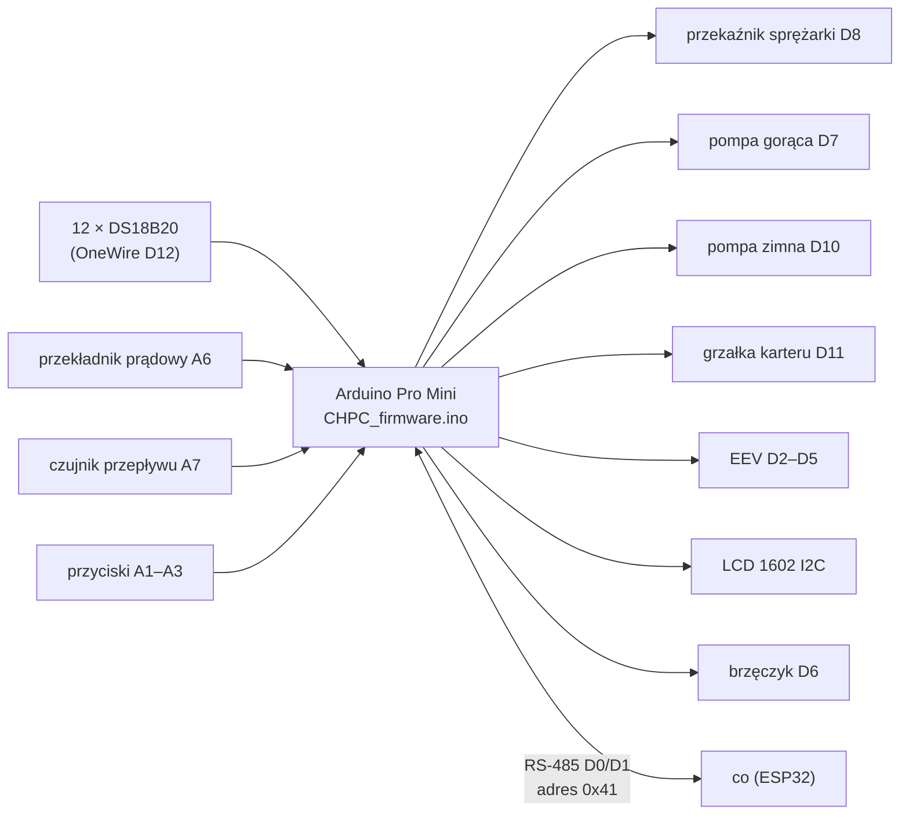
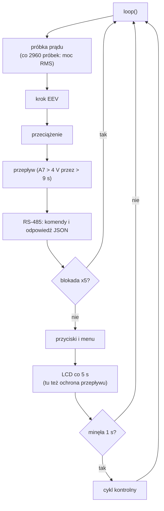
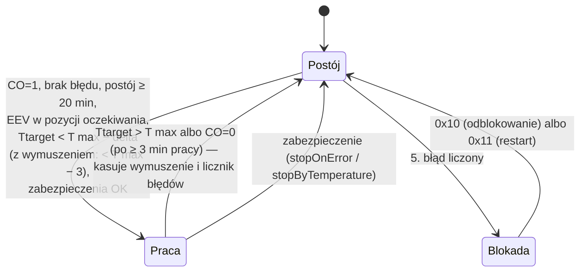

# Firmware CHPC — zasada działania

[← Dokumentacja systemu](../../../docs/README.md) · [1. Opis biznesowy](1-opis-biznesowy.md) · **2. Zasada działania** · [3. Dokumentacja techniczna](3-dokumentacja-techniczna.md) · [English](en/2-how-it-works.md)

## Schemat

## Start

1. Przekaźniki wyłączone, LCD pokazuje `ID: 0x41`, inicjalizacja RS-485.
2. Odczyt EEPROM (znacznik `0x50`): T max, delta, zgoda `CO`, przegrzanie, EEV min, EEV max, limit mocy, adresy czujników. Bez znacznika — wykrywanie czujników po kolei (wymagane Tae, Tbe, Ttarget); brak Tae lub Tbe zatrzymuje sterownik z komunikatem.
3. Pierwszy pomiar z czekaniem (pomija fałszywe 85 °C po włączeniu).
4. Kalibracja EEV: pełne otwarcie, pełne zamknięcie, powrót do pozycji oczekiwania.
5. **90 s pauzy** („Wait: N s.”): termostat i zabezpieczenia nie działają, RS-485 i EEV już tak.

## Pętla główna

W stanie blokady sterownik nadal odpowiada po RS-485, ale **cykl kontrolny nie działa** — temperatury w odpowiedzi JSON się nie zmieniają, a ochrona przed mrozem i reakcja na zablokowany przekaźnik nie działają.

## Cykl kontrolny (co 1 s)

Warunki startu (wszystkie naraz): Tsump 5–85 °C, Tae > −2 °C, Tbc < 70 °C, Tci i Tco > −2 °C.

**Pompy:**
- gorąca i zimna startują 2,25 s po sprężarce;
- gorąca pracuje jeszcze 60 s po zatrzymaniu i dłużej, dopóki Tho > Ttarget + 3 °C;
- zimna wyłącza się ≥ 10 s po zatrzymaniu, gdy Tbe i Tae > 0 °C;
- **ochrona przed mrozem** (sprężarka wyłączona): czujnik ≤ 0 °C włącza pompę gorącą, wszystkie ≥ 2 °C ją wyłączają;
- grzałka karteru: włączona przy Tsump < 10 °C;
- wymuszenia ręczne (przyciski, RS-485 `0x09`–`0x0B`) są sumowane z automatyką.

## Zawór EEV

Zawór utrzymuje przegrzanie (Tae − Tbe; liczone tylko przy mocy > 914 W) na nastawie (domyślnie 1,0 K):

| Sytuacja | Reakcja |
|---|---|
| przegrzanie poniżej nastawy | zamykanie po 1 kroku co 40 s |
| powyżej nastawy + 0,2 K | otwieranie co 40 s |
| powyżej nastawy + 4,2 K | otwieranie co 1,3 s |
| przegrzanie < 0,2 K, Tae < 0,2 °C, Tci/Tco < 0 °C | szybkie zamykanie (nie poniżej EEV min) |
| praca | zakres EEV min…EEV max; po starcie sprężarki szybkie otwarcie do min + 1 |
| postój / błąd | pełne zamknięcie i otwarcie do pozycji oczekiwania `min(45, EEV min − 4)` |
| 24 h postoju | ponowna kalibracja |

## RS-485

- Sterownik czyta z magistrali jednym ciągiem do 49 bajtów i przetwarza kolejne 5-bajtowe ramki `[0x41][cmd][d1][d2][0xFF]` **od początku bufora**. Obce bajty na początku (np. końcówka odpowiedzi DTU) powodują odrzucenie całego odczytu — dlatego `co` sprawdza skutek poleceń i je powtarza.
- Komendy zapisu nie mają odpowiedzi. Na `0x01` sterownik odpowiada jedną linią JSON (CRLF) z kluczami: `Tbe`, `Tae`, `Tco`, `Tho`, `Ttarget`, `Tsump`, `EEV_dt`, `Tmax`, `Tmin`, `Watts`, `EEV`, `EEV_pos`, `EEV_pulse`, `SHS`, `HCS`, `CCS`, `HPS`, `F`, `CO`, `WWatt`, `EEVmax`, `EEVmin`, `ERR`, `ERRn`, `ERRc`, `lt_pow`, `lt_hp_on`.
- Wymuszenie (`0x03`) jest przyjmowane tylko w postoju; w czasie pracy komenda jest pomijana w całości.

## Błędy i blokada

- `ERR` — kod ostatniego zdarzenia (nie wraca do 0), `ERRn` — numer zdarzenia (rośnie przy każdym), `ERRc` — licznik błędów liczonych.
- Błędy **liczone** (do blokady): przeciążenie (2), brak przepływu (3), za mała moc (4). Pozostałe zatrzymują sprężarkę bez zwiększania licznika.
- Normalne zatrzymanie termostatem zeruje licznik; w blokadzie do niego nie dochodzi, więc potrzebne jest `0x10` albo `0x11`.
