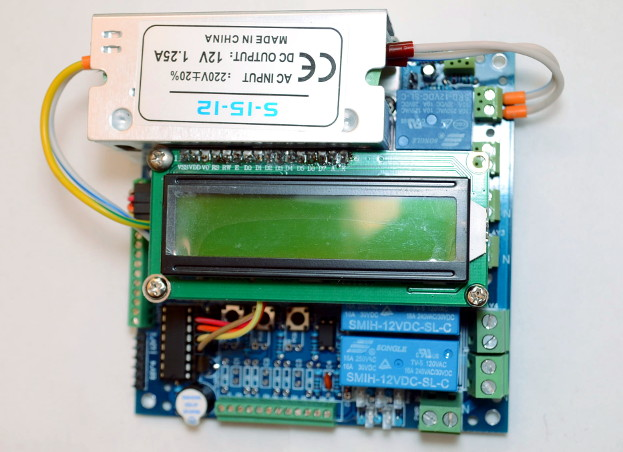

# Firmware CHPC — dokumentacja techniczna

[← Dokumentacja systemu](../../../docs/README.md) · [1. Opis biznesowy](1-opis-biznesowy.md) · [2. Zasada działania](2-zasada-dzialania.md) · **3. Dokumentacja techniczna** · [English](en/3-technical-documentation.md)

## Sprzęt

| Element | Szczegóły |
|---|---|
| Płytka | CHPC v1.3 z Arduino Pro Mini (ATmega328P, 5 V, 16 MHz); PCB, BOM i schemat w `docs/` |
| Czujniki | 12 × DS18B20 na jednej magistrali OneWire (D12) |
| Moc | przekładnik prądowy na A6, RMS co 2960 próbek, napięcie przyjęte na sztywno |
| Przepływ | wejście A7 (> 4 V = brak przepływu) |
| Przekaźniki | sprężarka D8, pompa gorąca D7, pompa zimna D10, grzałka karteru D11, zawór 4-drogowy D9 (nieużywany) |
| EEV | silnik krokowy D2, D4, D3, D5; 480 kroków |
| Obsługa | LCD 1602 I2C, przyciski A2 (lewy), A3 (prawy), A1 (menu), brzęczyk D6 |
| RS-485 | Serial D0/D1, 9600 8N1, adres `0x41` |



## Kod

Cały firmware to `src/CHPC_firmware.ino` (~2200 linii). Nagłówek pliku zawiera mapę sekcji. Najważniejsze miejsca:

| Miejsce | Rola |
|---|---|
| `#define` na początku | progi temperatur, czasy, EEV, adresy EEPROM, piny, kody `ERRC_*` |
| `setup()` | EEPROM, czujniki, pierwszy pomiar, start kalibracji EEV |
| `loop()`, część asynchroniczna | moc, EEV, przeciążenie, przepływ, RS-485 (`ReadSerialCommand`) |
| przyciski i menu | 10 pozycji `INPUT_TYPE_*`, zapis w EEPROM |
| blok wyświetlacza (`DISPLAY_1602`) | ekrany co 5 s i **ochrona przepływu** |
| cykl kontrolny (co 1 s) | czujniki, termostat, pompy, mróz, zabezpieczenia temperaturowe, błąd przekaźnika |
| `stopOnError` / `stopByTemperature` / `reportError` | zatrzymanie z licznikiem / bez licznika / zapis zdarzenia (`ERR`, `ERRn`) |
| `StatsSerial()` | odpowiedź JSON na `0x01` |

## Stałe (stan kodu)

| Stała | Wartość | Znaczenie |
|---|---|---|
| `POWERON_PAUSE` | 90 s | pauza po włączeniu |
| `MINCYCLE_POWEROFF` | 20 min | minimalny postój przed kolejnym startem |
| `MINCYCLE_POWERON` | 3 min | minimalna praca przed zatrzymaniem termostatem |
| `MINCYKLE_CHECK` | 60 s | po tym czasie pracy: kontrola mocy minimalnej i Tsump |
| `POWERON_HIGHTIME` | 9 s | okno rozruchu (dopuszczalna moc do 3,5 × limit); pompy startują po 1/4 (2,25 s) |
| `COLDOFF_HIGHTIME` | 50 s | od startu do pierwszej kontroli przepływu |
| `DEFFERED_STOP_HOTCIRCLE` | 60 s | wybieg pompy gorącej |
| `T_SETPOINT_MAX` / `T_DELTA_MAX` | 50 / 30 °C | limity T max i delty (wyższe wartości z RS-485 są ignorowane) |
| `T_DELTA_DEFAULT` | 5 °C | delta, gdy EEPROM jej nie ma |
| `MAX_WATTS` | 3200 W | domyślny limit; próg **minimalnej mocy** = `MAX_WATTS / 3.5` ≈ **914 W** (stały, niezależny od limitu) |
| `MAX_WATTS_LIMIT` | 4000 W | górna granica limitu |
| `EEV_TARGET_TEMP_DIFF` | 1,0 K | domyślne przegrzanie |
| `EEV_CLOSEEVERY` | 24 h | okresowa kalibracja EEV |

## Zabezpieczenia

| Kod | Nazwa (LCD) | Warunek | Skutek |
|---|---|---|---|
| 1 | `ERR: Temp. Sens.` | −127 z Tae, Tbe, Ttarget, Tsump, Tco albo Tho (dwa odczyty) | blokuje start i zatrzymuje; znika sam po powrocie czujnika |
| 2 | `ERR: Overload` | moc > limitu po 9 s od startu albo > 3,5 × limit w każdej chwili | stop, **liczony** |
| 3 | `ERR: Cold Flow` | brak przepływu > 9 s, po 50 s od startu; **tylko gdy limit mocy > 3200 W**; sprawdzane w bloku LCD co 5 s | stop, **liczony** |
| 4 | `ERR: Wattage Min` | po 60 s pracy moc < ≈ 914 W | stop, **liczony** |
| 5 | `ERR: Temp. Tho` | Tho > 60 °C | stop |
| 6 | `ERR: Temp. Tsump` | Tsump > 85 °C | stop |
| 7 | `ERR: Temp. Tbc` | Tbc > 70 °C | stop |
| 8 | `ERR: Temp. Tae` | Tae < −2 °C | stop |
| 9 | `ERR: Temp. Tco` | Tco < −2 °C | stop |
| 10 | `ERR: Relay` | moc > ≈ 914 W, a sprężarka wyłączona od > 10 s | włącza wymuszenie obu pomp (zostaje po ustaniu usterki) |
| 11 | `ERR: Locked x5` | piąty błąd liczony | blokada do `0x10` lub `0x11` |
| 12 | `ERR: Temp. Low` | po 60 s pracy Tsump < 3 °C | stop |
| 13 | `ERR: Temp. Tbe` | Tbe < −1 °C dłużej niż 60 s | stop |

„Stop” bez licznika pozwala na ponowny start po 20 min postoju. Zatrzymanie termostatem zeruje licznik błędów liczonych. Kody są w `client/src/devices/heat-pump/utils/errors.ts` — zmieniać razem.

## RS-485

Ramka: `[0x41][cmd][d1][d2][0xFF]`, liczby: `d1` + `d2`/100, waty: `d1·100 + d2`.

| cmd | Działanie w CHPC | Zapis w EEPROM |
|---|---|---|
| `0x01` | odpowiedź JSON | — |
| `0x03` | wymuszenie 0/1 — **tylko w postoju** | nie |
| `0x04` | T max (≤ 50) | tak |
| `0x05` | delta (≤ 30) | tak |
| `0x08` | przegrzanie EEV (bez kontroli zakresu; po restarcie wartość spoza 0–8 wraca do 1,0) | tak |
| `0x09` / `0x0A` / `0x0B` | ręczne włączenie pompy gorącej / zimnej / grzałki | nie |
| `0x0C` | `co_on` (zgoda na start sprężarki) | tak |
| `0x0D` | EEV max (26–255); gdy ≤ EEV min, min obniża się do max − 1 | tak |
| `0x0F` | EEV min (25–255); gdy ≥ EEV max, max podnosi się do min + 1 | tak |
| `0x0E` | limit mocy (1001–4000 W) | tak |
| `0x10` | odblokowanie (`error_count = 0`; `ERR` zostaje) | — |
| `0x11` | restart programowy (`jmp 0`: przekaźniki wyłączone, `setup()` od nowa, pauza 90 s) | — |

Odpowiedź na `0x01` — jedna linia JSON zakończona CRLF, kolejność kluczy:
`Tbe`, `Tae`, `Tco`, `Tho`, `Ttarget`, `Tsump`, `EEV_dt`, `Tmax`, `Tmin` (= Tmax − delta), `Watts`, `EEV` (nastawa przegrzania), `EEV_pos`, `EEV_pulse`, `SHS`, `HCS`, `CCS`, `HPS`, `F`, `CO`, `WWatt`, `EEVmax`, `EEVmin`, `ERR`, `ERRn`, `ERRc`, `lt_pow` (Wh od startu sprężarki), `lt_hp_on` (s pracy bieżącej lub ostatniej). Temperatury i część liczb są napisami.

- `HCS` obejmuje też ręczne wymuszenie i ochronę przed mrozem; `CCS` i `SHS` — ręczne wymuszenie.
- Klucze, na których polegają `co` i chpc-web, wymienia [dokumentacja modułu heat-pump](../../../docs/moduly/heat-pump/3-dokumentacja-techniczna.md). **Nie zmieniać nazw ani kolejności bez zmiany po obu stronach.**
- Firmware **nie wysyła** klucza z wersją (`FW`), choć wcześniejsze opisy (CLAUDE.md) o nim mówiły; nie ma go w żadnym commicie.

## EEPROM

| Adres | Zawartość |
|---|---|
| `0x00` | znacznik `0x50` (zmiana = ponowne wykrycie czujników) |
| `0x01` | T max (float, 4 B) |
| `0x05` | maska używanych czujników (2 B) |
| dalej | adresy czujników DS18B20 (po 8 B) |
| `0x70` | `co_on` |
| `0x74` / `0x8A` | EEV max / EEV min |
| `0x78` | przegrzanie EEV |
| `0x82` | delta |
| `0x86` | limit mocy |

## Menu przycisków

Przycisk A1 przełącza pozycję, A2/A3 zmniejszają/zwiększają wartość: `CO` (zgoda), T max, delta, EEV max, przegrzanie, pompa gorąca, pompa zimna, grzałka karteru, limit mocy, EEV min (kolejność `INPUT_TYPE_*`). Przytrzymanie powtarza co 750 ms.

## Tryby budowania

| Środowisko PlatformIO | Tryb | Zastosowanie |
|---|---|---|
| `promini` (domyślne) | `RS485_PYTHON` | **produkcja** — na magistrali tylko odpowiedzi dla `co` |
| `wokwi` | `RS485_HUMAN` | symulacja Wokwi; komunikaty tekstowe psują magistralę — **nie wgrywać na pompę z `co`** |
| `promini_debug` | `DEBUG_LOG` | log zdarzeń (linie JSON) na UART, odczyt `tools/serial-log.ps1` — **nie wgrywać na pompę z `co`** |
| `native`, `native_debug` | — | symulacja firmware na PC (`test/sim_env`) |

```bash
pio test -d devices/chpc -e native      # 54 testy
pio run  -d devices/chpc                # build Pro Mini; Flash 95,0% (29 174 B z 30 720 B)
pio run  -d devices/chpc -t upload      # wgranie (programator / USB-UART)
```

Scenariusze Wokwi: `test-wokwi/`. Wykres przykładowej pracy: `docs/m_t_graph_example.png`.

## Znane problemy

- **Ochrona przepływu żyje w bloku LCD** — działa tylko z `DISPLAY_1602` i co 5 s.
- **Przy limicie mocy ≤ 3200 W ochrona przepływu jest wyłączona** — celowo, ale dotyczy to każdego limitu 1001–3200 W, **także domyślnego (3200 W)**. Ustawienie niższego, „bezpieczniejszego” limitu wyłącza ochronę. Propozycja z audytu 2026-09-25 (lokalny raport `test/raport-testow/AUDYT-2026-09-25.md`, poza gitem): osobny bit w EEPROM i kontrola poza blokiem LCD.
- **W blokadzie cykl kontrolny nie działa**: brak ochrony przed mrozem, brak odświeżania temperatur w JSON.
- **Wymuszenie jest kasowane tylko przez zatrzymanie termostatem** (i restart); zatrzymanie przez zabezpieczenie je zostawia.
- **Błąd przekaźnika zostawia ręczne wymuszenie pomp** do zmiany przez `0x09`/`0x0A`, menu albo restart.
- Pamięć Flash 95% — nowe funkcje kosztem starych.
- `devices/chpc/README.md` (angielski, z projektu źródłowego) i `devices/chpc/CLAUDE.md` mogą być miejscami nieaktualne; ten dokument jest nadrzędny.
