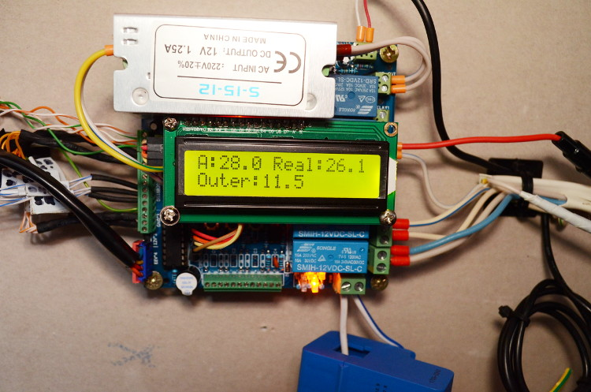
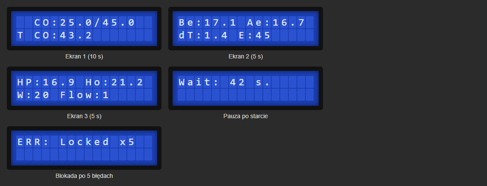
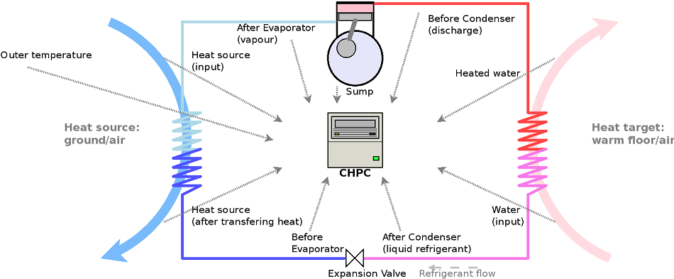

# CHPC firmware — business description

[← System documentation](../../../../docs/en/README.md) · **1. Business description** · [2. How it works](2-how-it-works.md) · [3. Technical documentation](3-technical-documentation.md) · [Polski](../1-opis-biznesowy.md)

## What this controller is for

CHPC (*Cheap Heat Pump Controller*) is the controller of the heat pump itself, built on an Arduino Pro Mini and the CHPC v1.3 board. **It is the part that physically switches the compressor and the pumps**. The rest of the system (`co`, the cloud, the application) only tells it what is expected.

The controller:

- switches the **compressor** on and off like a thermostat, by the water temperature in the tank;
- drives the **circulating pumps** (hot side: floor heating; cold side: ground loop), the compressor **crankcase heater** and the **EEV expansion valve**;
- **protects the compressor and heat exchangers** against overheating, freezing, overload and lack of flow;
- measures **power draw** and **12 temperatures** in the circuit;
- shows its state on a **1602 display** and lets you change settings with buttons;
- answers the `co` controller over **RS-485** and accepts its commands.

The firmware is a fork of the open project [gonzho000/chpc](https://github.com/gonzho000/chpc) (GPLv3), adapted to one installation: a ground-source pump feeding floor heating and a domestic hot water (CWU) tank.

## Who it is for

- **The owner** — normally does not touch the controller and uses the application.
- **The service technician** — reads the display, changes settings with the buttons, flashes the firmware and reads the errors.

## What the controller shows

*Emulation of the 1602 display with demo data. The screens change every 5 s (the first one is shown for 10 s): CO temperatures (min/max and current), evaporator and EEV valve, crankcase, outlet water, power and flow. For 90 s after power-on the controller waits ("Wait"), and errors replace the normal screen.*

## Sensors in the circuit

| Name | Location | Used for |
|---|---|---|
| Tae | after the evaporator | EEV superheat, freeze protection **(required)** |
| Tbe | before the evaporator | EEV superheat **(required)** |
| Ttarget | middle of the tank / heating loop | thermostat: compressor start and stop **(required)** |
| Tsump | compressor crankcase | crankcase heater, too high and too low temperature |
| Tci / Tco | cold loop in / out | ground loop freeze protection |
| Thi / Tho | hot loop in / out | hot side overheating, pump run-on |
| Tbc | before the condenser (discharge) | discharge overheating |
| Tac, Touter, Tcwu | after the condenser, outdoor, hot water | information only |

## Protections (what the user sees)

Every event reaches the application as an error code with a time. Five "counted" errors (overload, no flow, too low power) **lock the controller**: the pump will not start until someone presses "Odblokuj" (unlock) in the application or restarts the controller. The full list of codes is in the [technical documentation](3-technical-documentation.md#protections).

## Limitations

- **No clock**: the controller does not know the time; the cloud timestamps events (accuracy 10–30 s).
- **Program memory is almost full** (95%): every new key in the JSON reply must be added sparingly.
- **Commands are not acknowledged**: the `co` controller checks their effect in the next reading.
- **A power limit of 3200 W or less disables the flow protection** (on purpose, for a power source on which the flow sensor is unreliable).

## Glossary

| Term | Meaning |
|---|---|
| **Compressor** | the heart of the heat pump; CHPC switches it with a relay |
| **EEV** | electronic expansion valve (stepper motor, 480 steps) |
| **Superheat** | Tae − Tbe; the EEV keeps it at the setpoint |
| **T max / delta** | the compressor starts below T max − delta and stops above T max |
| **Force start** (`F`) | start without waiting for the whole delta (T max − 3 °C is enough) |
| **Lock x5** | state after five counted errors; cleared by unlock or restart |
| **RS-485** | bus to the `co` controller; CHPC has address 0x41 |
