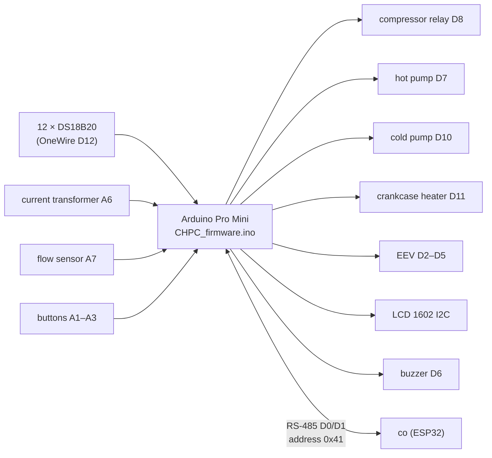
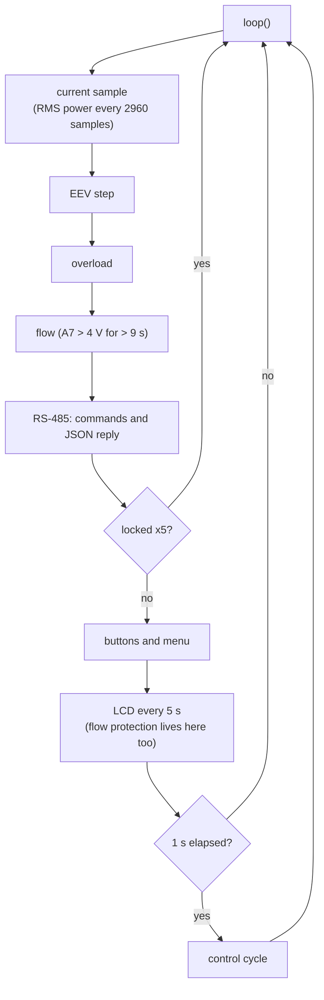
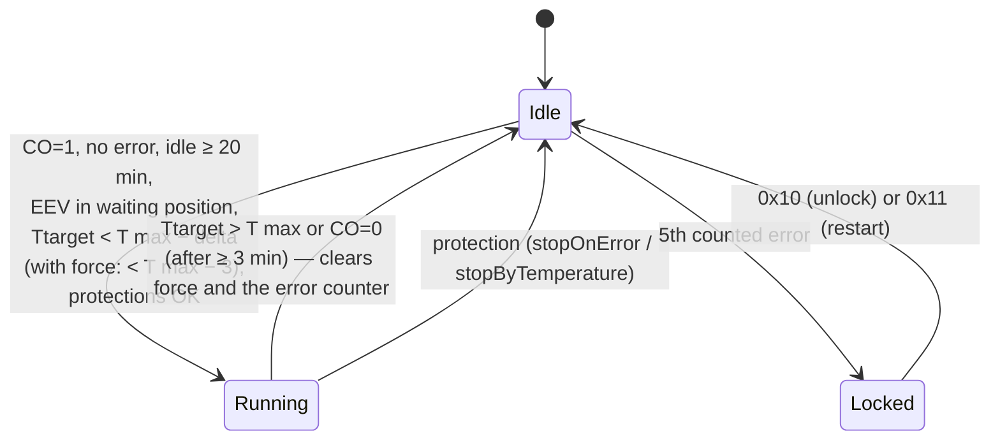

# CHPC firmware — how it works

[← System documentation](../../../../docs/en/README.md) · [1. Business description](1-business-description.md) · **2. How it works** · [3. Technical documentation](3-technical-documentation.md) · [Polski](../2-zasada-dzialania.md)

## Diagram

## Start

1. Relays off, the LCD shows `ID: 0x41`, RS-485 initialised.
2. EEPROM read (marker `0x50`): T max, delta, `CO` permission, superheat, EEV min, EEV max, power limit, sensor addresses. Without the marker, sensors are detected one by one (Tae, Tbe, Ttarget required); a missing Tae or Tbe halts the controller with a message.
3. First measurement with a wait (skips the false 85 °C after power-on).
4. EEV calibration: full open, full close, back to the waiting position.
5. **90 s pause** ("Wait: N s."): thermostat and protections are idle; RS-485 and the EEV already work.

## Main loop

While locked, the controller still answers over RS-485, but **the control cycle does not run**: temperatures in the JSON reply do not change, and frost protection and the stuck relay reaction do not work.

## Control cycle (every 1 s)

Start conditions (all at once): Tsump 5–85 °C, Tae > −2 °C, Tbc < 70 °C, Tci and Tco > −2 °C.

**Pumps:**
- hot and cold start 2.25 s after the compressor;
- hot keeps running 60 s after the stop, and longer while Tho > Ttarget + 3 °C;
- cold stops ≥ 10 s after the stop, once Tbe and Tae > 0 °C;
- **frost protection** (compressor off): any sensor ≤ 0 °C switches the hot pump on, all ≥ 2 °C switch it off;
- crankcase heater: on while Tsump < 10 °C;
- manual overrides (buttons, RS-485 `0x09`–`0x0B`) are OR-ed with the automatic control.

## EEV valve

The valve keeps the superheat (Tae − Tbe; computed only at power > 914 W) at the setpoint (default 1.0 K):

| Situation | Reaction |
|---|---|
| superheat below the setpoint | close 1 step every 40 s |
| above setpoint + 0.2 K | open every 40 s |
| above setpoint + 4.2 K | open every 1.3 s |
| superheat < 0.2 K, Tae < 0.2 °C, Tci/Tco < 0 °C | fast close (not below EEV min) |
| running | range EEV min…EEV max; after compressor start a fast open to min + 1 |
| idle / error | full close, then open to the waiting position `min(45, EEV min − 4)` |
| 24 h idle | recalibration |

## RS-485

- The controller reads up to 49 bytes from the bus in one go and processes the 5-byte frames `[0x41][cmd][d1][d2][0xFF]` **from the start of the buffer**. Foreign bytes at the start (e.g. the tail of a DTU reply) make it reject the whole read; that is why `co` checks the effect of its commands and repeats them.
- Write commands have no reply. To `0x01` the controller replies with one JSON line (CRLF) with the keys: `Tbe`, `Tae`, `Tco`, `Tho`, `Ttarget`, `Tsump`, `EEV_dt`, `Tmax`, `Tmin`, `Watts`, `EEV`, `EEV_pos`, `EEV_pulse`, `SHS`, `HCS`, `CCS`, `HPS`, `F`, `CO`, `WWatt`, `EEVmax`, `EEVmin`, `ERR`, `ERRn`, `ERRc`, `lt_pow`, `lt_hp_on`.
- Force start (`0x03`) is accepted only while idle; while running the command is ignored entirely.

## Errors and the lock

- `ERR` — code of the last event (does not return to 0), `ERRn` — event sequence number (grows with each), `ERRc` — counted error counter.
- **Counted** errors (towards the lock): overload (2), no flow (3), too low power (4). The others stop the compressor without touching the counter.
- A normal thermostat stop clears the counter; while locked it never happens, so `0x10` or `0x11` is needed.
