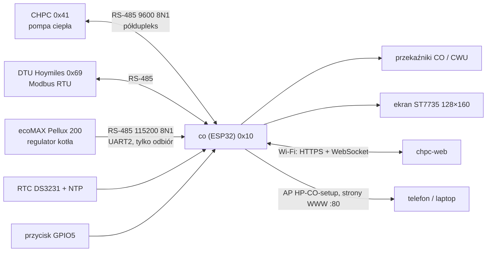
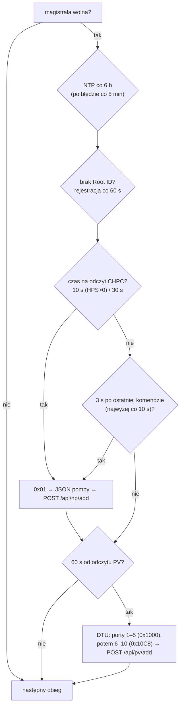
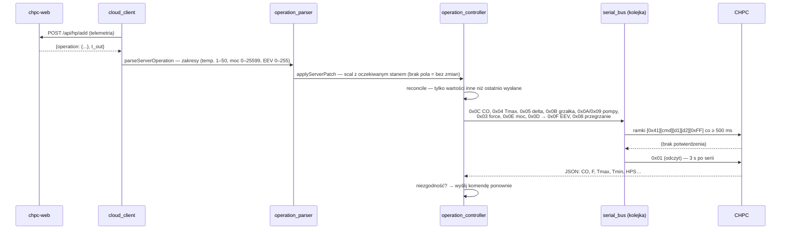
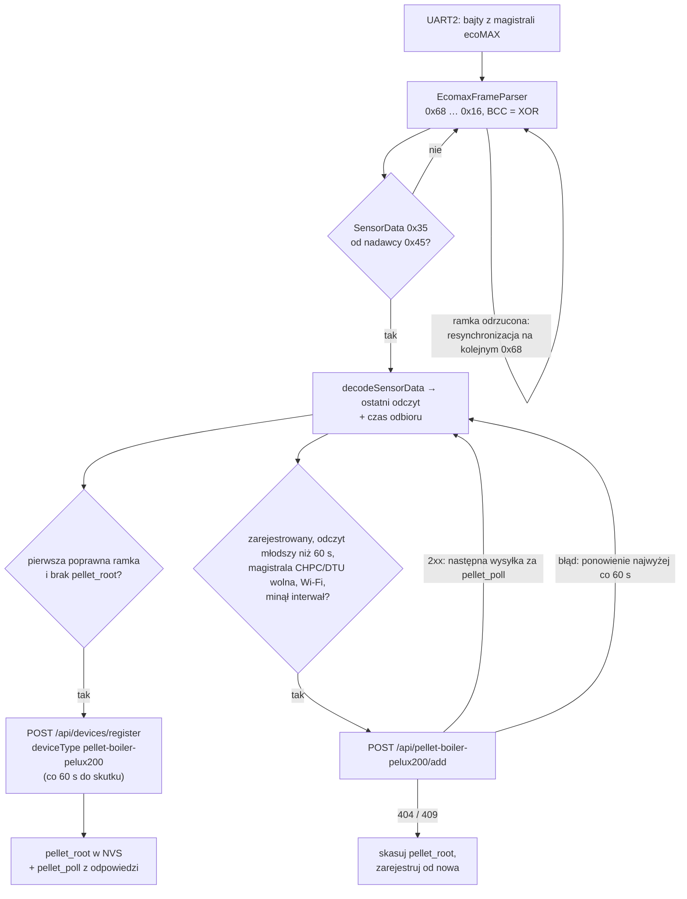
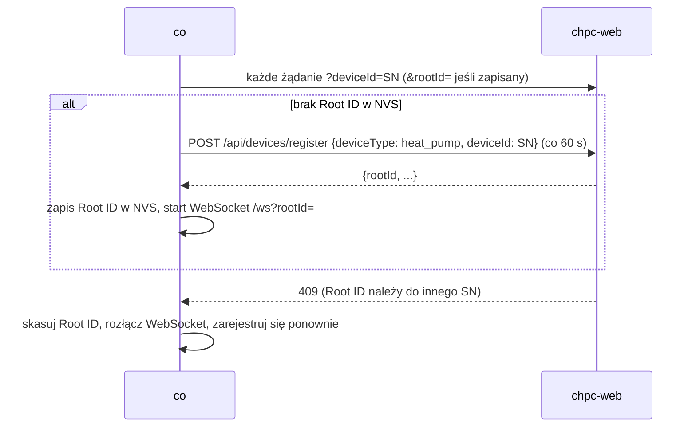

# Firmware co — zasada działania

[← Dokumentacja systemu](../../../docs/README.md) · [1. Opis biznesowy](1-opis-biznesowy.md) · **2. Zasada działania** · [3. Dokumentacja techniczna](3-dokumentacja-techniczna.md) · [English](en/2-how-it-works.md)

## Schemat połączeń

Na magistrali transmisję zaczyna tylko `co`. Między ramkami jest co najmniej 500 ms; koniec ramki to 5 ms ciszy; brak odpowiedzi po 3 s to timeout. Magistrala kotła (ecoMAX) jest osobna: własny UART2 i konwerter, a `co` tylko z niej czyta (punkt „Piec Pellux 200” niżej).

## Pętla główna

Każdy obieg `loop()`:

1. przycisk trybu (zastosowanie 5 s po ostatnim naciśnięciu);
2. `serialBus.tick()` — wysłanie następnej ramki z kolejki;
3. `operationController.tick()` — ponowienie komend, których kolejka nie przyjęła;
4. przekaźniki CO/CWU;
5. odebrane ramki: CHPC → telemetria, DTU → PV, zapytania do `co` (0x10) → odpowiedź;
6. WebSocket, odbiór ramek ecoMAX z UART2 (`ecomaxBus.tick()`), strony WWW, polityka punktu dostępowego.

Potem zadania czasowe. Te, które blokują (HTTP, NTP), czekają, aż magistrala będzie wolna:

- **Szybki odczyt** po serii komend sprawdza, czy pompa je przyjęła, i od razu wysyła świeży stan; zwykły cykl liczy się wtedy od nowa.
- **Komunikat WebSocket `operation`** wymusza wcześniejszy `POST /api/hp/add`.
- **Brak odpowiedzi pompy** oznacza `heatPumpLost()`: pierwszy odczyt po powrocie wysyła do pompy cały stan od nowa.
- Telemetria idzie także przy odłączonej pompie (z pustym `HP`), żeby serwer odesłał tryb pracy.
- Rejestracja i wysyłka pieca (niżej) są w tym samym miejscu pętli co rejestracja pompy, przed wysyłką telemetrii, i też czekają na wolną magistralę.

## Od operacji z chmury do komend RS-485

Porównanie po odczycie pompy (`updateHeatPumpReport`):

| Pole pompy | Oczekiwane | Kiedy sprawdzane |
|---|---|---|
| `HP.CO` | `1` dla trybu innego niż `OFF`, `0` dla `OFF` i lokalnego `OFF` | zawsze (poza `MANUAL_*`) |
| `HP.F` | wartość `force` z chmury (w `PV` — z produkcji PV) | tylko przy `HPS = 0`; CHPC przyjmuje wymuszenie tylko w postoju |
| `HP.Tmax` | `co_max` / `cwu_max` | poza `OFF`; tolerancja 0,11 °C; pomijane, gdy > 50 |
| `HP.Tmax − HP.Tmin` | max − min | jw.; pomijane, gdy > 30 |

Po co to wszystko: CHPC czyta z magistrali do 49 bajtów i przetwarza je tylko wtedy, gdy bufor zaczyna się od jego adresu. Komenda, która trafi do jednego odczytu razem z obcymi bajtami (np. końcówką odpowiedzi DTU), ginie bez śladu.

## Tryby sterownika

```mermaid
stateDiagram-v2
    [*] --> CLOUD: domyślnie (NVS „mode”)
    OFF --> CLOUD: przycisk
    CLOUD --> MANUAL_CO: przycisk
    MANUAL_CO --> MANUAL_CWU: przycisk
    MANUAL_CWU --> OFF: przycisk
    note right of OFF: przekaźniki off, sekwencja bezpieczeństwa<br/>(CO off, force off, pompy off), ponawiana,<br/>gdy pompa zgłosi CO=1 lub F=1
    note right of CLOUD: wykonuje operację z chmury;<br/>do pierwszej niepustej operacji nic nie wysyła
```

W `MANUAL_CO` przekaźniki są włączone, w `MANUAL_CWU` wyłączone; w obu `co` nie wysyła komend do pompy i nie sprawdza jej stanu. Operacja z chmury (także akcje odblokowania i restartu) jest stosowana **tylko w `CLOUD`**.

Przekaźniki CO i CWU są przełączane razem: włączone w `M`, `A`, `PV` (chyba że `co_pomp` = 0), wyłączone w `CWU` i `OFF`.

## Piec Pellux 200 (druga rola)

Regulator ecoMAX sam, cyklicznie wysyła ramki `SensorData` (typ `0x35`) do swojego panelu. `co` jest tylko słuchaczem: osobny UART2 (RX GPIO16, 115200 8N1, TX nieprzypisany, DE/RE na GPIO4 na stałe LOW), bufor sterownika 2 KB. Pełny opis podłączenia i protokołu: [piec-pellux200.md](piec-pellux200.md).

- **Odbiór** nie przerywa reszty pętli: jedno wywołanie `tick()` przetwarza najwyżej 512 bajtów. Wysyłka do chmury blokuje pętlę do ok. 10 s (HTTP), a bufor UART2 (2 KB) przy 115200 baud mieści tylko ułamek sekundy ruchu; nadmiar jest gubiony, a parser po śmieciach szuka kolejnego `0x68`. Do chmury idzie zawsze ostatni poprawny odczyt, więc pojedyncze zgubione ramki nie szkodzą.
- **Rejestracja** dopiero po pierwszej poprawnej ramce `SensorData`: sterownik bez kotła nie tworzy urządzenia. Żądanie ma `deviceType: "pellet-boiler-pelux200"`, ten sam SN co pompa i nazwę „Piec Pellux 200”; Root ID (inny niż pompy) trafia do NVS (`pellet_root`), a `settings.poll_interval_seconds` z odpowiedzi do `pellet_poll`. Nieudane zgłoszenie jest ponawiane co 60 s.
- **Wysyłka** `POST /api/pellet-boiler-pelux200/add?deviceId=<SN>&rootId=<Root ID pieca>`: pierwsza zaraz po rejestracji i odebraniu ramki, potem co `pellet_poll` (domyślnie 300 s, dozwolone 30–3600 s). Odpowiedź `{"poll_interval_seconds": N}` aktualizuje `pellet_poll`. Po nieudanej wysyłce następna próba za mniej z dwóch: interwał albo 60 s. Wysyłane są tylko pola odczytane z ramki, plus `time`.
- Wysyłka nie zależy od trybu sterownika (przycisk) i nie dotyka kolejki RS-485 pompy.

## Rejestracja i punkt dostępowy

Punkt dostępowy `HP-CO-setup` (otwarty) startuje ze sterownikiem. `AccessPointPolicy` wyłącza go, gdy przez 3 min Wi-Fi ma adres, a każde żądanie do chmury dostaje odpowiedź HTTP (dowolny kod). Wraca, gdy Wi-Fi jest rozłączone dłużej niż 1 min albo chmura milczy 5 min.

## Szacunek COP

`cop_estimator` dla każdego cyklu sprężarki (`HPS` 0→1→0) liczy ciepło oddane do zbiornika 300 l z przyrostu jego średniej temperatury — góra to `Tho`, środek `Ttarget`, dół jest szacowany — i dzieli przez energię z pompy (`lt_pow`). Wynik powstaje po zatrzymaniu sprężarki; `cop_min` i `cop_max` to granice wynikające z nieznanej temperatury dołu. Pola `cop`, `cop_min`, `cop_max`, `t_min`, `t_max`, `cop_bottom_start` idą w telemetrii.

## Ekran

- Wiersz 1: data, godzina, tryb (`L-OFF`, `M-CO`, `M-CWU`, `C-M`, `C-A`, `C-PV`, `C-CWU`, `C-OFF`).
- Wiersz 2: `P:` moc/produkcja dziś PV, `T:` temperatura falowników (`--` przy mocy 0 albo odczycie starszym niż 5 min).
- Środek: żółte „F” przy wymuszeniu; duże `T:` = `HP.Ttarget` — czerwone przy `ERRc` > 0, żółte przy pracy sprężarki, inaczej białe; `T. zew:` z chmury (`--` po 30 min bez nowej wartości).
- Dół: `T.HP` Tmin/Tmax, `T.CO`, `T.CWU`, `Tbe/Tae`, `Tsump/Tho`, EEV, moc, stan pomp.
- Ekran trybu (3 s po naciśnięciu przycisku): źródło, tryb, IP, `AP: <ip>` albo `AP: off`.
