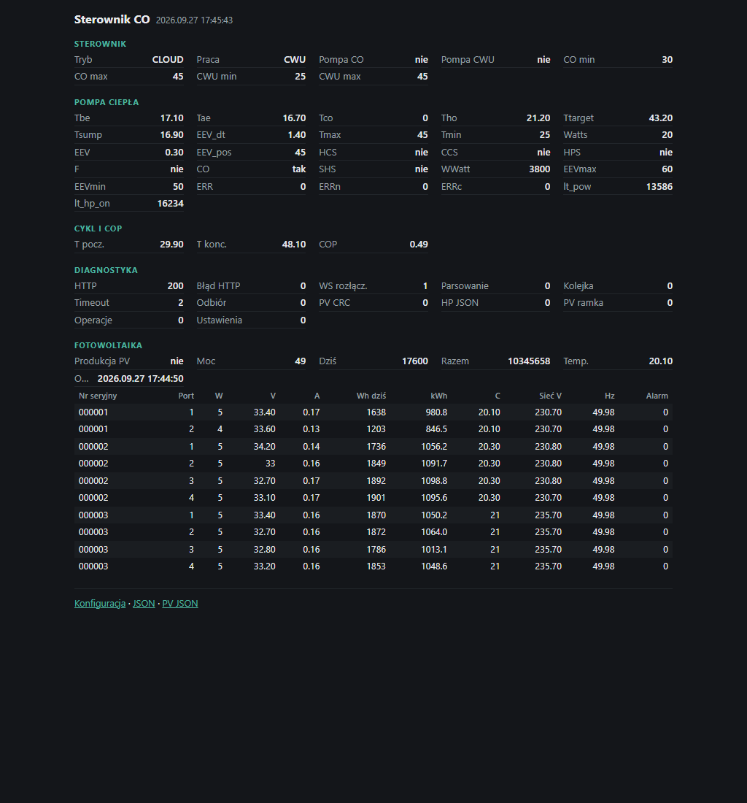

# Firmware co — dokumentacja techniczna

[← Dokumentacja systemu](../../../docs/README.md) · [1. Opis biznesowy](1-opis-biznesowy.md) · [2. Zasada działania](2-zasada-dzialania.md) · **3. Dokumentacja techniczna** · [English](en/3-technical-documentation.md)

## Sprzęt

| Element | Szczegóły |
|---|---|
| Płytka | ESP32 (PlatformIO `esp32dev`) |
| RS-485 | 9600 8N1, półdupleks; adresy: CHPC `0x41`, DTU `0x69`, `co` `0x10` |
| Ekran | ST7735 128×160, pionowo |
| Zegar | RTC DS3231, synchronizacja NTP (czas polski) |
| Przycisk | GPIO5, aktywny stan wysoki, debounce 50 ms |
| Przekaźniki | CO i CWU (przełączane razem) |

Piny i adresy są w `src/hardware_config.hpp`.

Od 2026-10-03 odczyt pieca Pellux 200 (magistrala ecoMAX, dawniej UART2 tego sterownika) działa na osobnej płytce — [devices/pellet-boiler-pelux200](../../pellet-boiler-pelux200/README.md).

## Pliki (`devices/co/src`)

| Plik | Rola |
|---|---|
| `main.cpp` | pętla główna: odczyty CHPC i PV, przycisk trybu, wymiana z chmurą, odpowiedzi `co` jako urządzenia 0x10 |
| `access_point_policy.*` | kiedy AP `HP-CO-setup` ma działać (3 min / 1 min / 5 min) |
| `cloud_client.*` | HTTPS do chpc-web (`hp/add`, `pv/add`, `devices/register`), WebSocket `/ws?rootId=`, obsługa 409 |
| `command_sink.hpp` | interfejs kolejki komend (na urządzeniu `SerialBus`, w testach `RecordingSink`) |
| `config_portal.*` | serwer WWW na porcie 80 (`/`, `/telemetry.json`, `/pv.json`, `/install`, `/save`) |
| `cop_estimator.*` | szacunek COP zbiornika 300 l dla cyklu sprężarki |
| `device_config.*` | Wi-Fi i Root ID w NVS (przestrzeń `hp`), SN z MAC, dane logowania do `/install`; przy starcie usuwa klucze dawnej roli pieca |
| `device_io.*` | ekran, RTC i NTP, Wi-Fi AP+STA, przekaźniki, zapis odpowiedzi na magistralę |
| `domain_types.hpp` | typy PV, `SERIAL_OPERATION`, `WORK_MODE`, `ControllerMode`, `DeviceSettings` |
| `hardware_config.hpp` | adresy 0x10 i 0x69, mapa rejestrów DTU, piny |
| `heat_pump_data_processor.*` | parsowanie JSON z CHPC, przekazanie danych do estymatora COP |
| `json_converters.hpp` | konwertery ArduinoJson (pola PV, `time` jako `YYYY.MM.DD HH:MM:SS`, tryby) |
| `modbus_frame.*` | ramki komend CHPC (5 B), zapytania Modbus do DTU (8 B), CRC-16/MODBUS |
| `operation_controller.*` | stan z chmury → komendy RS-485 (tylko zmiany), tryby, sekwencja OFF, force z PV, ponawianie po niezgodności, przekaźniki |
| `operation_parser.*` | JSON `operation` → `ServerOperationState`, z zakresami |
| `operation_types.hpp` | `ServerValue`/`ServerOperationState` (flaga `present`), `HeatPumpReport`, scalanie |
| `pv_data_processor.*` | dwie odpowiedzi DTU → sumy instalacji i `panels[]` |
| `pv_telemetry.*` | dokument `POST /api/pv/add` i `/pv.json` |
| `serial_bus.*` | kolejka RS-485 w trzech klasach (bezpieczeństwo, kontynuacja PV, zwykłe); 500 ms, 3 s, 5 ms |
| `telemetry.*` | dokument `POST /api/hp/add` i `/telemetry.json` |
| `secrets.example.h` | wzór `secrets.h` (poza gitem): domyślne Wi-Fi i opcjonalny `CLOUD_ROOT_ID` |

## Protokół RS-485 z CHPC

Ramka komendy: `[0x41][cmd][d1][d2][0xFF]`. Liczby dziesiętne: `d1` = część całkowita, `d2` = setne. Waty: `d1 = W/100`, `d2 = W%100`.

| cmd | Znaczenie | Źródło w operacji |
|---|---|---|
| `0x01` | odczyt JSON | cykliczny odczyt |
| `0x03` | force start 0/1 | `force` (w `PV` — z produkcji PV) |
| `0x04` | T zadana (max) | `co_max` albo `cwu_max` |
| `0x05` | delta T | max − min |
| `0x08` | przegrzanie EEV | `eev_setpoint` |
| `0x09` / `0x0A` / `0x0B` | pompa gorąca / zimna / grzałka karteru | `hot_pomp`, `cold_pomp`, `sump_heater` |
| `0x0C` | CO on/off | `work_mode` (+ przekaźniki CO/CWU) |
| `0x0D` | EEV max (26–255) | `eev_max_pulse_open` |
| `0x0F` | EEV min (25–255), wysyłane po `0x0D` | `eev_min_pulse_open` |
| `0x0E` | limit mocy (1001–4000 W) | `working_watt` |
| `0x10` | odblokowanie po 5 błędach | akcja `error_reset` |
| `0x11` | restart programowy CHPC | akcja `restart` (potem cały stan od nowa) |

`co` odpowiada też jako urządzenie `0x10`: `0x01` — telemetria z `PV` i `pv_power` w jednym JSON, `0x02` — ustawienia i `controller_mode`, `0x03` — nic.

DTU: dwa zapytania Modbus po pięć portów — od `0x1000` i od `0x10C8` (porty co `0x28` adresów, choć rekord ma 20 rejestrów).

## Kontrakt z chmurą

| Kierunek | Adres | Treść |
|---|---|---|
| `co` → serwer | `POST /api/hp/add?deviceId=SN&rootId=…` | telemetria (opis w [module heat-pump](../../../docs/moduly/heat-pump/3-dokumentacja-techniczna.md)) |
| serwer → `co` | odpowiedź | `{"operation": {...napisy...}, "t_out": 12.3}` |
| `co` → serwer | `POST /api/pv/add?...` | `time`, `total_power` (wymagane), `total_prod`, `total_prod_today`, `temperature` (najniższa z portów), `pv_power` (≥ 2000 W), `panels[]` |
| `co` → serwer | `POST /api/devices/register` | `{deviceType: "heat_pump", deviceId: SN, ip}` — przy każdym starcie, po zmianie IP i po 409 (`registrationDue()`), także z Root ID; inny `rootId` z odpowiedzi zastępuje zapisany i restartuje WebSocket |
| serwer → `co` | WebSocket `/ws?rootId=` | `{"type":"operation"}` → natychmiastowy `hp/add` |

Nieprzyjęty odczyt PV sterownik ponawia co 60 s, aż zastąpi go nowszy.

## Strony WWW (port 80)

| Adres | Dostęp | Zawartość |
|---|---|---|
| `GET /` | otwarty | podgląd (HTML `TELEMETRY_PAGE` w `config_portal.cpp`; JS co 5 s pobiera oba JSON-y) |
| `GET /telemetry.json` | otwarty | dokument telemetrii |
| `GET /pv.json` | otwarty | odczyt PV z panelami (`{}` przed pierwszym odczytem) |
| `GET /install` | Basic Auth | Wi-Fi, SN i Root ID tylko do odczytu, stan rejestracji (szablon `PAGE_TEMPLATE`) |
| `POST /save` | Basic Auth | `ssid`, `password` (puste = bez zmian); zapis w NVS, restart po 500 ms |

Nieznany adres przekierowuje (302) na `/`. Login i hasło do `/install` są w `src/device_config.hpp`.



## Konfiguracja

| Klucz NVS (`hp`) | Znaczenie |
|---|---|
| `wifi_ssid`, `wifi_pass` | Wi-Fi (pusty = wartość z `secrets.h`) |
| `root_id` | Root ID z rejestracji (pusty = `CLOUD_ROOT_ID` z `secrets.h`, jeśli podany) |
| `mode` | tryb sterownika (`ControllerMode`), domyślnie `CLOUD` |
| `pellet_root`, `pellet_poll` | dawna rola pieca (firmware 2026-10-01–02); `loadDeviceConfig()` usuwa je przy starcie |

Ustawienia z chmury (`DeviceSettings`: tryb pracy, temperatury) są tylko w pamięci RAM; po starcie domyślnie `OFF`, 35/45, 40/47, aż do pierwszej operacji.

## Budowanie, testy, wgrywanie

```bash
cp devices/co/src/secrets.example.h devices/co/src/secrets.h   # raz, uzupełnić
pio test -d devices/co -e native     # 64 testy: kontroler operacji, parser, COP, ramki Modbus, PV, polityka AP
pio run -d devices/co                # build esp32dev
pio run -d devices/co -t upload      # wgranie przez USB
```

Testy `native` nie wymagają sprzętu (`test/test_access_point_policy`, `test/test_modbus_frame`, `test/test_operation_controller`, `test/test_pv_data_processor`). Build `esp32dev` (2026-10-03, po usunięciu roli pieca): RAM 17,2 %, Flash 34,7 %. Kod RS-485 `co` jest też używany w teście całego łańcucha (`test/e2e`, most `bridge.exe`), obecnie nieaktualnym.

Kolejność wdrożenia: najpierw serwer, potem `co`, na końcu CHPC.

## Historia

- [Opis stanu przed przebudową (2026-09-10)](baseline-before-server-driven-refactor.md)
- [Przebudowa na sterowanie z serwera (2026-09-20)](server-driven-refactor-2026-09-20.md) — część opisów jest już nieaktualna (liczba stron WWW, stały AP, wysyłka przed rejestracją); obowiązuje ten dokument.

## Znane problemy

- **Akcje `error_reset` i `restart` giną poza trybem `CLOUD`**: `applyServerOperation` (`main.cpp`) odrzuca wtedy całą operację, a serwer wysyła akcję tylko raz. Komentarz w `operation_controller.cpp` („Maintenance actions run in every controller mode”) opisuje zamiar, który nie jest spełniony.
- **Nieaktualny TODO** w `main.cpp` („Scheduler must perform the MANUAL -> AUTO transition”) — serwer już to robi.
- **`DeviceSettings.controllerMode`** jest nieużywane; tryb trzyma `OperationController::localMode`.
- **Bezpieczeństwo**: otwarty AP, login i hasło `/install` w kodzie, HTTPS bez sprawdzania certyfikatu.
- **Walidacja zakresów po cichu**: wartość spoza zakresu nie jest stosowana, a aplikacja tego nie pokazuje.
