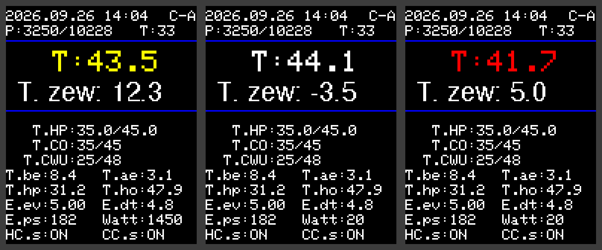
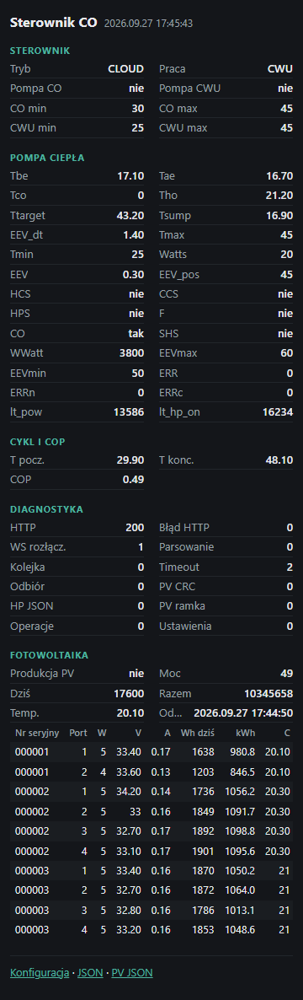
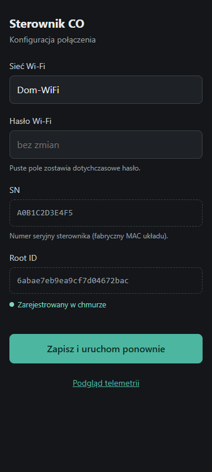

# co firmware — business description

[← System documentation](../../../../docs/en/README.md) · **1. Business description** · [2. How it works](2-how-it-works.md) · [3. Technical documentation](3-technical-documentation.md) · [Polski](../1-opis-biznesowy.md)

## Why this controller exists

`co` is a small computer (ESP32) mounted next to the heat pump. It is the **translator between the pump and the cloud**:

- it reads the state of the heat pump (the CHPC controller) and of the photovoltaic installation (Hoymiles microinverters),
- sends the data to the chpc-web application,
- receives settings from the cloud (mode, temperatures, forced start…) and passes them to the pump,
- makes sure the pump really has those settings — CHPC does not acknowledge commands, so `co` checks and repeats them when needed.

Without `co` the pump runs on its own with its last settings, but it cannot be controlled from the application and no data is collected.

## Who uses it

- **The owner** — does nothing; the controller works by itself. They can look at its page on the home network or at its display.
- **The installer** — sets the Wi-Fi during installation (through the `HP-CO-setup` access point and the `/install` page); the controller registers with the cloud by itself.
- **The service technician** — with the button on the housing can cut the pump off from the cloud (local mode) or switch it manually to CO or CWU.

## What it enables

| Function | Description |
|---|---|
| Cloud control | operating mode, CO and CWU temperatures, forced start, circulation pumps, EEV valve, power limit, pump unlock and restart |
| Pump data | every 10 s (compressor running) or 30 s (idle) |
| Photovoltaics | every 60 s: power, production, temperatures and state of every microinverter |
| COP estimate | efficiency of every heating cycle of the 300 l tank |
| PV mode | forced pump start when PV produces at least 2000 W |
| Work without the cloud | button: `OFF` (pump stopped), `MANUAL_CO`, `MANUAL_CWU` |
| Local view | colour display and a web page on the home network |

## Display and controller pages

The user interface is in Polish; the screenshots show it as is.

*Display (emulation): at the top date, time and mode (`C-A` = cloud, heating-schedule mode), PV power and production, inverter temperature. The big "T" is the temperature in the middle of the tank — yellow when the compressor runs, red on a pump error. Below it the outdoor temperature from the cloud, then pump parameters.*

| Page `/` (phone) | Page `/install` (phone) |
|---|---|
|  |  |

*The `/` page refreshes every 5 s: controller, pump, cycle and COP, diagnostics, photovoltaics with a microinverter table. The `/install` page (password protected) sets the Wi-Fi and shows the SN, Root ID and registration state.*

## Controller modes (button)

| Mode | On the display | Behaviour |
|---|---|---|
| `CLOUD` | `C-…` | applies the cloud settings (default mode) |
| `OFF` | `L-OFF` | switches the pump off (CO, forced start, circulation pumps) and the relays; keeps it that way |
| `MANUAL_CO` | `M-CO` | CO/CWU relays on, the pump runs on its own settings |
| `MANUAL_CWU` | `M-CWU` | relays off, the pump heats hot water only |

The first press only shows the mode; further presses move on: `OFF → CLOUD → MANUAL_CO → MANUAL_CWU → OFF`. The chosen mode takes effect 5 s after the last press and survives a restart. Data goes to the cloud in every mode.

## Limitations

- Cloud commands reach the pump at the next exchange (10–30 s); only the unlock and restart actions are faster — **and only in `CLOUD` mode**; in other modes those actions are lost.
- The `HP-CO-setup` access point is open (no password) and runs only for the first minutes or when Wi-Fi or the cloud is missing.
- The `/install` login and password are written in the code; the `/` and `/telemetry.json` pages are open to anyone on the home network.
- The controller does not verify the server certificate (HTTPS without checking).

## Glossary

| Term | Meaning |
|---|---|
| **RS-485** | two-wire bus with the pump (address 0x41), the DTU (0x69) and `co` (0x10) |
| **DTU** | Hoymiles microinverter gateway (Modbus RTU) |
| **SN** | `co` serial number — the MAC address of the ESP32 |
| **Root ID** | the controller identifier in the cloud, stored in `co` memory |
| **NVS** | ESP32 persistent memory (Wi-Fi, Root ID, mode) |
| **Operation** | settings from the cloud in the reply to pump data |
