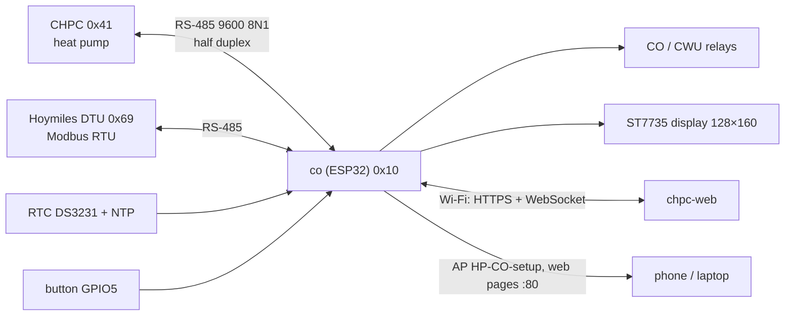
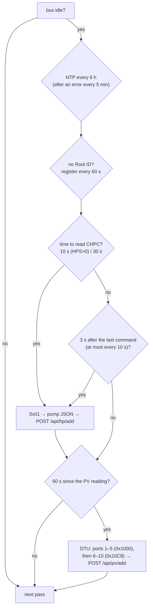
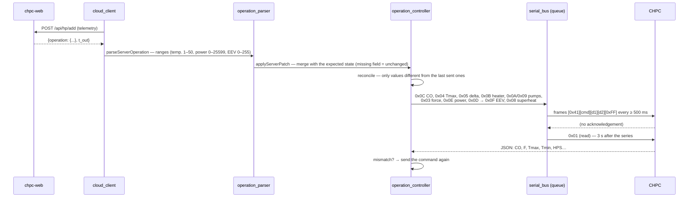
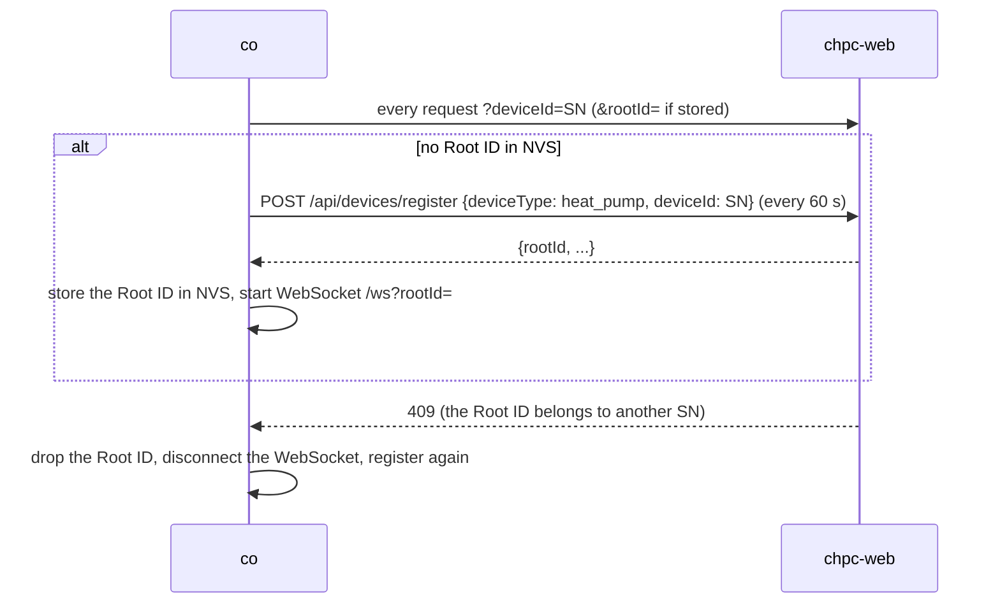

# co firmware — how it works

[← System documentation](../../../../docs/en/README.md) · [1. Business description](1-business-description.md) · **2. How it works** · [3. Technical documentation](3-technical-documentation.md) · [Polski](../2-zasada-dzialania.md)

## Connection diagram



Only `co` starts transmissions on the bus. There are at least 500 ms between frames; the end of a frame is 5 ms of silence; no answer within 3 s is a timeout.

## Main loop

Every `loop()` pass:

1. mode button (applied 5 s after the last press);
2. `serialBus.tick()` — send the next frame from the queue;
3. `operationController.tick()` — retry commands the queue did not accept;
4. CO/CWU relays;
5. received frames: CHPC → telemetry, DTU → PV, queries to `co` (0x10) → reply;
6. WebSocket, web pages, access point policy.

Then the timed tasks. Those that block (HTTP, NTP) wait until the bus is idle:



- **The fast read** after a series of commands checks whether the pump accepted them and sends the fresh state at once; the regular cycle then starts over.
- **The WebSocket `operation` message** forces an earlier `POST /api/hp/add`.
- **No answer from the pump** means `heatPumpLost()`: the first reading after it comes back resends the whole state to the pump.
- Telemetry is sent even with the pump disconnected (with an empty `HP`), so the server returns the operating mode.

## From a cloud operation to RS-485 commands



Comparison after a pump reading (`updateHeatPumpReport`):

| Pump field | Expected | When checked |
|---|---|---|
| `HP.CO` | `1` for a mode other than `OFF`, `0` for `OFF` and local `OFF` | always (except `MANUAL_*`) |
| `HP.F` | `force` from the cloud (in `PV` — from PV production) | only when `HPS = 0`; CHPC accepts forcing only when idle |
| `HP.Tmax` | `co_max` / `cwu_max` | except `OFF`; tolerance 0.11 °C; skipped when > 50 |
| `HP.Tmax − HP.Tmin` | max − min | as above; skipped when > 30 |

Why all this: CHPC reads up to 49 bytes from the bus and processes them only if the buffer starts with its address. A command that lands in one read together with foreign bytes (e.g. the tail of a DTU reply) is lost without a trace.

## Controller modes

```mermaid
stateDiagram-v2
    [*] --> CLOUD: default (NVS "mode")
    OFF --> CLOUD: button
    CLOUD --> MANUAL_CO: button
    MANUAL_CO --> MANUAL_CWU: button
    MANUAL_CWU --> OFF: button
    note right of OFF: relays off, safety sequence<br/>(CO off, force off, pumps off), repeated<br/>when the pump reports CO=1 or F=1
    note right of CLOUD: applies the cloud operation;<br/>sends nothing until the first non-empty operation
```

In `MANUAL_CO` the relays are on, in `MANUAL_CWU` off; in both `co` sends no commands to the pump and does not check its state. The cloud operation (unlock and restart actions included) is applied **only in `CLOUD`**.

The CO and CWU relays switch together: on in `M`, `A`, `PV` (unless `co_pomp` = 0), off in `CWU` and `OFF`.

## Registration and the access point



The `HP-CO-setup` access point (open) starts with the controller. `AccessPointPolicy` switches it off when for 3 min Wi-Fi has an address and every cloud request gets an HTTP reply (any code). It comes back when Wi-Fi has been disconnected for more than 1 min or the cloud has been silent for 5 min.

## COP estimate

For every compressor cycle (`HPS` 0→1→0) `cop_estimator` computes the heat delivered to the 300 l tank from the rise of its mean temperature — the top is `Tho`, the middle `Ttarget`, the bottom is estimated — and divides it by the pump energy (`lt_pow`). The result is ready after the compressor stops; `cop_min` and `cop_max` are the bounds due to the unknown bottom temperature. The fields `cop`, `cop_min`, `cop_max`, `t_min`, `t_max`, `cop_bottom_start` go with the telemetry.

## Display

- Row 1: date, time, mode (`L-OFF`, `M-CO`, `M-CWU`, `C-M`, `C-A`, `C-PV`, `C-CWU`, `C-OFF`).
- Row 2: `P:` PV power/production today, `T:` inverter temperature (`--` at zero power or a reading older than 5 min).
- Middle: a yellow "F" when forced; the big `T:` = `HP.Ttarget` — red when `ERRc` > 0, yellow while the compressor runs, white otherwise; `T. zew:` (outdoor) from the cloud (`--` after 30 min without a new value).
- Bottom: `T.HP` Tmin/Tmax, `T.CO`, `T.CWU`, `Tbe/Tae`, `Tsump/Tho`, EEV, power, pump state.
- Mode screen (3 s after a button press): source, mode, IP, `AP: <ip>` or `AP: off`.
