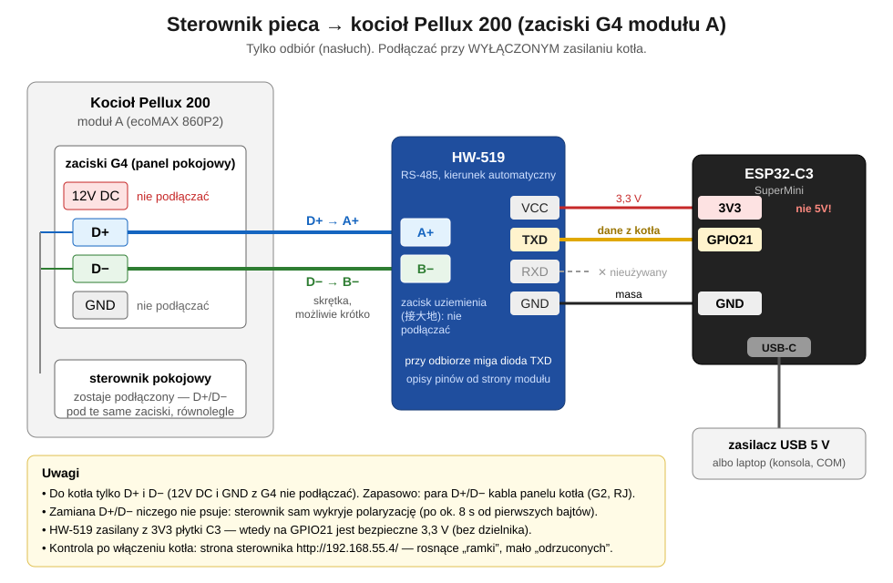

# Piec Pellux 200 — sterownik `pellet-boiler-pelux200`

Sterownik na płytce ESP32-C3 SuperMini z modułem RS-485 HW-519 na magistrali regulatora ecoMAX kotła pelletowego Pellux 200 Touch. Przedstawia się regulatorowi jako moduł ecoNET (`0x56`), dzięki czemu dostaje ramki `SensorData`, dekoduje je i co kilka minut wysyła ostatni odczyt do chpc-web; czyta też wszystkie ustawienia regulatora (kopia na wypadek awarii) i na polecenie z konsoli USB zmienia jeden parametr kotła przy kotle zatrzymanym (sprawdzone: CWU 55 → 50 °C). Z aplikacji kotłem nie steruje. Firmware 1.1.0 (sprawdzony na kotle 2026-10-03).

Do 2026-10-02 tę rolę pełnił sterownik `co` (drugi UART, piny GPIO16 i GPIO4); od 2026-10-03 działa na tej osobnej płytce, a kontrakt z chmurą się nie zmienił.

Dokumentacja: **[podłączenie, protokół i dane](docs/piec-pellux200.md)** · **[kocioł: sprzęt (ecoMAX 860P2) i ustawienia, plan z pompą ciepła](docs/kociol-ustawienia.md)** · **[wszystkie parametry regulatora z opisem i oceną](docs/parametry-kotla.md)** · [dokumentacja producenta kotła](docs/pellux200-dokumentacja/README.md) · strona chmury i aplikacji: [moduł pellet-boiler-pelux200](../../docs/moduly/pellet-boiler-pelux200/1-opis-biznesowy.md) · kontrakt: [CLAUDE.md, punkt 5c](../../CLAUDE.md).

## Płytka i podłączenie



```text
 kocioł Pellux 200, moduł A, zaciski G4          sterownik pieca
 ┌──────────────────────────┐            ┌──────────────┐        ┌──────────────────────┐
 │ D+ ──────────────────────┼────────────┤ A            │        │ ESP32-C3 SuperMini   │
 │ D− ──────────────────────┼────────────┤ B    HW-519  │        │                      │
 │ 12V DC (nie podłączać)   │            │         TXD ─┼───────►│ GPIO21 (UART1 RX)    │
 │ GND  (nie podłączać)     │            │         RXD ◄┼────────┤ GPIO20 (UART1 TX)    │
 │ sterownik pokojowy       │            │         VCC ─┼────────┤ 3V3                  │
 │ zostaje, równolegle      │            │         GND ─┼────────┤ GND                  │
 └──────────────────────────┘            └──────────────┘        │ USB-C 5 V: zasilanie │
                                                                 │ i konsola            │
                                                                 └──────────────────────┘
```

| HW-519 | ESP32-C3 SuperMini | Uwagi |
|---|---|---|
| TXD | GPIO21 | **wyjście** modułu: dane odebrane z magistrali (opisy HW-519 są od strony modułu, przy odbiorze miga dioda TXD); sprawdzone 2026-10-03 |
| RXD | GPIO20 | **wejście** nadawcze modułu (od 1.1.0): odpowiedzi ecoNET i zapytania o ustawienia; sprawdzone na kotle 2026-10-03. Bez tego przewodu sterownik tylko słucha i nie dostaje `SensorData` |
| VCC | 3V3 | sprawdzone 2026-10-03 (odbiór bez błędów); przy 5V wyjście TXD dawałoby 5 V na GPIO21, czego ESP32-C3 nie toleruje |
| GND | GND | |
| A / B | D+ / D− na zaciskach **G4** modułu A kotła (`12V DC / D+ / D− / GND`, wejście panelu pokojowego) | pod te same zaciski co przewody sterownika pokojowego, równolegle; zapasowo para D+/D− kabla panelu kotła (G2, wtyk RJ); kolejność dobiera sterownik (niżej) |

- Przy pierwszych próbach do GPIO21 trafił pin RXD modułu (wejście) i odbiór nie działał — bez względu na napięcie; dane są na pinie **TXD**.
- HW-519 sam przełącza kierunek transmisji, więc nie ma pinu DE/RE.
- Płytkę C3 zasila się przez USB-C (5 V). Tym samym złączem idzie konsola (USB CDC, 115200) i pierwsze wgranie.
- Punkt wpięcia w kotle (zaciski G4, równolegle do sterownika pokojowego; ostrzeżenia: tylko D+ i D−, bez 12 V i GND, wyłączone zasilanie kotła): [docs/piec-pellux200.md, punkt 3](docs/piec-pellux200.md#3-podłączenie).
- Magistrala: 115200 baud 8N1 (`ECOMAX_RX_PIN = 21`, `ECOMAX_TX_PIN = 20`, `ECOMAX_BAUD` w `src/firmware.hpp`). Moduł HW-519 nie słyszy własnego nadawania (echo 0).

## ecoNET: odczyt danych i ustawień (od 1.1.0)

Regulator co 2 s pyta adres ecoNET `0x56` (CheckDevice `0x30`). Fabryczny moduł ecoNET kotła jest wyłączony, więc odpowiada sterownik (`src/econet.*`, ustalenia: [docs/kociol-ustawienia.md, punkt 1a](docs/kociol-ustawienia.md)):

- **DeviceAvailable `0xB0`** (stan Wi-Fi sterownika) na CheckDevice i **`0xC0`** na ProgramVersion `0x40`; potem regulator nadaje **SensorData `0x35` do wszystkich (`0x00`)** co ok. 2,5 s. Odpowiedź wychodzi 2 ms po zapytaniu z osobnego zadania FreeRTOS (`busTask`), bo HTTP blokuje `loop()`.
- **Osłona adresu `0x56`** (`EconetGuard`): fabryczny ecoNET może zostać włączony, a dwa urządzenia pod jednym adresem zderzałyby się. Sterownik nadaje dopiero po minucie samego nasłuchu; obca ramka od `0x56` (nie nasze echo) albo 3 kolizje z rzędu wstrzymują nadawanie na 30 min, liczone od ostatniego zdarzenia.
- **Odczyt ustawień** (`src/boiler_settings.*`) po każdym starcie i na polecenie `p` z konsoli: zapytania `0x31` (parametry kotła), `0x32` (mieszacze), `0x5C` (termostaty), `0x36` (harmonogramy), `0x55` (schemat RegulatorData), każde 50 ms po naszej odpowiedzi na CheckDevice (doklejone tuż za nią regulator pomija); odpowiedź (typ | `0x80`) przychodzi po ok. 65 ms do `0x00`. 4 s na odpowiedź, 3 próby. Wynik: `/boiler-settings.json` i linie `SETTINGS` na konsoli; rozkodowanie: `tools/dekoduj_ustawienia.py`. Kopia z 2026-10-03: [docs/kociol-ustawienia.md, punkt 4](docs/kociol-ustawienia.md).
- **Zmiana parametru kotła** (`BoilerParameterWriter`, tylko z konsoli): `set <nr> <wartość>` → ramka `0x33 [nr, wartość]` w oknie ecoNET, potwierdzenie `0xB3` (do `0x00`), potem ponowny odczyt ustawień. Tylko przy świeżym odczycie z kotłem zatrzymanym (stan 0), w zakresie min–max z ostatniego odczytu, jedna naraz, 3 próby po 4 s. Sprawdzone 2026-10-03: CWU (nr 119) 55 → 50 °C ([docs/kociol-ustawienia.md, punkt 4a](docs/kociol-ustawienia.md)). Ramek `0x34` (mieszacz), `0x37` (harmonogram), `0x3B` (włącz/wyłącz regulator) i `0x5D` (termostat) firmware nie buduje.

**Konsola USB** (115200): `p` — odczyt ustawień, `t` — czasy ramek przez 3 s (`TRACE`), `r` — nagranie rozmowy z kotłem przez 5 min (`RAW <ms> RX|TX <hex>`), `set <nr> <wartość>` + Enter — zmiana parametru kotła. Co 10 s `DUMP` ramek `0x08`, `0x89`, `0x35`; co 30 s stan, liczniki ecoNET, zdekodowany odczyt i lista rodzajów ramek.

## Automatyczna polaryzacja

Zamienione przewody A/B dają odwrócony sygnał na wyjściu danych modułu (TXD): bajty płyną, ale żadna ramka nie przechodzi kontroli. Sterownik wybiera polaryzację sam (`src/bus_polarity.*`), odwracając sygnał wejścia UART:

- gdy przez 8 s (`SWITCH_AFTER_MS`) od ostatniej zmiany przyszło co najmniej 64 bajty (`MIN_BYTES`) i ani jedna poprawna ramka, odwraca sygnał;
- przy ciszy (mniej niż 64 bajty: kocioł wyłączony, odłączony przewód) polaryzacja się nie zmienia;
- pierwsza poprawna ramka (dowolnego typu) zatwierdza polaryzację i zapisuje ją w NVS (klucz `bus_inv`), więc po restarcie sterownik zaczyna od właściwej;
- zatwierdzona polaryzacja zmienia się dopiero po 5 min (`CONFIRMED_SWITCH_AFTER_MS`) bajtów bez poprawnej ramki (np. po przełożeniu przewodów), więc krótkie zakłócenia jej nie przełączają.

## Wi-Fi i punkt dostępowy

- Punkt dostępowy `Piec-setup` pod adresem `10.11.18.1` (hydrofor ma `10.11.16.1`, włącznik `10.11.17.1`), domyślnie otwarty (`AP_PASSWORD` krótsze niż 8 znaków = bez hasła). Działa po starcie razem z Wi-Fi (AP+STA), wyłącza się po 1 min połączenia z siecią domową i wraca po 1 min bez Wi-Fi.
- Wi-Fi ustawia się na stronie `/install`; zapis trafia do NVS i ma pierwszeństwo przed `WIFI_SSID`/`WIFI_PASSWORD` z `secrets.h`.
- NVS: przestrzeń `pel` (`wifi_ssid`, `wifi_pass`, `root_id`, `poll_s`, `bus_inv`, `ota_tried` od 1.5.0).
- **Moc nadajnika 8,5 dBm** (`WIFI_TX_POWER`, od 2026-10-03): ESP32-C3 SuperMini przy pełnej mocy często nie łączy się z siecią — przy kotle płytka przez wiele minut miała status 6; po obniżeniu mocy łączy się w ok. 2 s (2026-10-03, RSSI −74 dBm za ścianą). Moc jest ustawiana po każdej zmianie trybu Wi-Fi.
- **Diagnostyka Wi-Fi:** na konsoli przyczyna rozłączenia (np. 201 = nie widać sieci, 15 = złe hasło), adres i RSSI po połączeniu; bez połączenia co minutę skan: czy sieć jest widoczna i z jakim sygnałem (też na stronie `/`).
- **Samoczynny restart** (od 1.0.1; 2026-10-03 płytka raz zawisła bez restartu przy słabym Wi-Fi): watchdog zadania pętli i magistrali restartuje układ, gdy któreś stoi dłużej niż 30 s (`WATCHDOG_S`; najdłuższe zapytanie HTTP trwa 8 s). Bez sieci domowej sterownik co 2 min łączy się od nowa (`WIFI_RECONNECT_EVERY_MS`), a restartuje dopiero po 30 min (`WIFI_RESTART_AFTER_MS`) — tylko z zapisaną siecią, gdy nikt nie jest połączony z AP i nie trwa odczyt ani zmiana ustawień kotła. Do 2026-10-03 restart był po 10 min i przerwał pracę na magistrali (11:08:51, w trakcie sterowania ręcznego z panelu; przyczyną był brak Wi-Fi, nie pompa).
- **Przyczyna poprzedniego startu** (`esp_reset_reason` i zapisana w NVS przyczyna restartu programowego, klucz `restart`) — na konsoli po starcie i na stronie `/` („poprzedni start”, razem z czasem działania).

## Strony sterownika

| Adres | Dostęp | Zawartość |
|---|---|---|
| `/` (i każdy nieznany adres) | otwarty | odczyt kotła (stan, temperatury, paliwo, moc, wyjścia, wiek odczytu); diagnostyka magistrali: bajty, ramki (w tym `SensorData`), odrzucone, polaryzacja (normalna / odwrócona, „dobierany” przed zatwierdzeniem); ecoNET: stan (nasłuch / odpowiada / wstrzymany), odpowiedzi, echo, obce ramki, kolizje, ustawienia kotła `N/5` z linkiem „pobierz”; Wi-Fi i chmura (sieć, IP, RSSI, zgłoszenie, ostatnia wysyłka i jej kod HTTP, interwał). Odświeżane co 2 s z `/state.json` |
| `/state.json` | otwarty | to samo jako JSON |
| `/boiler-settings.json` | otwarty | surowe odpowiedzi regulatora z ustawieniami (`hex`, typ, wiek) — kopia na wypadek awarii |
| `/install` | Basic Auth (`INSTALL_USER`/`INSTALL_PASSWORD` z `secrets.h`) | Wi-Fi (SSID, hasło: puste = bez zmian), wersja firmware i wgranie pliku `firmware.bin`, „Aktualizacja z chmury: <stan>” (od 1.5.0, po próbie OTA), SN, Root ID, stan zgłoszenia |
| `POST /install/firmware` | Basic Auth | wgranie `firmware.bin` (formularz albo `curl`, niżej); po poprawnym pliku restart do nowej wersji |

## Chmura

Kontrakt jak w CLAUDE.md, punkt 5c (serwer i klient pieca bez zmian):

- **Zgłoszenie** przy każdym starcie (po połączeniu z Wi-Fi): `POST devices/register` z `{deviceId: SN, deviceType: "pellet-boiler-pelux200", name: "Piec Pellux 200", version: "1.2.0", ip}`. SN to fabryczny MAC z eFuse (12 znaków hex). Odpowiedź niesie `rootId` (zapis w NVS) i `settings.poll_interval_seconds`. Nieudane zgłoszenie jest ponawiane co 30 s; do skutku sterownik niczego nie wysyła.
- **Wysyłka** `POST pellet-boiler-pelux200/add?deviceId=<SN>&rootId=<id>` co `poll_interval_seconds` (domyślnie 300 s, 30–3600, ustawiane w aplikacji, zapis w NVS `poll_s`), tylko gdy ostatni odczyt `SensorData` jest młodszy niż 60 s. Treść: pola odczytane z ramki (bez `time`, czas bierze serwer). Odpowiedź `{"poll_interval_seconds": N}` aktualizuje interwał.
- Nieudana wysyłka jest ponawiana po 60 s; 404 albo 409 kasuje Root ID i uruchamia zgłoszenie od nowa.
- **Ustawienia regulatora** po każdym pełnym odczycie (start, `p`, po zmianie parametru): `POST pellet-boiler-pelux200/settings?deviceId=…&rootId=…` z `{ecomax_parameters, mixer_parameters, thermostat_parameters, schedules, regulator_data_schema}` (hex, jak `/boiler-settings.json`). Serwer pokazuje je w aplikacji w panelu „Ustawienia zaawansowane”. Błąd (także 404 od serwera bez tego endpointu) nie kasuje Root ID; ponowienie po 10 min.
- Adres chmury: `https://chpc-web.onrender.com/api/` (`CLOUD_URL` w `firmware.hpp`, do podmiany flagą `-D PELLET_CLOUD_URL=...`). Certyfikat nie jest sprawdzany, jak w pozostałych sterownikach.
- **Licznik spalonego pelletu (od 1.7.1, `fuel_meter.*`).** Przy każdym SensorData (co ok. 2,5 s) sterownik dodaje zużycie z regulatora (kg/h) × czas od poprzedniego, jak FuelMeter w PyPlumIO; przerwa ≥ 5 min nie jest liczona. Stan w gramach jest narastający, zapisany w NVS (`fuel_g`) co 5 min i przed restartem; w każdym odczycie idzie jako `fuel_burned_kg`. Zużycie za dzień, miesiąc i rok liczy serwer z różnicy stanów. Dokładność zależy od kalibracji wydajności podajnika w regulatorze (regulator nie waży pelletu).
- **Zmiany z panelu (od 1.7.2, `FrameVersionWatch` w `bus_watch.*`).** SensorData zaczyna się od tabeli wersji danych regulatora (typ ramki i licznik zmian). Jak PyPlumIO sterownik porównuje ją z poprzednią: zmiana wersji parametrów (0x31, 0x32, 0x36, 0x38, 0x5C) zleca od razu pełny odczyt ustawień, zmiana 0x3D — odczyt dziennika alarmów. Pierwsza tabela po starcie tylko zapamiętuje wersje; zmiana do 15 s po potwierdzeniu naszego zapisu jest pomijana (odczyt po zapisie już zlecony). Odczyt okresowy co 60 min (wcześniej 10 min) zostaje jako zabezpieczenie. W nagraniach: zwykła praca — żadnego odczytu, zmiana z panelu (0x38 3 → 4) — jeden; po włączeniu zasilania regulator kilka razy podbija wersje (kilka odczytów w pierwszej minucie).
- **Mieszacz 2 (od 1.8.1).** Regulator nie podaje nastaw mieszacza 2 (same FF w 0xB2), choć mieszacz pracuje. Zmianę jego parametru (zadana 20–40 °C, sterowanie pogodowe, krzywa, przesunięcie — zakres sprawdza serwer) sterownik wysyła bez zakresu z odczytu (`mixerReported`); wyniku nie da się odczytać, trzeba sprawdzić na panelu.
- **Cisza regulatora i StartMaster (od 1.7.0, `bus_watch.*`).** Gdy przez 30 s nie przyjdzie żadna ramka od innego urządzenia niż sterownik, sterownik wysyła regulatorowi `StartMaster` (`0x19`, `68 0A 00 45 56 30 05 19 5D 16`, jak biblioteka PyPlumIO) i ponawia ją po każdych kolejnych 30 s ciszy. Tylko przy znanej polaryzacji i gdy `EconetGuard` pozwala nadawać; `StopMaster` (`0x18`) nigdy. Powód: 2026-10-05 regulator milczał wiele minut przy zasilonym kotle (16:48–17:25, 17:28–17:37). Ostatnie 10 zdarzeń (cisza: długość, liczba StartMaster, czy regulator odezwał się w 10 s po naszej ramce, 8 ramek przed ciszą; każda obca ramka `0x18`/`0x19`) jest na stronie `/` i w `/state.json` (`silenceS`, `startMasterSent`, `busEvents`), wpisy także na konsoli. Czy ecoMAX 860P2 reaguje na `0x19`, jeszcze nie wiadomo.
- **Aktualizacja z chmury (OTA, od 1.5.0), tylko na zlecenie.** Plik `.bin` wgrywa się na stronie firmware w aplikacji (lista sterowników → trybik na kafelku pieca, `/firmware/pellet-boiler-pelux200`), a aktualizację zleca przycisk „Aktualizuj” w Ustawieniach pieca (karta „Sterownik”; „Anuluj aktualizację” ją odwołuje). Sterownik co 15 s pyta `GET pellet-boiler-pelux200/commands/next`, ale tylko przy działającej komunikacji z regulatorem (odczyt młodszy niż 60 s; od 1.6.3: przy wyłączonym kotle zlecenia i oferta czekają w kolejce w chmurze, zamiast kończyć się błędem); przy zleceniu odpowiedź to `{firmware: {version, url, sha256, request}}` **zamiast** zlecenia parametru (zmiany parametrów czekają do końca aktualizacji). Pobranie startuje, gdy nie trwa zlecenie parametru ani odczyt ustawień kotła: HTTPS prosto do nieaktywnej partycji, SHA-256 liczone w locie, watchdog resetowany w trakcie, a `busTask` dalej obsługuje ecoNET. Po zgodnej sumie zapis `ota_tried` = `wersja#request` (`otaKey()` w `src/ota.hpp`) i restart; zgłoszenie z nową wersją kasuje zlecenie w chmurze. Każde „Aktualizuj” to jedna próba (klucz pamiętany też w RAM); nieudaną ponawia się kolejnym kliknięciem. Stan próby: „Aktualizacja z chmury: …” na `/install`.
- **Wersja 1.4.0 i starsze nie mają OTA**: 1.5.0 trzeba wgrać raz przez USB albo stronę `/install`:

  ```sh
  curl -u admin:<hasło> -F "firmware=@.pio/build/esp32c3/firmware.bin" http://<IP>/install/firmware
  ```

## Budowanie, testy, wgrywanie

```sh
cp src/secrets.example.h src/secrets.h   # nazwa i hasło AP, login /install, domyślne Wi-Fi
pio run                                  # build (esp32c3)
pio test -e native                       # testy na PC (42, w tym 8 na nagraniach z kotła)
pio device monitor                       # konsola (USB CDC, 115200)
```

**Pierwsze wgranie** przez USB płytki. Na tym laptopie wgrywanie ze stubem esptool urywa się, dlatego `--no-stub` (wolniej, ale działa); pliki z `.pio/build/esp32c3/`, a `boot_app0.bin` z `~/.platformio/packages/framework-arduinoespressif32/tools/partitions/`:

```sh
esptool.py --chip esp32c3 --port COMx --baud 115200 --no-stub --before default_reset --after hard_reset \
  write_flash 0x0 bootloader.bin 0x8000 partitions.bin 0xe000 boot_app0.bin 0x10000 firmware.bin
```

(`esptool.py` jest w `~/.platformio/packages/tool-esptoolpy/`.) Kolejne wersje: „Aktualizuj” w aplikacji (od 1.5.0), `/install` albo `curl` (wyżej). Wgrana przez USB sama aplikacja (`0x10000`) po wcześniejszym OTA nie startuje, bo `otadata` wskazuje drugą partycję — wtedy razem z nią `0xe000 boot_app0.bin`.

## Testy

| Zestaw | Co sprawdza |
|---|---|
| [test_ecomax_frame](test/test_ecomax_frame/test_main.cpp) (11, przeniesione z `co`) | parser ramek ecoMAX (BCC, za duża ramka, ramka urwana, resynchronizacja, dwie ramki pod rząd), dekoder `SensorData` z tabelą wersji ramek na początku (poziom paliwa > 100, krótki ładunek, inny nadawca lub typ) i JSON z samymi odczytanymi polami; mieszacze za modułami, lambdą i termostatami (ramka zbudowana według PyPlumIO) i ich pola w JSON |
| [test_logic](test/test_logic/test_main.cpp) (4) | polaryzacja: odwrócenie po bajtach bez ramek, brak zmiany przy ciszy, zatwierdzenie ramką i dłuższe trzymanie, ramki odnawiające okno |
| [test_econet](test/test_econet/test_main.cpp) (14) | DeviceAvailable i ProgramVersion, brak odpowiedzi na cudze zapytania, osłona `0x56` (nasłuch, echo odpowiedzi i zapytania, obcy ecoNET, kolizje), zapytania o ustawienia, odpowiedź do `0x00`, ponowienia, zmiana parametru (ramka, potwierdzenie, ponowienia) |
| [test_ota](test/test_ota/test_main.cpp) (3) | oferta OTA z odpowiedzi `commands/next` (tylko przy zleceniu, odrzucenie bez `https://` i złej sumy), klucz `wersja#request`, jedna próba na zlecenie i kolejna po nowym „Aktualizuj” |
| [test_capture](test/test_capture/test_main.cpp) (8) | **nagrania z kotła** [test/fixtures/](test/fixtures/): całość bez odrzuconych ramek, 128 `SensorData` (stan 0, zadane 67 / 55 °C, mieszacze z dekodera zgodne z bajtami 156–170), ruchy zaworów obu mieszaczy z panelu (nigdy oba kierunki naraz), zapytania o ustawienia bajt w bajt jak nagrane i przyjęte odpowiedzi, zakres parametru z odczytu, odpowiedzi na CheckDevice, brak obcego ecoNET; sterowanie ręczne z panelu (stan 9, pompa mieszacza 1 w `SensorData`); zmiana CWU 55 → 50 (ramka jak nagrana, `0xB3`, nowa wartość w odczycie i w `SensorData`) |

### Bez kotła: nagranie i symulator

- **Nagranie** `test/fixtures/kociol-2026-10-03.txt`: 5 min rozmowy z kotłem 2026-10-03 (kocioł uruchomiony, wyłączony; 1518 ramek: regulator, panele, eSTER, ISM i nasze odpowiedzi; dwa odczyty ustawień). Format `<ms> <RX|TX> <cała ramka hex>`. Drugie nagranie `kociol-2026-10-03-sterowanie-reczne.txt` (ok. 6 min, z przerwą na restart płytki ok. 11:08:52, czas `ms` liczony od nowa): sterowanie ręczne z panelu, pompa mieszacza 1 włączona i wyłączona ([docs/kociol-ustawienia.md, punkt 1b](docs/kociol-ustawienia.md)). Trzecie `kociol-2026-10-03-zmiana-cwu.txt`: zmiana CWU 55 → 50 °C i ponowny odczyt ustawień (punkt 4a). Zamaskowane `tools/maskuj_nagranie.py` (dane modułu ISM, ProgramVersion regulatora, IP, brama i SSID w naszej `0xB0` i w RegulatorData, do której regulator je przepisuje) — długości i ruch bez zmian. Nowe nagranie: polecenie `r` na konsoli, potem `maskuj_nagranie.py`.
- **Symulator kotła** `tools/symulator_kotla.py COMx`: odtwarza nagranie przez przejściówkę USB-RS485 podłączoną do A/B modułu HW-519; `SensorData` dopiero po odpowiedzi sterownika na CheckDevice, na zapytania o ustawienia nagrana odpowiedź po 65 ms. Sprawdzony tylko na sucho (`--dry-run`).
- **Ustawienia**: `tools/dekoduj_ustawienia.py` (PyPlumIO z `pip`) — z logu konsoli albo `/boiler-settings.json` robi archiwum JSON i tabele jak w `docs/kociol-ustawienia.md`.
- Wcześniejszy test na biurku (1.0.x, 2026-10-03): komputer wysyłał co 1 s ramkę `SensorData`, sterownik sam odwrócił polaryzację po 16 s i odebrał 13 z 13 ramek.

## Pliki

| Plik | Zawartość |
|---|---|
| `src/pellet.cpp` | magistrala w zadaniu `busTask` (UART1, GPIO21/20), odpowiedzi ecoNET i odczyt ustawień, polecenia konsoli, Wi-Fi i punkt dostępowy, zgłoszenie i wysyłka do chmury, zlecenia z aplikacji i pobieranie OTA, strony `/`, `/state.json`, `/boiler-settings.json`, `/install`, `/install/firmware` |
| `src/ota.*` | oferta OTA z chmury: `parseOtaOffer`, `otaKey` (`wersja#request`), `shouldUpdate` (jak we włączniku) |
| `src/firmware.hpp` | typ, wersja (`FW_VERSION`), nazwa, piny i prędkość magistrali, wiek odczytu, domyślny interwał, adres chmury |
| `src/bus_polarity.*` | automatyczny wybór polaryzacji (bez zależności od Arduino) |
| `src/econet.*` | ramki ecoNET (DeviceAvailable, ProgramVersion) i osłona adresu `0x56` (`EconetGuard`) |
| `src/boiler_settings.*` | zapytania o ustawienia i przechowywanie odpowiedzi (`BoilerSettingsReader`) |
| `src/ecomax_frame.*` | parser ramek ecoMAX (do 1024 B) i dekoder `SensorData` (skopiowane z `co`) |
| `test/fixtures/` | nagranie rozmowy z kotłem (dane testów i symulatora) |
| `tools/` | `maskuj_nagranie.py`, `symulator_kotla.py`, `dekoduj_ustawienia.py` (Python) |
| `src/pellet_telemetry.*` | JSON wysyłki `pellet-boiler-pelux200/add` (skopiowane z `co`) |
| `src/secrets.example.h` | wzór `secrets.h` (poza gitem) |

## Znane ograniczenia

- Format ramek, `SensorData` (z tabelą wersji ramek na początku) i odpowiedzi ecoNET sprawdzone na kotle 2026-10-03, ale **tylko przy kotle zatrzymanym** (stan 0): stany pracy, moc, wentylator, podajnik i alarmy z `SensorData` czekają na nagranie przy pracy.
- Odczyt ustawień: nazwy parametrów według PyPlumIO dla ecoMAX P; grupa „nadmuch” ma wartości > 100 przy jednostce `%`; mieszacz 2 nie ma wartości w odpowiedzi; termostaty tylko surowo.
- Wi-Fi przy kotle: do obniżenia mocy nadajnika (2026-10-03) płytka nie łączyła się z siecią; po zmianie łączy się, sygnał za ścianą ok. −74 dBm (słaby, ale wystarcza).
- OTA z chmury dopiero od 1.5.0 (wcześniejsze wersje: `/install` albo `curl`); tylko na zlecenie „Aktualizuj” z aplikacji.
- Wysyłka HTTP blokuje pętlę na kilka sekund; bufor UART (4 KB) gubi wtedy nadmiar bajtów, parser się resynchronizuje, a do chmury idzie ostatni poprawny odczyt.
