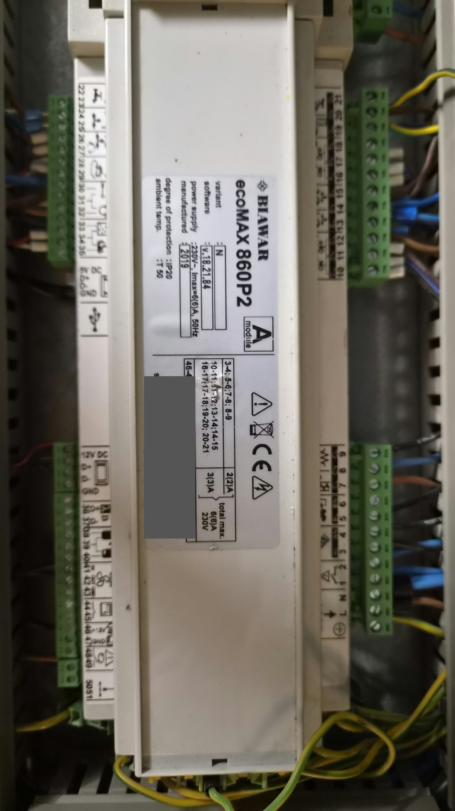

# Kocioł Pellux 200 Touch — sprzęt i ustawienia regulatora

Ustalenia z 2026-10-03: co jest zamontowane w kotle, jak regulator decyduje o rozpaleniu i
pracy pomp oraz plan ustawień na czas pracy drugiego źródła ciepła (pompy ciepła). Dokument
jest uzupełniany w miarę kolejnych ustaleń. Podłączenie sterownika pieca do magistrali:
[piec-pellux200.md](piec-pellux200.md) i [rysunek](img/podlaczenie-kotla.svg).

## 1. Zamontowany sprzęt

Zdjęcia z kotła (numery seryjne zamaskowane):

| Element | Oznaczenie z tabliczki | Zdjęcie |
|---|---|---|
| Regulator, moduł A | **Biawar ecoMAX 860P2**, wykonanie N, oprogramowanie **v18.21.84**, rok 2019, 230 V, IP20 | [kociol-modul-a-ecomax860p2.png](img/kociol-modul-a-ecomax860p2.png) |
| Panel sterujący | **Biawar ecoTOUCH 3**, wariant **ecoMAX860P2-N T5**, gniazdo RJ: `5…12V`, `D+`, `D−`, `GND` | [kociol-panel-ecotouch3.png](img/kociol-panel-ecotouch3.png) |
| Sterownik siłownika zaworu (ochrona powrotu) | **Biawar ecoDRIVE**, 230 V, 30 W, rok 2019 | [kociol-ecodrive.png](img/kociol-ecodrive.png) |

Wnioski dla sterownika pieca:

- Panel ecoTOUCH 3 łączy się z modułem A kablem z wtykiem RJ (G2): zasilanie 5…12 V,
  **D+, D−** i GND. Zaciski śrubowe `12V DC / D+ / D− / GND` modułu A to **G4** — wejście
  panelu pokojowego; jest do nich podłączony sterownik pokojowy (2026-10-03). Panel kotła,
  panel pokojowy i ecoNET dzielą jedną magistralę RS-485 ecoMAX, więc ramki `SensorData`
  powinny być na G4 tak samo jak na G2 (do potwierdzenia odczytem).
- **Punkt podłączenia sterownika pieca: G4**, tylko **D+ i D−**, pod te same zaciski co
  przewody sterownika pokojowego (równolegle; sterownik pieca tylko słucha, więc nie
  przeszkadza). 12V DC i GND z G4 nie podłączamy. Zapasowo: para D+/D− kabla panelu (G2).
  Rysunek: [podlaczenie-kotla.svg](img/podlaczenie-kotla.svg).
- Przy sterowniku pokojowym regulator ma prawdopodobnie `Wybór termostatu = ecoSTER`; to
  wpływa na wariant automatyczny w punkcie 3 (jedno źródło termostatu). Model sterownika
  pokojowego — do uzupełnienia.
- Zaciski 36/37 (`D+`, `D−`, opis `B`) to osobna magistrala do modułu B/C — druga opcja,
  gdyby na magistrali panelu nie było ramek.
- Instrukcja regulatora wprost dla „ecoMAX 860P2” nie została znaleziona; najbliższe są
  instrukcja panelu ecoMAX ze strony Pellux (niżej, źródło 1) i instrukcje 860P/860P3.
  Nazwy pozycji menu na panelu mogą się nieznacznie różnić.

## 1a. Co jest na magistrali (nasłuch 2026-10-03, zaciski G4)

Wersje z panelu (`Informacje 8/8`): panel 18.11.7, moduł A 18.21.85P1, panel pokojowy
**eSTER_x80 T1** 1.25.93, moduł internetowy **ISM_X-SMART** 1.22.41. Na magistrali ok. 290
poprawnych ramek na minutę, 0 błędów, polaryzacja normalna (firmware pieca 1.0.2/1.0.3,
diagnostyka na konsoli USB):

| Typ ramki | Od → do | Rozmiar | Co to jest |
|---|---|---|---|
| `0x08` | regulator `0x45` → wszyscy `0x00`, co 2 s | 313 B | **RegulatorData** — bieżące dane regulatora (mapa niżej) |
| `0x30` | `0x45` → `0x56`, co 2 s | 0 B | CheckDevice: regulator szuka ecoNET pod `0x56` — nikt nie odpowiada |
| `0x40` | `0x45` → `0x57`, `0x58` | 0 B | ProgramVersion (inne moduły) |
| `0x0a` | `0x45` → `0x50`, `0x55` | 0 B | zapytania do paneli |
| `0x89` | `0x50` (panel kotła), `0x51` (eSTER) → wszyscy | 26 / 48 B | zaczynają się od „TIME”; eSTER niesie m.in. 20,0 i 21,8 °C |
| `0x6b` / `0xeb` | `0x45` ↔ `0x59` | 31 / 256 B | prawdopodobnie moduł ISM X-SMART |
| `0x6a` / `0xea` | `0x50` ↔ `0x59` | 5 / 14 B | panel ↔ ISM |

**SensorData (`0x35`) nie występuje**: regulator wysyła ją tylko do modułu ecoNET, który się
przedstawi na CheckDevice (wymaga nadawania — etap 2). Dlatego odczyt opieramy na
**RegulatorData (`0x08`)**, którą słychać bez nadawania.

Mapa RegulatorData tego regulatora (offset = bajt danych ramki, od 0; float32 LE; NaN =
czujnik niepodłączony). Porównanie zrzutów z panelem przy postoju kotła (kocioł 23,0 °C,
pogodowa 11,0, mieszacz 1 19,8, mieszacz 2 20,0, CWU 24,3, zadana CWU 55, zadane mieszaczy
40 / 27):

| Offset | Typ | Znaczenie | Pewność |
|---|---|---|---|
| 81 | float | 22,6–22,9 °C — CWU albo podajnik | do potwierdzenia |
| 85 | float | temperatura mieszacza 1 | potwierdzone |
| 89 | float | temperatura mieszacza 2 | potwierdzone |
| 93 | float | temperatura zewnętrzna (pogodowa) | potwierdzone |
| 97, 113–165 | float NaN | czujniki niepodłączone (spaliny, powrót, bufor…) | zgodne z „---” na panelu |
| 105 | float | **temperatura kotła** | potwierdzone |
| 169 | bajt | **temperatura zadana CWU** (55) | potwierdzone |
| 170 / 171 | bajt | temperatury zadane mieszacza 1 / 2 (40 / 27) | potwierdzone |
| 175 | bajt | **temperatura zadana kotła** (67) | potwierdzone |

Do ustalenia przy pracy kotła: stan (rozpalanie, praca, nadzór…), płomień, moc, wyjścia
(nadmuch, podajnik, pompy). Układ ramki zależy od schematu regulatora (PyPlumIO pobiera go
zapytaniem `0x55`), więc mapa dotyczy tego regulatora i tej wersji oprogramowania.

## 2. Kiedy kocioł rozpala i kiedy pracują pompy

| Zachowanie | Parametr (menu) | Wartość fabryczna | U nas (obserwacja) |
|---|---|---|---|
| Rozpalenie, gdy temperatura kotła < **temperatura zadana − histereza** | Temperatura zadana kotła (`Menu → Ustawienia kotła`) | — | **67 °C** (panel i bajt 175 RegulatorData) |
| | Histereza kotła (`Ustawienia serwisowe → Ustawienia kotła → Modulacja mocy`) | **5 °C** (źródło 1, str. 26) | do odczytu w menu serwisowym; rozpala przy ok. 55 °C, więc prawdopodobnie ok. **12 °C** |
| Pompa CWU włącza się, gdy CWU < **zadana CWU − histereza zasobnika CWU** | Temperatura zadana CWU, Histereza zasobnika CWU (`Menu → Ustawienia CWU`) | — | zadana CWU **55 °C**, histereza CWU **15 °C** (panel, 2026-10-03) → ładowanie CWU poniżej 40 °C |
| Pompa CO pracuje dopiero powyżej progu (ochrona kotła przed wychłodzeniem i roszeniem) | Temperatura załączenia pompy CO (`Ustawienia serwisowe → Ustawienia CO i CWU`) | nie podana w dokumentacji Pellux | pompy stoją poniżej 50 °C |
| Obniżenie temperatury zadanej przy rozwartym styku termostatu | Termostat pokojowy kotła (`Ustawienia serwisowe → Ustawienia kotła → Modulacja mocy`) | **0 °C**, maks. 30 °C (źródło 1, str. 26) | — |
| Wejście termostatu | Wybór termostatu (`Ustawienia serwisowe → Ustawienia kotła`): Wyłączony / Uniwersalny / ecoSTER | — | — |
| Dolna granica temperatury zadanej — także ustawianej automatycznie (obniżenia, termostat) | Minimalna temperatura kotła (`Ustawienia serwisowe → Ustawienia kotła`) | — | — |
| Przymknięcie zaworu przy zimnym powrocie | Ochrona powrotu: Minimalna temperatura powrotu (ecoDRIVE) | — | 40 °C |
| Progi zmniejszania mocy w pracy (nie start) | 50% Histereza H2 / 30% Histereza H1 | 3 °C / 1 °C (źródło 1, str. 26) | — |

„—” = brak w znalezionej dokumentacji; wartość odczytać na panelu.

## 3. Plan: pompa ciepła jako drugie źródło (do 50 °C)

Problem: pompa ciepła grzeje wodę najwyżej do 50 °C, a przy obecnych nastawach kocioł
rozpala przy 55 °C, a pompy CO stoją poniżej 50 °C — ciepło z pompy ciepła nie dochodzi do
instalacji, a kocioł i tak się rozpala.

Na czas pracy pompy ciepła:

1. **Temperatura załączenia pompy CO → ok. 40 °C**, żeby pompy pracowały na wodzie 40–50 °C.
   Ochrona przed roszeniem dotyczy palącego się kotła; gdy wodę grzeje pompa ciepła, kocioł
   stoi.
2. **Próg rozpalenia poniżej tego, co daje pompa ciepła (np. ok. 40 °C)** — kocioł zostaje
   rezerwą. Dwie drogi:
   - **ręcznie, bez menu serwisowego:** obniżyć temperaturę zadaną kotła z 67 °C do ok.
     **52 °C** (przy histerezie ok. 12 °C start przy ok. 40 °C); Minimalna temperatura kotła
     (serwis) musi na to pozwalać. Albo w menu serwisowym histereza kotła ok. 12 → 27 °C przy
     zadanej 67 °C. Po zakończeniu pracy pompy ciepła z powrotem 67 °C (i ewentualnie
     histereza) oraz pompa CO 50 °C;
   - **automatycznie, przez wejście termostatu:** Wybór termostatu = Uniwersalny, Termostat
     pokojowy kotła = 20 °C (rozwarty styk obniża zadaną 60 → 40 °C, start przy 35 °C),
     **Minimalna temperatura kotła ≤ 40 °C** (inaczej obniżenie się nie zmieści). Styk
     przełącza się przy włączaniu pompy ciepła — może to robić przekaźnik **Włącznika**
     (`devices/switch`): rozwarty, gdy pracuje pompa ciepła.
3. **Ochrona powrotu 40 °C** bez zmian — przy 45–50 °C nie zadziała (chyba że woda z pompy
   ciepła wraca przez zawór ochrony powrotu; zależy od hydrauliki).

Do sprawdzenia przed wdrożeniem:

- hasło do menu serwisowego (instrukcje go nie podają; serwis / producent) i zgoda serwisu
  Pellux na zmiany (gwarancja);
- który stan styku termostatu (zwarty / rozwarty) daje obniżenie — sprawdzić na kotle;
- czy przy obniżeniu z termostatu pompy CO nadal pracują;
- schemat hydrauliki: gdzie pompa ciepła oddaje ciepło (do kotła, do powrotu, do bufora).

Sterownik pieca (`devices/pellet-boiler-pelux200`) tylko odczytuje magistralę i nie zmienia
ustawień regulatora. Zmiana nastaw z chmury wymagałaby nadawania na magistralę (etap 2,
niezaimplementowany).

## Źródła

1. [Instrukcja obsługi i montażu — Panel dotykowy ecoMAX (pellux.pl)](https://pellux.pl/app/uploads/2017/02/26571_Panel_dotykowy.pdf),
   str. 7 (POSTÓJ i rozpalenie), 22–26 (menu serwisowe, wartości domyślne), 29–30 (opisy
   parametrów kotła, CO i CWU).
2. [Instrukcja kotła Pellux 200 Touch](pellux200-dokumentacja/kociol-Pellux-200-Touch-instrukcja.pdf),
   str. 33–38 (menu użytkownika i serwisowe).
3. [Instrukcja ecoMAX 860P TOUCH](pellux200-dokumentacja/ecoMAX-860P-TOUCH-instrukcja.pdf),
   str. 8, 12, 41.
4. [Regulator ecoMAX860P3 — instrukcja (kipi.pl)](https://kipi.pl/wp-content/uploads/2021/03/Instrukcja-obslugi-regulatora-ecoMAX860P3-simTOUCH-ST4.pdf).
