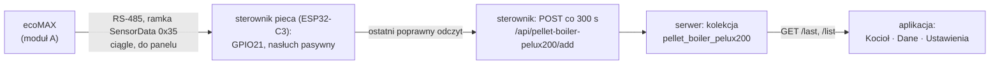
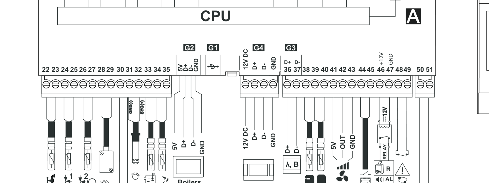
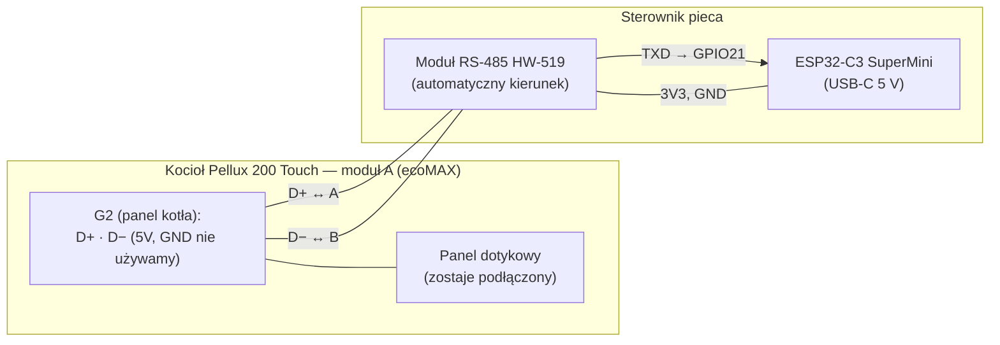
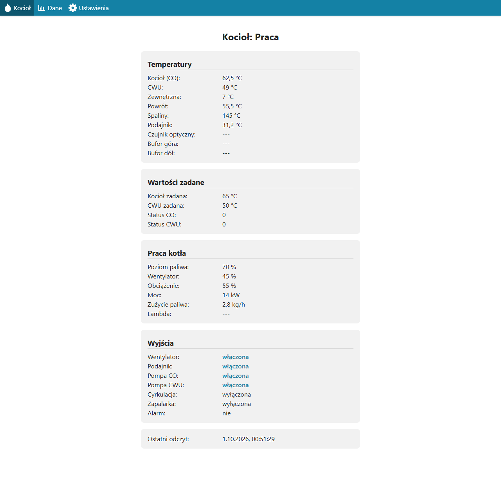
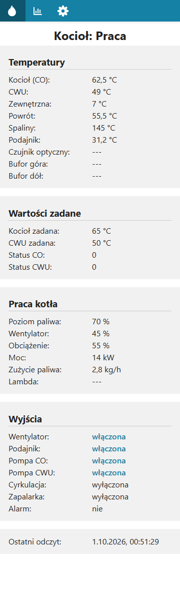
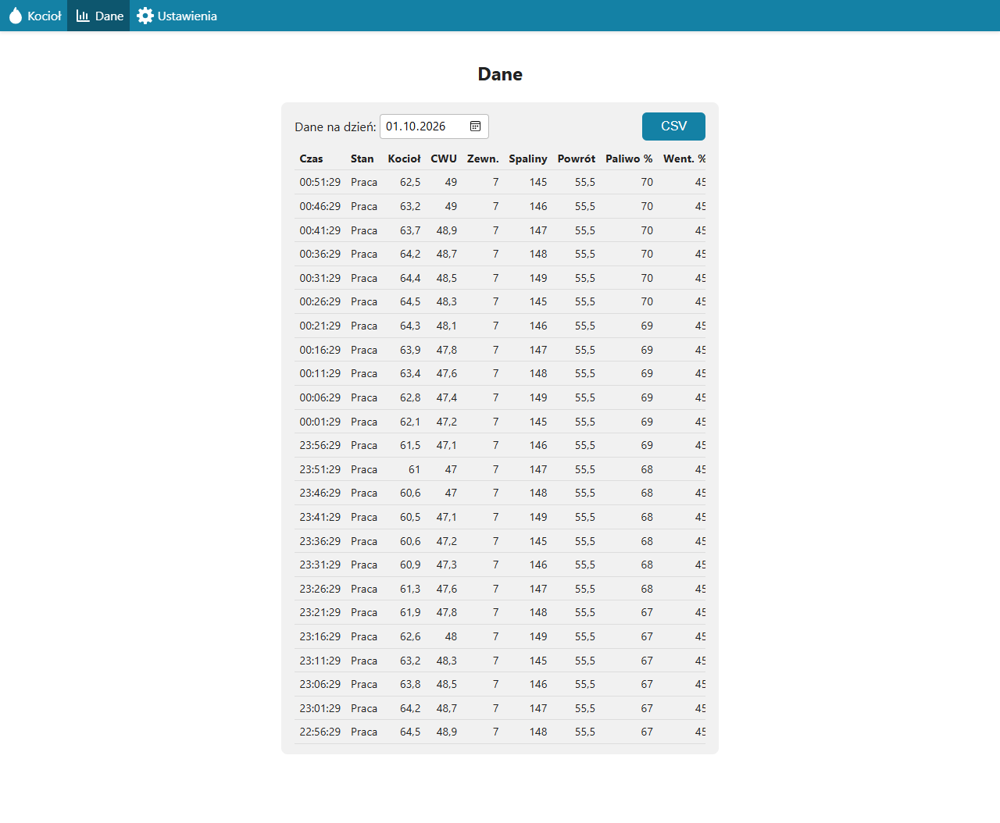

# Piec Pellux 200 (ecoMAX): podłączenie, protokół i dane

Jeden dokument dla sterownika pieca: odczyt kotła pelletowego Plum Pellux 200 Touch
z regulatorem ecoMAX (rodzaj `pellet-boiler-pelux200`) na osobnej płytce **ESP32-C3
SuperMini z modułem RS-485 HW-519** (firmware w tym katalogu, instrukcja:
[README.md](../README.md)). Opisuje, jak fizycznie podłączyć sterownik, jak wygląda
protokół na magistrali, co odczytujemy i jak to wygląda w chmurze i aplikacji. Opis po
stronie serwera i klienta: CLAUDE.md, punkt 5c.

Do 2026-10-02 tę rolę pełnił sterownik `co` (drugi UART, osobny konwerter z pinem
DE/RE); od 2026-10-03 działa na osobnej płytce, a `co` obsługuje tylko pompę ciepła i PV.

**Stan:** etap 1, tylko odbiór. Format ramek pochodzi z biblioteki PyPlumIO
(reverse-engineering, nie dokumentacja producenta) i **nie był sprawdzony na kotle**.
Punkt wpięcia wynika z dokumentacji producenta i nie był sprawdzony przy kotle. Płytkę
(odbiór na GPIO21, automatyczna polaryzacja, wysyłka do chmury) sprawdzono 2026-10-03 na
biurku, z komputerem udającym kocioł ([README](../README.md#test-na-biurku)). Przykładowa
ramka jest zbudowana według tego opisu i sprawdzona parserem z firmware, nie nagrana
z kotła.

## 1. Kocioł i sterownik

- Kocioł **Pellux 200 Touch** (Plum, palnik PBMAX 20.1) ma regulator z rodziny **ecoMAX**
  z osobnym panelem dotykowym połączonym łączem RS-485 z modułem A (generacja TOUCH,
  860P/920P). Z tabliczek (2026-10-03): **Biawar ecoMAX 860P2**, moduł A, wykonanie N,
  oprogramowanie v18.21.84; panel **ecoTOUCH 3** (ecoMAX860P2-N T5, gniazdo RJ: 5…12V,
  D+, D−, GND); ochrona powrotu przez sterownik siłownika **ecoDRIVE**. Zdjęcia i
  ustawienia regulatora: [kociol-ustawienia.md](kociol-ustawienia.md).
- Kocioł obsługuje moduł internetowy ecoNET300 (Wi-Fi/LAN, econet24.com), którego **nie
  mamy**, dlatego czytamy RS-485 bezpośrednio.
- Dokumentacja producenta (PDF-y i schematy) jest w
  [pellux200-dokumentacja/](pellux200-dokumentacja/README.md).

## 2. Droga danych



Sterownik niczego nie pyta kotła: ecoMAX sam wysyła `SensorData` do panelu, a sterownik
podsłuchuje wspólną magistralę. Do chmury idzie **ostatni** poprawny odczyt raz na
`poll_interval_seconds` (domyślnie 300 s, ustawiane w aplikacji), tylko gdy jest młodszy
niż 60 s.

## 3. Podłączenie

### Płytka sterownika

**ESP32-C3 SuperMini** (zasilanie i konsola przez USB-C, 5 V) i moduł **RS-485 HW-519**,
który sam przełącza kierunek transmisji (nie ma pinu DE/RE). Etap 1 to tylko odbiór,
więc z modułu do płytki idzie jeden przewód sygnałowy. Stałe są w `src/firmware.hpp`
(`ECOMAX_RX_PIN = 21`, `ECOMAX_BAUD = 115200`).

| HW-519 | ESP32-C3 SuperMini | Uwagi |
|---|---|---|
| TXD (wyjście: dane odebrane z magistrali) | GPIO21 | odbiór, UART1; opisy HW-519 są od strony modułu (przy odbiorze miga dioda TXD); sprawdzone 2026-10-03 |
| RXD | — | nieużywany: pin TX UART-u nie jest przypisany, sterownik nigdy nie nadaje |
| VCC | 3V3 | sprawdzone 2026-10-03; przy 5V wyjście TXD dawałoby 5 V na GPIO21, czego ESP32-C3 nie toleruje |
| GND | GND | masa modułu |

### Gdzie wpiąć się w kotle

Na płytce modułu A nie ma gniazda RJ11, tylko zaciski śrubowe (schemat: rozdział 12
instrukcji kotła, strona 55 w druku, 24 w PDF):



| Gniazdo | Zaciski | Do czego służy |
|---|---|---|
| G2 | 5V, D+, D−, GND | panel kotła („Boiler's panel” BP) |
| G4 | 12V DC, D+, D−, GND | panel pokojowy ecoSTER TOUCH („Room panel” RP) |
| G3 | 36 = D+, 37 = D− | magistrala dwuprzewodowa do modułu B/C i sondy lambda (λ, B) |
| G1 | USB | aktualizacja oprogramowania |

**Wpinamy się w G2**, równolegle do przewodów panelu, tylko do D+ i D−: tam ecoMAX
rozmawia z panelem i tam biegną ramki `SensorData`. G3 zostaje drugą opcją, jeśli na G2
nie zobaczymy ramek (to magistrala dla modułów B/C, może mieć inny protokół). Pełny
schemat elektryczny kotła: [schemat-polaczen-elektrycznych-str24.png](pellux200-dokumentacja/schemat-polaczen-elektrycznych-str24.png).

### Schemat



| Z (kocioł, moduł A, gniazdo G2) | Do (HW-519) | Uwagi |
|---|---|---|
| D+ | A (RS-485 A) | równolegle do przewodu panelu |
| D− | B (RS-485 B) | równolegle do przewodu panelu |
| 5V | — | **nie podłączać** |
| GND | — | na początek **nie podłączać** |

### Odbiór i nadawanie

RS-485 jest półdupleksem: para D+/D− służy naprzemiennie do odbioru i nadawania.

- **Odbiór (etap 1, jedyny zaimplementowany):** ramki z D+/D− → A/B → TXD HW-519 →
  GPIO21 → UART1 → parser (`ecomax_frame.*`).
- **Nadawanie (etap 2, nie zaimplementowane):** po `CheckDevice` (`0x30`) od kotła
  sterownik wysłałby ramkę `DeviceAvailable` (`0xB0`) i odebrał `SensorData` adresowane
  do siebie; HW-519 sam przełącza się na nadawanie na czas wysyłki. W teście na biurku
  (2026-10-03) nadawanie z C3 przez HW-519 **nie działało** — przed etapem 2 trzeba to
  wyjaśnić. Linia nie może zostać w trybie nadawania: zablokowałaby panel i kocioł. Adres
  sterownika na magistrali kotła (w PyPlumIO `0x56`) i czasy trzeba ustalić z nasłuchu.

### Zasady i ostrzeżenia

- **Tylko D+ i D−.** Instrukcja modułów B/C każe łączyć te linie wyłącznie dwuprzewodowo;
  czterema przewodami „grozi to uszkodzeniem regulatora”. Zacisku 5V obok D+ nie ruszać.
- **Nie mieszać z magistralą CHPC/DTU.** Tam jest 9600 baud i `co` jest masterem, a ecoMAX
  ma własnego mastera, nadaje cyklicznie i pracuje na 115200 baud. Jego ramki wpadałyby do
  odczytów CHPC, który odrzuca komendę z obcymi bajtami w jednym odczycie (CLAUDE.md,
  punkt 7). Dlatego kocioł ma osobną płytkę i osobny moduł RS-485.
- **Poziom 3,3 V na GPIO21.** HW-519 zasilać z 3V3 płytki C3 (sprawdzone, odbiór bez
  błędów); ESP32-C3 nie toleruje 5 V na wejściu.
- **Masa kotła i ESP32.** Nie łączymy ich na początku. Gdy ramki będą nieczytelne,
  zmierzyć multimetrem różnicę potencjałów; bezpieczniejszy jest konwerter z izolacją
  galwaniczną.
- **Zasilanie kotła wyłączone** na czas wpinania przewodów.
- Zamiana D+ i D− niczego nie uszkadza, daje tylko nieczytelne ramki, a te sterownik
  wykrywa i sam odwraca sygnał ([automatyczna polaryzacja](../README.md#automatyczna-polaryzacja)).

## 4. Protokół na magistrali (wg PyPlumIO)

Warstwa fizyczna: RS-485 half-duplex, **115200 baud** 8N1 (stała `ECOMAX_BAUD` w `firmware.hpp`).

Ramka (little-endian): `0x68` | długość całej ramki, uint16 (od `0x68` do `0x16`
włącznie) | adres odbiorcy | adres nadawcy | typ nadawcy | wersja ecoNET | typ ramki |
dane | BCC | `0x16`. Nagłówek to 7 bajtów, minimalna ramka 10 B. **BCC to XOR wszystkich
bajtów od `0x68` do ostatniego bajtu danych** (bez samego BCC i `0x16`). Adresy: `0x00`
broadcast, `0x45` ecoMAX, `0x51` ecoSTER (panel), `0x56` ecoNET (PyPlumIO).

| Ramka | Dec / Hex | Znaczenie |
|---|---|---|
| `CHECK_DEVICE` / `DEVICE_AVAILABLE` | 48 / `0x30`, 176 / `0xB0` | sprawdzenie obecności urządzenia i odpowiedź (etap 2) |
| `REGULATOR_DATA` | 8 / `0x08` | cykliczny broadcast, klucze numeryczne wymagają schematu (`0x55`/`0xD5`) — nie używamy |
| `SENSOR_DATA` | 53 / `0x35` | zestaw czujników i stanów — **tego odczytujemy** |
| `PROGRAM_VERSION`, `UID`, parametry `0x31`/`0xB1` | 64/192, 57/185, 49/177 | wersja, identyfikator, parametry edytowalne — nie używamy |

Sterownik przyjmuje `SENSOR_DATA` tylko od nadawcy `0x45` (ecoMAX). Parser jest defensywny:
sprawdza granice, liczy ramki odrzucone, resynchronizuje się po śmieciach (szuka
następnego `0x68`) i nie czyta poza buforem.

## 5. Co odczytujemy

| Pole w JSON | Znaczenie | Jednostka | Skąd w ramce SensorData |
|---|---|---|---|
| `state` | stan pracy kotła, 0–11 (tabela niżej) | — | bajt 0 |
| `fan`, `feeder`, `heating_pump`, `water_heater_pump`, `circulation_pump`, `lighter`, `alarm` | wyjścia: wentylator, podajnik, pompa CO, pompa CWU, cyrkulacja, zapalarka, alarm | tak/nie | bity 0–6 maski wyjść (bajty 1–4) |
| `heating_temp` | temperatura kotła (CO) | °C | tablica temperatur, indeks 0 |
| `feeder_temp` | temperatura podajnika | °C | indeks 1 |
| `water_heater_temp` | temperatura CWU | °C | indeks 2 |
| `outside_temp` | temperatura zewnętrzna | °C | indeks 3 |
| `return_temp` | temperatura powrotu | °C | indeks 4 |
| `exhaust_temp` | temperatura spalin | °C | indeks 5 |
| `optical_temp` | czujnik optyczny (palnik) | °C | indeks 6 |
| `upper_buffer_temp`, `lower_buffer_temp` | bufor góra i dół | °C | indeksy 7 i 8 |
| `heating_target`, `water_heater_target` | temperatury zadane kotła i CWU | °C | 4 bajty po temperaturach |
| `heating_status`, `water_heater_status` | status obiegu CO i CWU (liczba, znaczenie nieudokumentowane) | — | 4 bajty po temperaturach |
| `fuel_level` | poziom paliwa w zasobniku | % | bajt po liście alertów |
| `fan_power` | moc wentylatora | % | float32 |
| `boiler_load` | obciążenie kotła | % | bajt |
| `boiler_power` | moc kotła | kW | float32 |
| `fuel_consumption` | zużycie paliwa | kg/h | float32 |

Stany `state`: 0 Wyłączony, 1 Stabilizacja, 2 Rozpalanie, 3 Praca, 4 Nadzór, 5 Pauza,
6 Czuwanie, 7 Wygaszanie, 8 Alarm, 9 Ręczny, 10 Rozszczelnianie, 11 Inny.

Układ danych `SensorData` po bajcie typu ramki: stan (1 B), maska wyjść (uint32), flagi
wyjść (uint32, pomijane), liczba temperatur N, N × {indeks, float32}, cztery bajty
(zadana CO, status CO, zadana CWU, status CWU), liczba alertów M i M bajtów alertów,
poziom paliwa, bajt `transmission` (pomijany), moc wentylatora, obciążenie, moc kotła,
zużycie paliwa. Brak wartości: float NaN albo bajt `0xFF` — pole nie trafia do JSON.
Poziom paliwa większy niż 100 jest pomniejszany o 101.

**Czego nie odczytujemy w etapie 1:** poziom sondy lambda (`lambda_level` jest w kontrakcie,
ale dekoder go nie wypełnia), mieszacze, termostaty pokojowe, wersje modułów, treść
alertów i pozostałe temperatury (solar, kominek, wymiennik).

### Przykład: ramka na magistrali

Ramka `SensorData` od ecoMAX do panelu (60 bajtów), zbudowana według opisu PyPlumIO:

```text
68 3C 00 51 45 45 05 35 03 07 00 00 00 04 00 00 00 04 00 00 00 7A 42 02 00 00 40 42
03 00 00 E0 40 05 00 00 11 43 41 00 32 00 00 46 00 00 00 34 42 37 00 00 60 41 33 33
33 40 DB 16
```

| Bajty | Znaczenie |
|---|---|
| `68` | początek ramki |
| `3C 00` | długość całej ramki, 60 |
| `51` `45` `45` `05` | odbiorca (panel), nadawca (ecoMAX), typ nadawcy, wersja ecoNET |
| `35` | typ ramki: SensorData |
| `03` | stan: 3 = Praca |
| `07 00 00 00` | wyjścia: bity 0, 1, 2 = wentylator, podajnik, pompa CO |
| `04 00 00 00` | flagi wyjść (pomijane) |
| `04` | cztery temperatury |
| `00` + `00 00 7A 42` | indeks 0 (kocioł) = 62,5 °C |
| `02` + `00 00 40 42` | indeks 2 (CWU) = 48,0 °C |
| `03` + `00 00 E0 40` | indeks 3 (zewnętrzna) = 7,0 °C |
| `05` + `00 00 11 43` | indeks 5 (spaliny) = 145,0 °C |
| `41 00 32 00` | zadana kotła 65 °C, status CO 0, zadana CWU 50 °C, status CWU 0 |
| `00` | brak alertów |
| `46` | poziom paliwa 70 % |
| `00` | bajt pomijany (transmission) |
| `00 00 34 42` | moc wentylatora 45,0 % |
| `37` | obciążenie 55 % |
| `00 00 60 41` | moc kotła 14,0 kW |
| `33 33 33 40` | zużycie paliwa 2,8 kg/h |
| `DB` | BCC (XOR wszystkich poprzednich bajtów) |
| `16` | koniec ramki |

### Przykład: co trafia do chmury

```json
{
  "state": 3,
  "heating_temp": 62.5, "water_heater_temp": 48.0,
  "outside_temp": 7.0, "exhaust_temp": 145.0,
  "heating_target": 65, "heating_status": 0,
  "water_heater_target": 50, "water_heater_status": 0,
  "fuel_level": 70, "fan_power": 45.0, "boiler_load": 55,
  "boiler_power": 14.0, "fuel_consumption": 2.8,
  "fan": true, "feeder": true, "heating_pump": true,
  "water_heater_pump": false, "circulation_pump": false,
  "lighter": false, "alarm": false
}
```

Sterownik nie wysyła `time` (serwer i tak bierze czas ze swojego zegara). Serwer
zapisuje dokument w kolekcji `pellet_boiler_pelux200` i odpowiada `{"poll_interval_seconds": 300}`.

## 6. Jak wygląda w aplikacji

Zrzuty z klienta (`client/src/devices/pellet-boiler-pelux200/pages/`) z **przykładowymi
danymi**: odpowiedzi API zostały podstawione w przeglądarce, nie pochodzą z prawdziwego
kotła. Menu ma trzy widoki: Kocioł, Dane, Ustawienia. Brak wartości pokazuje `---`.

**Kocioł (`/`)** — bieżące dane ostatniego odczytu, odświeżane co 30 s. Gdy odczyt jest
starszy niż 3 interwały odpytywania, pod czasem odczytu pojawia się „Dane nieaktualne”.



Na telefonie (360 px) karty sięgają krawędzi ekranu, a menu ma same ikony:



**Dane (`/data`)** — wybór dnia, eksport CSV, jeden wiersz na odczyt (co 5 min przy
domyślnym interwale). Tabela ma 12 kolumn (czas, stan, kocioł, CWU, zewn., spaliny,
powrót, paliwo %, wentylator %, moc kW, pompa CO, pompa CWU) i przewija się poziomo we
własnym kontenerze.



**Ustawienia (`/settings`)** — pole „Odpytywanie pieca [min]” (0,5–60 min) i sekcja
„Sterownik” z nazwą, `deviceId` i Root ID. Nowy interwał sterownik pobiera przy
następnej wysyłce danych.


## 7. Do sprawdzenia nasłuchem na kotle

1. Model ecoMAX i wersja oprogramowania (MENU → Informacje).
2. Czy na G2 widać ramki od `0x68` do `0x16` z typem `0x35` od nadawcy `0x45`. Jeśli nie,
   powtórzyć na G3 (zaciski 36 = D+, 37 = D−).
3. Prędkość: 115200 baud według PyPlumIO; gdy ramki są odrzucane w obu polaryzacjach
   (liczniki na stronie `/` sterownika), sprawdzić inne.
4. Czy `SensorData` w ogóle płynie do panelu, czy trzeba odpowiadać na `CheckDevice`
   (etap 2).
5. Założenia dekodera bez potwierdzenia: bajt licznika alertów liczony osobno od bajtów
   alertów, odejmowanie 101 od poziomu paliwa, nadawca `0x45`.
6. Liczniki na stronie `/` sterownika przy kotle: bajty, ramki (w tym `SensorData`),
   odrzucone i wybrana polaryzacja.

## 8. Źródła

- PyPlumIO — protokół: <https://pyplumio.denpa.pro/protocol.html>, ramki:
  <https://pyplumio.denpa.pro/frames.html>, połączenie:
  <https://pyplumio.denpa.pro/connecting.html>, repozytorium:
  <https://github.com/denpamusic/PyPlumIO> (kod w `frames/__init__.py`,
  `structures/sensor_data.py`, `const.py`)
- Instrukcja kotła Pellux 200 Touch, regulator ecoMAX, ecoNET300:
  [pellux200-dokumentacja/](pellux200-dokumentacja/README.md)
- Karta produktu: <https://webgallery.progettofuoco.com/en/prodotto/pellux-200/>
