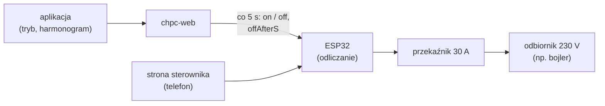
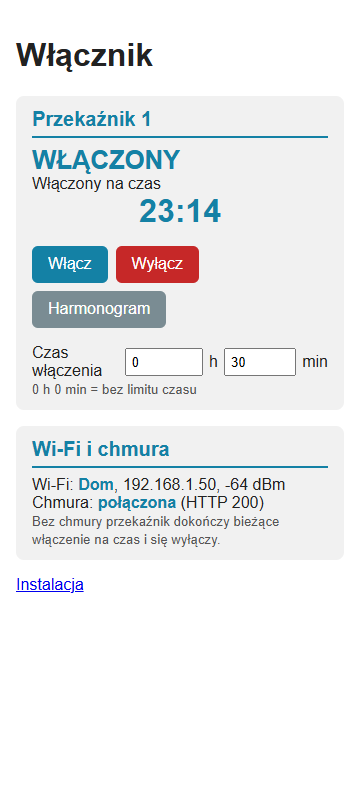
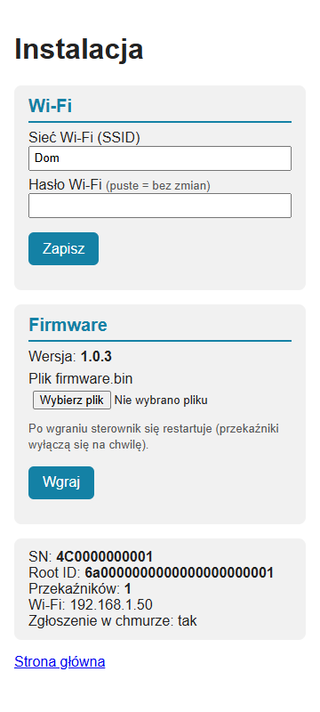

# Firmware włącznika — opis biznesowy

[← Dokumentacja systemu](../../../docs/README.md) · **1. Opis biznesowy** · [2. Zasada działania](2-zasada-dzialania.md) · [3. Dokumentacja techniczna](3-dokumentacja-techniczna.md) · [English](en/1-business-description.md)

## Po co jest ten sterownik

Włącznik włącza i wyłącza odbiornik 230 V (pierwszy steruje grzałką bojlera) według harmonogramu z chmury albo na polecenie z aplikacji lub ze strony sterownika. Działa jak harmonogram pompy ciepła, ale bez temperatur.

Sterownik (gotowa płytka „ESP32 Relay AC X1” z ESP32-WROOM-32E, przekaźnikiem 30 A i zasilaczem 230 V, nazwa w aplikacji „Włącznik”):

- co 5 s **zgłasza stan przekaźnika** do chmury i **wykonuje polecenie** z odpowiedzi: włącz na N sekund, włącz bez limitu albo wyłącz;
- **sam odlicza czas włączenia**, więc bez internetu dokończy bieżące włączenie i się wyłączy;
- pozwala z telefonu (sieć domowa albo własna sieć Wi-Fi sterownika) **zobaczyć stan** i **sterować przekaźnikiem** bez aplikacji;
- **zgłasza się do chmury sam** przy każdym starcie (z liczbą przekaźników) i **aktualizuje firmware przez sieć**.

Harmonogram, tryby i historię włączeń prowadzi chmura: opis w [module switch](../../../docs/moduly/switch/1-opis-biznesowy.md).

## Najważniejsza cecha: harmonogram zna tylko chmura

1. Sterownik pyta chmurę co 5 s (albo od razu, gdy chmura go obudzi przez WebSocket) i dostaje polecenie z czasem do wyłączenia.
2. Odlicza ten czas sam i wyłącza przekaźnik, także gdy sieć zniknie.
3. Bez chmury kolejne okno harmonogramu się nie włączy; „Włącz” i „Wyłącz” na stronie sterownika działają nadal.
4. Po restarcie (np. zanik zasilania) przekaźnik jest wyłączony, dopóki sterownik nie połączy się z chmurą.

## Strony sterownika (telefon)

Po starcie działa sieć Wi-Fi sterownika `Wlacznik-setup` (adres `10.11.17.1`); po minucie połączenia z siecią domową znika, a strony są pod adresem IP sterownika (widać go w aplikacji: Ustawienia → Sterownik).

| Strona główna | Instalacja |
|---|---|
|  |  |

*Zrzuty z emulatora stron sterownika (prawdziwy HTML z firmware, dane demonstracyjne).*

- **Strona główna** (bez logowania): karta każdego przekaźnika — stan („WŁĄCZONY” / „WYŁĄCZONY”), tryb z chmury, duże odliczanie przy włączeniu na czas i przyciski:
  - **„Włącz”**: na czas z pól „Czas włączenia [h] [min]” pod przyciskami (domyślnie wartość z chmury, 30 min); 0 h 0 min = bez limitu;
  - **„Wyłącz”** (czerwony): wyłącza i blokuje harmonogram;
  - **„Harmonogram”**: powrót do harmonogramu (bez chmury wyłącza przekaźnik).
  
  Karta „Wi-Fi i chmura”: sieć, adres, sygnał, stan połączenia z chmurą.
- **Instalacja** (login i hasło): Wi-Fi, wgranie pliku firmware, SN, Root ID, liczba przekaźników, stan zgłoszenia.

## Dla kogo

- **Właściciel** — steruje przekaźnikiem w aplikacji; na stronę sterownika zagląda, gdy nie ma internetu.
- **Instalator (elektryk)** — montuje płytkę w obudowie, podłącza 230 V i odbiornik, wgrywa pierwszy firmware, wpisuje Wi-Fi.

## Przed pierwszym wdrożeniem (lista kontrolna)

1. **Serwer pierwszy:** wdrożyć `main` na Render (ręczny build). Stary serwer odrzuci zgłoszenie typu `switch` (400).
2. **`src/secrets.h`** (lokalny, poza gitem, wzór `secrets.example.h`): nazwa i hasło punktu dostępowego (puste hasło = sieć otwarta), login `/install`, opcjonalnie domyślne Wi-Fi.
3. **Pierwsze wgranie** przez złącze P1 i przejściówkę USB-TTL ([część 3](3-dokumentacja-techniczna.md#pierwsze-wgranie-przez-złącze-p1)). Uwaga na zasilanie: pin 3V3 złącza to 3,3 V, a prąd z przejściówki nie wystarcza.
4. **Montaż** przez osobę uprawnioną do prac przy 230 V: zaciski wejścia 230 V, odbiornik na styku przekaźnika, obudowa, zabezpieczenie ([schemat](3-dokumentacja-techniczna.md#podłączenie-instalacja)).
5. **Wi-Fi**: telefonem do sieci `Wlacznik-setup`, strona `http://10.11.17.1/install`.
6. **W aplikacji**: nazwa przekaźnika (Ustawienia), harmonogram, ewentualnie gwiazdka „domyślny”.
7. **Kolejne wersje** przez sieć (strona firmware w aplikacji albo `/install`).

Stan wdrożenia: od 2026-10-03 na produkcji działa jeden włącznik z firmware 1.0.3, przekaźnik nazwany „Bojler”.

## Ograniczenia

- Bez chmury nie działa harmonogram (sterownik go nie zna); działa odliczanie bieżącego włączenia i strona sterownika.
- Po restarcie przekaźnik jest wyłączony do pierwszej odpowiedzi chmury.
- Nowe ustawienia z chmury (domyślny czas włączenia na stronie sterownika) i oferta aktualizacji docierają przy zgłoszeniu, czyli **przy starcie** sterownika.
- Strony sterownika są po HTTP, strona główna i `POST /relay` bez logowania, a sieć sterownika po starcie jest domyślnie otwarta: w tym czasie każdy w zasięgu może przełączyć przekaźnik.
- Sterownik wie tylko, że **ustawił pin przekaźnika** — nie mierzy prądu odbiornika.

## Słownik

| Pojęcie | Znaczenie |
|---|---|
| **Polecenie** | odpowiedź chmury na zgłoszenie stanu: włącz (na `offAfterS` sekund albo bez limitu) albo wyłącz |
| **Odliczanie** | czas do wyłączenia liczony przez sterownik; działa bez sieci |
| **Zmiana lokalna** | „Włącz” / „Wyłącz” / „Harmonogram” ze strony sterownika; czeka na wysłanie do chmury |
| **AP** | punkt dostępowy `Wlacznik-setup`: własna sieć Wi-Fi sterownika do konfiguracji |
| **OTA** | aktualizacja firmware przez sieć |
| **Złącze P1** | złącze programowania na płytce: `GND`, `RX`, `TX`, `3V3` |
