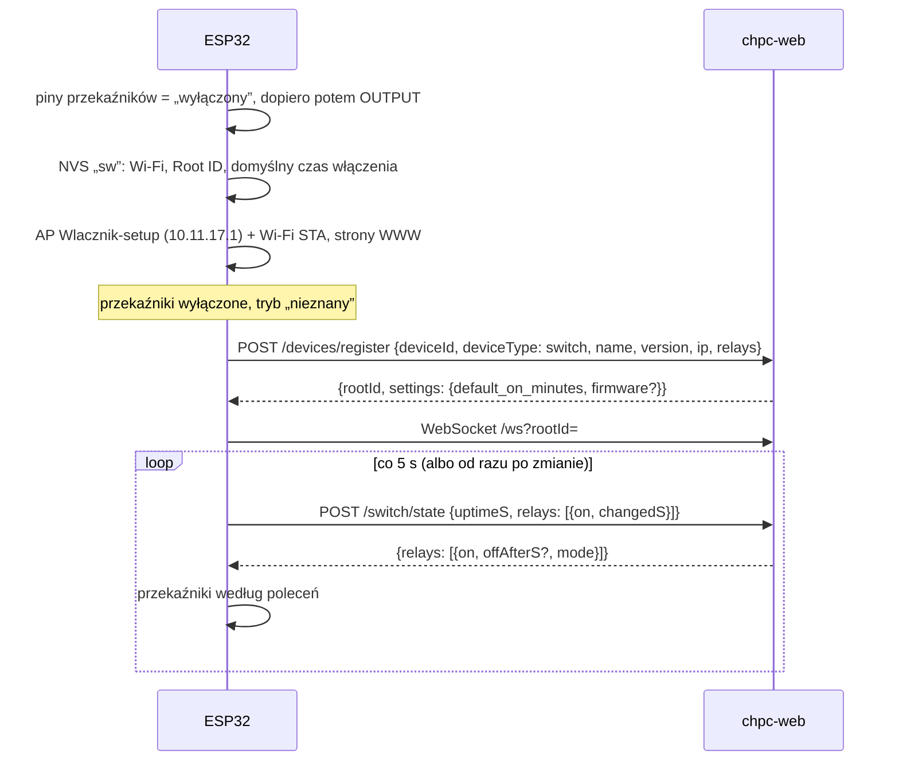
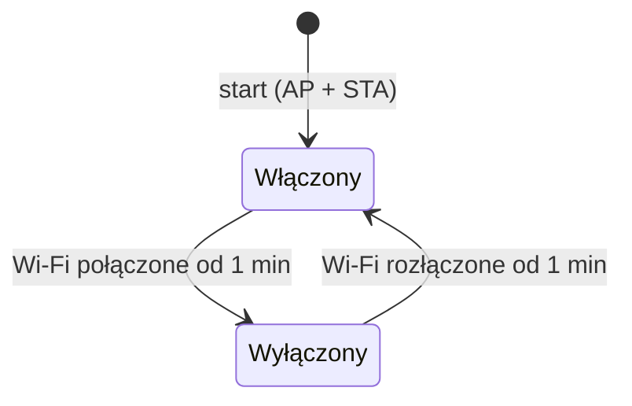
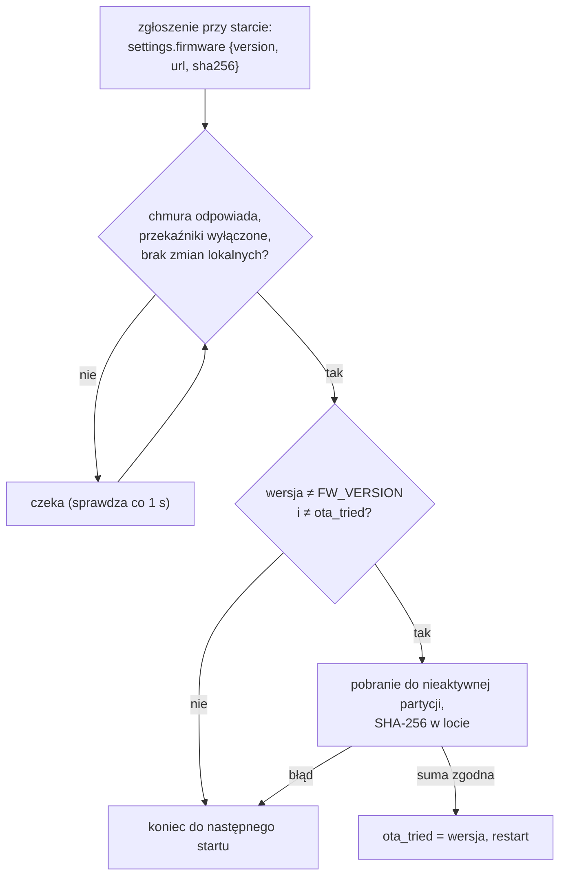

# Firmware włącznika — zasada działania

[← Dokumentacja systemu](../../../docs/README.md) · [1. Opis biznesowy](1-opis-biznesowy.md) · **2. Zasada działania** · [3. Dokumentacja techniczna](3-dokumentacja-techniczna.md) · [English](en/2-how-it-works.md)

## Start sterownika



- **Przekaźnik po starcie jest wyłączony.** Pin dostaje stan „wyłączony” przed przełączeniem na wyjście; włączy go dopiero polecenie chmury.
- **Bez zgłoszenia nie ma wymiany stanu.** Nieudane zgłoszenie jest ponawiane co 30 s; do tego czasu działa tylko strona sterownika.
- **Zgłoszenie jest raz na start** (i ponownie po 404/409). Domyślny czas włączenia i oferta OTA docierają więc przy starcie.

## Polecenia z chmury

Odpowiedź na każde zgłoszenie stanu niesie dla każdego przekaźnika `on`, ewentualnie `offAfterS` i `mode`:

| Polecenie | Co robi sterownik |
|---|---|
| `{on: true, offAfterS: N}` | włącza (jeśli był wyłączony) i ustawia wyłączenie za N s; każde kolejne polecenie przelicza ten czas od nowa |
| `{on: true}` | włącza bez limitu |
| `{on: false}` | wyłącza |
| `mode` | tylko do wyświetlenia na stronie sterownika |

**Odliczanie** jest sprawdzane w każdym obiegu pętli, niezależnie od sieci. Po jego końcu sterownik wyłącza przekaźnik, tryb na stronie zmienia się z „na czas” na „harmonogram” i od razu wysyła nowy stan do chmury.

Komunikat WebSocket `{"type":"operation"}` (zmiana trybu albo harmonogramu w aplikacji) powoduje zgłoszenie stanu od razu, więc zmiana z aplikacji działa w ciągu sekundy. Biblioteka WebSocket sama łączy się ponownie co 10 s po zerwaniu.

## Zmiana ze strony sterownika

```mermaid
sequenceDiagram
    participant P as strona / (telefon)
    participant E as ESP32
    participant S as chpc-web
    P->>E: POST /relay?n=1&mode=timer&minutes=30
    E->>E: przekaźnik od razu; pending (numer zmiany)
    E->>S: PUT /switch/mode {relay, mode, minutes, source: controller}
    alt 2xx albo 400
        S-->>E: OK → pending skasowane
    else błąd sieci / 5xx
        E->>E: ponowienie co 5 s
    end
    E->>S: POST /switch/state
    S-->>E: polecenie zgodne z nowym trybem
```

- **Do potwierdzenia zmiany polecenia chmury dla tego przekaźnika są pomijane** (`pending`), żeby odpowiedź wyliczona ze starego trybu nie cofnęła zmiany. Każda zmiana ma numer (`pendingSeq`): potwierdzenie starszej wysyłki nie kasuje nowszej zmiany.
- **„Włącz” na czas** wysyła do chmury minuty, które zostały (zaokrąglone w górę, co najmniej 1), więc ponowiona wysyłka nie wydłuża włączenia.
- **„Harmonogram”** z chmurą zostawia stan do najbliższej odpowiedzi (chmura zna okna). **Bez chmury** (brak udanej wymiany od 30 s) wyłącza przekaźnik, bo sterownik nie wie, czy okno trwa.
- **400** z chmury oznacza, że zmiana nie zostanie przyjęta; sterownik przestaje ją ponawiać.
- **404/409** (nieznany SN, Root ID innego urządzenia): sterownik kasuje Root ID, rozłącza WebSocket i zgłasza się ponownie.

## Pętla

W każdym obiegu `loop()`: strony WWW, WebSocket i odliczanie przekaźników. Co 1 s (albo od razu, gdy jest coś do wysłania) `tick()`:

1. Punkt dostępowy: wyłączenie po 1 min połączenia z Wi-Fi, włączenie po 1 min bez Wi-Fi.
2. Co 30 s linia stanu na konsoli.
3. Bez Wi-Fi — koniec.
4. Brak zgłoszenia w tym starcie → `POST devices/register` (co 30 s do skutku); bez zgłoszenia — koniec.
5. Niewysłane zmiany lokalne → `PUT switch/mode` (co 5 s albo od razu).
6. Wymiana stanu co 5 s albo od razu po zmianie.
7. OTA: raz na start, gdy chmura odpowiada, wszystkie przekaźniki są wyłączone i nie ma niewysłanych zmian.

Połączenie HTTPS jest jedno i stałe (keep-alive), limit zapytania 4 s, zgłoszenia 8 s. Nieudana wymiana stanu nie jest ponawiana — za 5 s idzie nowa.

## Czasy w zgłoszeniu stanu

Sterownik nie ma zegara. Podaje `uptimeS` (sekundy od startu) i przy każdym przekaźniku `changedS` (od ilu sekund jest w obecnym stanie). Serwer liczy z tego chwilę włączenia i wyłączenia (`teraz − changedS`), także po przerwie w łączności, a po `uptimeS` rozpoznaje restart: włączenie przerwane utratą zasilania kończy na ostatnim zgłoszeniu przed nią ([moduł switch](../../../docs/moduly/switch/2-zasada-dzialania.md#historia-włączeń)).

## Punkt dostępowy



AP `Wlacznik-setup` jest domyślnie otwarty (hasło krótsze niż 8 znaków albo puste). Nie działa stale, bo strona `/` pozwala przełączać przekaźnik bez logowania. Minuta po połączeniu wystarcza, żeby telefon zobaczył wynik zapisu Wi-Fi na `/install`. Przy wyłączonym AP strony są pod adresem IP sterownika w sieci domowej.

## Aktualizacja przez sieć (OTA)



- Pobieranie blokuje pętlę na kilkanaście sekund, a restart wyłącza przekaźniki, dlatego sterownik czeka, aż wszystkie przekaźniki będą wyłączone. Po restarcie stan przywraca chmura.
- Próba jest jedna na start. Nieudane pobranie i nowa oferta wgrana w aplikacji czekają na następny start sterownika.
- `ota_tried` w NVS chroni przed pętlą, gdy ktoś wgra obraz bez podniesienia `FW_VERSION`.

## Ustawienia

| Źródło | Kiedy | Co |
|---|---|---|
| chmura (odpowiedź na zgłoszenie) | start | `default_on_minutes` (0–10080) → NVS `def_min`; wartość domyślna pól „Czas włączenia” na stronie |
| `/install` | od razu | Wi-Fi → NVS (zapis łączy od razu, bez restartu) |

Złe `default_on_minutes` (spoza 0–10080) jest pomijane i zostaje poprzednia wartość.
