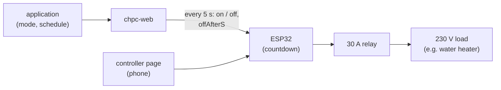

# Switch firmware — business description

[← System documentation](../../../../docs/en/README.md) · **1. Business description** · [2. How it works](2-how-it-works.md) · [3. Technical documentation](3-technical-documentation.md) · [Polski](../1-opis-biznesowy.md)

## What this controller is for

The switch (*włącznik*) turns a 230 V load on and off (the first one controls the heating element of a water heater) by a schedule from the cloud or on command from the application or the controller page. It works like the heat pump schedule, but without temperatures.

The controller (a ready-made "ESP32 Relay AC X1" board with an ESP32-WROOM-32E, a 30 A relay and a 230 V power supply; named "Włącznik" in the application):

- every 5 s **reports the relay state** to the cloud and **executes the command** from the reply: on for N seconds, on without a limit, or off;
- **counts the on time down by itself**, so without the internet it finishes the current activation and turns off;
- lets the user **see the state** and **control the relay** from a phone (home network or the controller's own Wi-Fi network) without the application;
- **registers with the cloud by itself** at every start (with the number of relays) and **updates its firmware over the network**.

The schedule, modes and activation history are kept by the cloud: see the [switch module](../../../../docs/en/moduly/switch/1-business-description.md).

## Key property: only the cloud knows the schedule

1. The controller asks the cloud every 5 s (or immediately when the cloud wakes it over WebSocket) and receives a command with the time until switch-off.
2. It counts that time down by itself and switches the relay off, also when the network is gone.
3. Without the cloud the next schedule window will not start; "Włącz" (on) and "Wyłącz" (off) on the controller page keep working.
4. After a restart (e.g. a power cut) the relay stays off until the controller connects to the cloud.

## Controller pages (phone)

After start the controller's Wi-Fi network `Wlacznik-setup` (address `10.11.17.1`) is up; one minute after connecting to the home network it disappears and the pages are available at the controller's IP address (shown in the application: Ustawienia → Sterownik).

| Main page | Installation |
|---|---|
|  |  |

*Screenshots from the controller page emulator (the real HTML from the firmware, demo data). The pages are in Polish.*

- **Main page** (no login): a card per relay — state ("WŁĄCZONY" / "WYŁĄCZONY", on / off), mode from the cloud, a large countdown when on for a time, and the buttons:
  - **"Włącz"** (on): for the time from the "Czas włączenia [h] [min]" fields below the buttons (by default the value from the cloud, 30 min); 0 h 0 min = no limit;
  - **"Wyłącz"** (off, red): switches off and blocks the schedule;
  - **"Harmonogram"** (schedule): back to the schedule (without the cloud it switches the relay off).

  The "Wi-Fi i chmura" card: network, address, signal, cloud connection state.
- **Installation** (login and password): Wi-Fi, firmware file upload, SN, Root ID, number of relays, registration state.

## Who uses it

- **The owner** — controls the relay in the application; opens the controller page when there is no internet.
- **The installer (electrician)** — mounts the board in an enclosure, connects 230 V and the load, flashes the first firmware, enters the Wi-Fi.

## Before the first deployment (checklist)

1. **Server first:** deploy `main` on Render (manual build). An old server rejects a registration of kind `switch` (400).
2. **`src/secrets.h`** (local, outside git, template `secrets.example.h`): access point name and password (empty password = open network), `/install` login, optionally a default Wi-Fi.
3. **First flashing** through the P1 header and a USB-TTL adapter ([part 3](3-technical-documentation.md#first-flashing-through-the-p1-header)). Mind the power: the header's 3V3 pin is 3.3 V, and the adapter cannot supply enough current.
4. **Installation** by a person qualified for 230 V work: 230 V input terminals, the load on the relay contact, enclosure, protection ([diagram](3-technical-documentation.md#wiring-installation)).
5. **Wi-Fi**: connect a phone to `Wlacznik-setup`, page `http://10.11.17.1/install`.
6. **In the application**: relay name (Ustawienia), schedule, optionally the "default" star.
7. **Further versions** over the network (firmware page in the application or `/install`).

Deployment state: since 2026-10-03 one switch with firmware 1.0.3 runs in production, its relay named "Bojler" (water heater).

## Limitations

- Without the cloud the schedule does not work (the controller does not know it); the countdown of the current activation and the controller page do.
- After a restart the relay is off until the first cloud reply.
- New settings from the cloud (the default on time on the controller page) and the update offer arrive with the registration, i.e. **at controller start**.
- The controller pages are plain HTTP, the main page and `POST /relay` have no login, and the controller network is open by default after start: during that time anyone in range can switch the relay.
- The controller only knows that it **set the relay pin** — it does not measure the load current.

## Glossary

| Term | Meaning |
|---|---|
| **Command** | the cloud's reply to a state report: on (for `offAfterS` seconds or without a limit) or off |
| **Countdown** | time until switch-off counted by the controller; works without the network |
| **Local change** | "Włącz" / "Wyłącz" / "Harmonogram" from the controller page; waits to be sent to the cloud |
| **AP** | the `Wlacznik-setup` access point: the controller's own Wi-Fi network for configuration |
| **OTA** | firmware update over the network |
| **P1 header** | the programming header on the board: `GND`, `RX`, `TX`, `3V3` |
