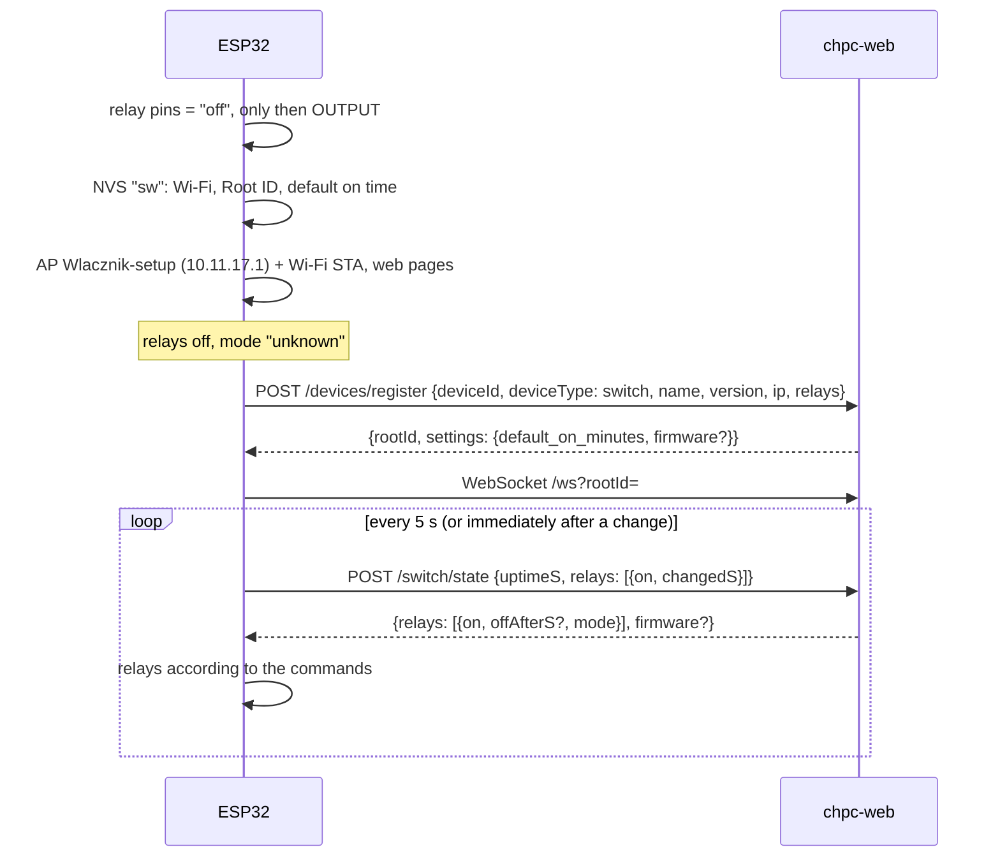
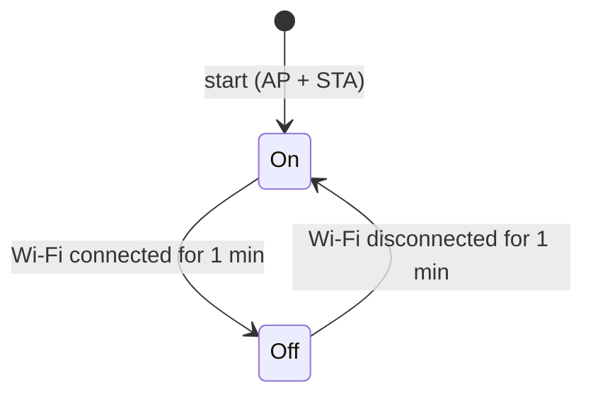
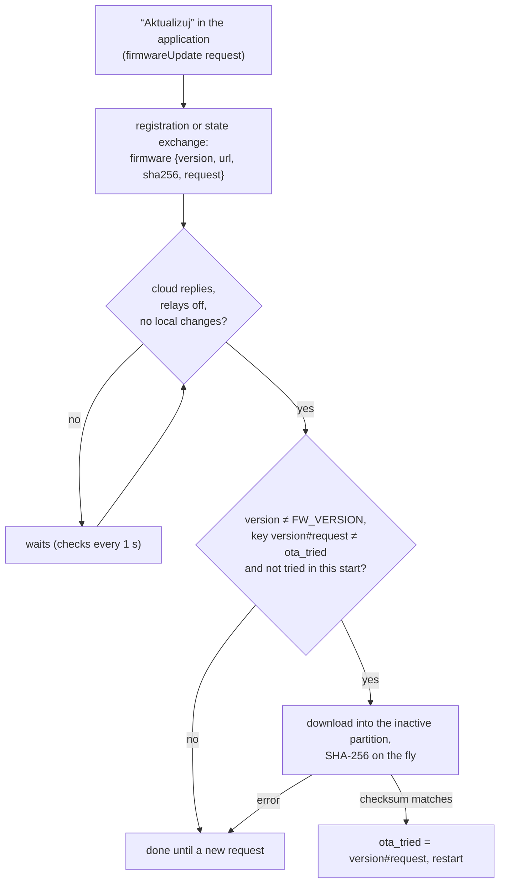

# Switch firmware — how it works

[← System documentation](../../../../docs/en/README.md) · [1. Business description](1-business-description.md) · **2. How it works** · [3. Technical documentation](3-technical-documentation.md) · [Polski](../2-zasada-dzialania.md)

## Controller start



- **The relay is off after start.** The pin gets the "off" level before it becomes an output; only a cloud command switches it on.
- **No registration, no state exchange.** A failed registration is retried every 30 s; until then only the controller page works.
- **Registration happens once per start** (and again after 404/409). The default on time therefore arrives at start. The OTA offer (only on an "Aktualizuj" request from the application) is in the registration reply and, from version 1.1.0, in every state exchange reply.

## Commands from the cloud

The reply to every state report carries, for each relay, `on` and optionally `offAfterS` and `mode`:

| Command | What the controller does |
|---|---|
| `{on: true, offAfterS: N}` | switches on (if it was off) and schedules switch-off in N s; every following command recomputes that time |
| `{on: true}` | switches on without a limit |
| `{on: false}` | switches off |
| `mode` | for display on the controller page only |

**The countdown** is checked in every loop pass, independently of the network. When it ends the controller switches the relay off, the mode on the page changes from "for a time" to "schedule", and it sends the new state to the cloud at once.

The WebSocket message `{"type":"operation"}` (a mode or schedule change in the application) triggers a state report immediately, so a change from the application takes effect within a second. The WebSocket library reconnects by itself every 10 s after a drop.

## Change from the controller page

```mermaid
sequenceDiagram
    participant P as page / (phone)
    participant E as ESP32
    participant S as chpc-web
    P->>E: POST /relay?n=1&mode=timer&minutes=30
    E->>E: relay at once; pending (change number)
    E->>S: PUT /switch/mode {relay, mode, minutes, source: controller}
    alt 2xx or 400
        S-->>E: OK → pending cleared
    else network error / 5xx
        E->>E: retry every 5 s
    end
    E->>S: POST /switch/state
    S-->>E: command matching the new mode
```

- **Until the change is confirmed, cloud commands for that relay are ignored** (`pending`), so a reply computed from the old mode cannot undo the change. Each change has a number (`pendingSeq`): the confirmation of an older send does not clear a newer change.
- **"Włącz" for a time** sends the remaining minutes to the cloud (rounded up, at least 1), so a retried send does not extend the activation.
- **"Harmonogram"** with the cloud available keeps the state until the next reply (the cloud knows the windows). **Without the cloud** (no successful exchange for 30 s) it switches the relay off, because the controller does not know whether a window is active.
- **400** from the cloud means the change will not be accepted; the controller stops retrying it.
- **404/409** (unknown SN, Root ID of another device): the controller clears the Root ID, disconnects the WebSocket and registers again.

## Loop

In every `loop()` pass: web pages, WebSocket and the relay countdown. Every 1 s (or immediately when something is to be sent) `tick()`:

1. Access point: off after 1 min connected to Wi-Fi, on after 1 min without Wi-Fi.
2. Every 30 s a status line on the console.
3. No Wi-Fi — done.
4. Not registered in this start → `POST devices/register` (every 30 s until it succeeds); not registered — done.
5. Unsent local changes → `PUT switch/mode` (every 5 s or immediately).
6. State exchange every 5 s or immediately after a change.
7. OTA: when there is an offer (a request from the application), the cloud replies, all relays are off and there are no unsent changes; one attempt per request.

There is one persistent HTTPS connection (keep-alive), request timeout 4 s, registration 8 s. A failed state exchange is not retried — a new one follows in 5 s.

## Times in the state report

The controller has no clock. It sends `uptimeS` (seconds since start) and for each relay `changedS` (how many seconds it has been in its current state). From that the server computes the on and off moments (`now − changedS`), also after a connectivity gap, and detects a restart from `uptimeS`: an activation interrupted by a power loss ends at the last report before it ([switch module](../../../../docs/en/moduly/switch/2-how-it-works.md#activation-history)).

## Access point



The `Wlacznik-setup` AP is open by default (password shorter than 8 characters or empty). It does not run permanently, because the `/` page lets anyone switch the relay without a login. One minute after connecting is enough for the phone to see the result of saving Wi-Fi on `/install`. With the AP off, the pages are at the controller's IP address in the home network.

## Over-the-air update (OTA)



- **The offer comes only on request.** The cloud sends `firmware` only when "Aktualizuj" (update) was clicked in the application (Settings, "Sterownik" card) and the request was not cancelled. The request disappears by itself when the controller registers with the offered version.
- **From 1.1.0 without a restart:** the offer is also in every `POST /switch/state` reply, so the update starts within seconds of the click (with the relays off). Version 1.0.3 reads the offer only at registration, so it needs a board restart.
- The download blocks the loop for a dozen or so seconds and the restart switches the relays off, so the controller waits until all relays are off. After the restart the cloud restores the state.
- **One attempt per request.** The key `version#request` (`otaKey()`) is kept in RAM after an attempt and in NVS (`ota_tried`) after a download. A failed download waits for another "Aktualizuj" (a new request = a new attempt). `ota_tried` also prevents a loop when someone uploads an image without raising `FW_VERSION`.

## Settings

| Source | When | What |
|---|---|---|
| cloud (registration reply) | start | `default_on_minutes` (0–10080) → NVS `def_min`; default value of the "Czas włączenia" fields on the page |
| `/install` | immediately | Wi-Fi → NVS (saving connects at once, without a restart) |

An invalid `default_on_minutes` (outside 0–10080) is ignored and the previous value stays.
