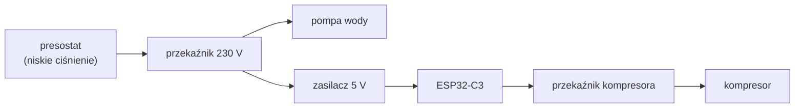

# Firmware hydroforu — opis biznesowy

[← Dokumentacja systemu](../../../docs/README.md) · **1. Opis biznesowy** · [2. Zasada działania](2-zasada-dzialania.md) · [3. Dokumentacja techniczna](3-dokumentacja-techniczna.md) · [English](en/1-business-description.md)

## Po co jest ten sterownik

Hydrofor ma dwa zbiorniki po 300 l połączone równolegle: **ocynkowany z poduszką powietrzną** i **przeponowy** (worek). Powietrze w zbiorniku ocynkowanym z czasem rozpuszcza się w wodzie, więc trzeba je dobijać kompresorem — przy okazji woda jest natleniana.

Sterownik (ESP32-C3 SuperMini, nazwa w aplikacji „Hydrofor”):

- przy **każdym uruchomieniu pompy** raz włącza **kompresor** na ustawiony czas (domyślnie 30 s);
- zapisuje, **kiedy i jak długo** pracowały pompa i kompresor, i wysyła to do chmury;
- pozwala z telefonu (Wi-Fi sterownika) **zobaczyć stan** i **uruchomić kompresor ponownie**.

Chmura z tych danych **szacuje zużytą wodę** i porównuje ją z odczytami wodomierza — opis w [module water-pressure-tank](../../../docs/moduly/water-pressure-tank/1-opis-biznesowy.md).

## Najważniejsza cecha: sterownik żyje tylko w czasie pracy pompy

1. Ciśnienie spada do progu dolnego — presostat włącza pompę i **jednocześnie zasila sterownik**.
2. Po 1 s sterownik włącza kompresor na ustawiony czas, dopiero potem łączy się z Wi-Fi.
3. Pompa pracuje do progu górnego; presostat ją wyłącza, a **sterownik gaśnie razem z nią**.

Każde uruchomienie pompy to nowy start sterownika. Nie ma zegara ani baterii; godziny nadaje chmura.

## Strony sterownika (telefon)

W zasięgu sterownika działa jego sieć Wi-Fi (adres `10.11.16.1`), a w sieci domowej — jego adres IP.

| Strona główna | Instalacja |
|---|---|
|  |  |

*Zrzuty z emulatora stron sterownika (prawdziwy HTML z firmware, dane demonstracyjne).*

- **Strona główna:** kompresor włączony/wyłączony, czas do wyłączenia, czas pracy pompy, zbiorniki z szacunkiem wody, przycisk „Uruchom kompresor ponownie”.
- **Instalacja** (login i hasło): Wi-Fi, czas pracy kompresora, SN, Root ID, stan połączenia z chmurą.

## Dla kogo

- **Właściciel** — patrzy na zużycie wody w aplikacji; na stronę sterownika zagląda, gdy chce dobić powietrze.
- **Instalator** — podłącza sterownik, wpisuje Wi-Fi, ustawia zworkę przekaźnika, wpisuje progi i zbiorniki w aplikacji.

## Przed pierwszym wdrożeniem (lista kontrolna)

Firmware **nie był jeszcze wgrywany na płytkę** — sprawdzony testami na PC i emulatorem stron.

1. **Serwer pierwszy:** wdrożyć `main` na Render (ręczny build). Stary serwer odrzuci zgłoszenie typu `water-pressure-tank` (400).
2. **`src/secrets.h`** (lokalny, poza gitem, wzór `secrets.example.h`): nazwa i hasło punktu dostępowego (obecnie „Piwnica” bez hasła = sieć otwarta), domyślne Wi-Fi, login `/install`.
3. **Moduł przekaźnika:** zamontowany jest moduł sterowany stanem niskim (`RELAY_ACTIVE_HIGH = false`) z rezystorem 10 kΩ z `IN` do `3V3` ESP32; bez niego kompresor może „kliknąć” w chwili podania zasilania. Moduł ze zworką H (stan wysoki) wymaga rezystora do masy i `RELAY_ACTIVE_HIGH = true` w `src/firmware.hpp`.
4. **Wgranie:** `pio run -d devices/water-pressure-tank -e esp32c3 -t upload` przez USB-C.
5. **Po pierwszym uruchomieniu pompy**, w aplikacji → Ustawienia:
   - progi presostatu odczytane z manometru przy starcie i zatrzymaniu pompy;
   - ciśnienie wstępne `p0` zbiornika przeponowego (manometr przy spuszczonej wodzie);
   - pierwsze odczyty wodomierza (Dane → Odczyty wodomierza), żeby dostać podpowiedź `k`;
   - opcjonalnie gwiazdka „domyślny” na liście sterowników.

## Ograniczenia

- Zmiana ustawień w aplikacji dociera do sterownika **przy następnym uruchomieniu pompy**.
- Bez sieci uruchomienia trafiają do kolejki (do 40) i są wysyłane później z datą przybliżoną.
- Kompresor nie ma czujnika — sterownik wie tylko, że **włączył przekaźnik**, nie że kompresor ruszył.
- Strony sterownika są po HTTP, sieć sterownika jest domyślnie otwarta.

## Słownik

| Pojęcie | Znaczenie |
|---|---|
| **Uruchomienie** (`runId`) | jedno włączenie pompy przez presostat = jeden start sterownika |
| **Presostat** | wyłącznik ciśnieniowy; progi dolny i górny w barach na manometrze |
| **Poduszka powietrzna** | powietrze w zbiorniku ocynkowanym, dobijane kompresorem; współczynnik `k` |
| **Przepona, `p0`** | worek w zbiorniku przeponowym; ciśnienie wstępne powietrza |
| **Kolejka** | uruchomienia bez sieci, wysyłane przy kolejnych startach |
| **Ponowne uruchomienie** | ręczne włączenie kompresora ze strony sterownika (`restarts`) |
