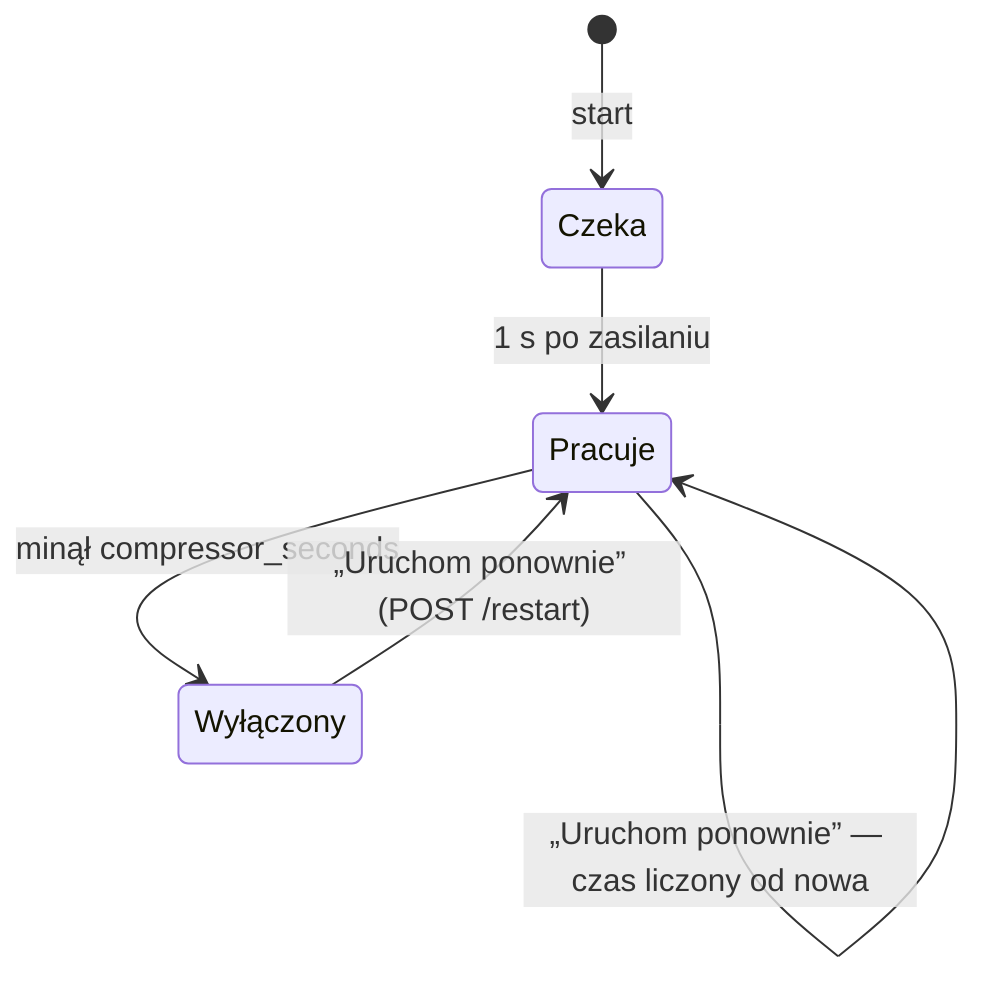
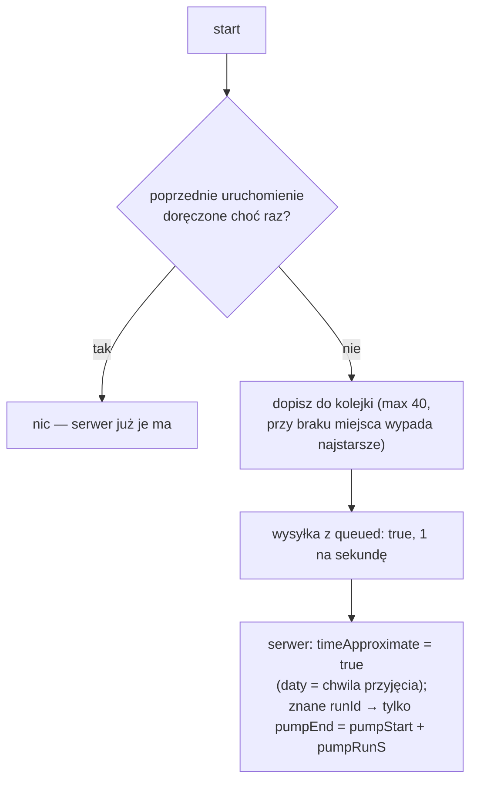

# Firmware hydroforu — zasada działania

[← Dokumentacja systemu](../../../docs/README.md) · [1. Opis biznesowy](1-opis-biznesowy.md) · **2. Zasada działania** · [3. Dokumentacja techniczna](3-dokumentacja-techniczna.md) · [English](en/2-how-it-works.md)

## Start sterownika

```mermaid
sequenceDiagram
    participant Z as zasilanie (presostat)
    participant E as ESP32 DevKit
    participant K as kompresor
    participant S as chpc-web
    Z->>E: 5 V (razem z pompą)
    E->>E: pin przekaźnika = „wyłączony”, dopiero potem OUTPUT
    E->>E: NVS: Wi-Fi, Root ID, ustawienia
    E->>K: po 1 s: włącz na compressor_seconds
    E->>E: kolejka: poprzednie uruchomienie bez doręczenia → kolejka;<br/>nowy runId
    E->>E: Wi-Fi STA + punkt dostępowy 10.11.16.1, strony WWW
    opt czas kompresora zmieniony na /install
        E->>S: PUT /water-pressure-tank/settings {compressor_seconds}
    end
    E->>S: POST /devices/register {deviceId, deviceType, name, version, ip}
    S-->>E: {rootId, settings}
    loop co 1 s, dopóki jest zasilanie
        E->>S: POST /water-pressure-tank/add {runId, pumpRunS, compressorStartS, compressorEndS, restarts}
    end
    Z--xE: presostat wyłącza pompę — sterownik gaśnie
```

- **Kompresor nie czeka na sieć** — włącza się przed Wi-Fi, raz, i wyłącza się jeden raz po czasie.
- **Pin przekaźnika** dostaje stan „wyłączony” przed przełączeniem na wyjście, więc nie ma impulsu przy starcie programu. (Impuls przy samym podaniu zasilania zależy od modułu przekaźnika — [opis w części 3](3-dokumentacja-techniczna.md#podłączenie).)

## Kompresor



- W raporcie zostaje **pierwsze włączenie** i **ostatnie wyłączenie** oraz liczba ponownych uruchomień (`restarts`).
- Nowy czas (z chmury albo z `/install`) działa od **następnego** włączenia; bieżąca praca kończy się po starym czasie.
- Czas 0 s = kompresor się nie włącza.

## Pętla

W każdym obiegu `loop()`: obsługa stron WWW i wyłączenie kompresora po czasie. Co 1 s (`tick`):

1. Zapis bieżącego uruchomienia do NVS (czasy względne, czas pracy pompy).
2. Bez Wi-Fi — koniec.
3. Niewysłany czas kompresora z `/install` → `PUT .../settings` (co 10 s do skutku).
4. Brak zgłoszenia w tym starcie → `POST /devices/register` (co 10 s do skutku); **bez zgłoszenia nic nie jest wysyłane**.
5. Wysyłka bieżącego uruchomienia, a gdy kolejka nie jest pusta — także jednego uruchomienia z kolejki (najstarsze pierwsze, `queued: true`).

Połączenie HTTPS jest jedno i stałe (keep-alive, limit 2 s). Nieudana wysyłka nie jest ponawiana — za sekundę idzie nowa.

## Daty bez zegara

Sterownik wysyła tylko **sekundy od startu**. Serwer:
- przy pierwszej wiadomości uruchomienia ustala `pumpStart = teraz − pumpRunS`;
- każdą kolejną ustawia `pumpEnd = teraz`, więc **ostatnia wiadomość przed zgaśnięciem to koniec pracy pompy** (dokładność 1 s).

## Uruchomienie bez sieci



`runId` to licznik w NVS; pierwszy numer jest losowy, żeby po wyczyszczeniu pamięci nie nadpisać starych rekordów.

## Ustawienia

| Źródło | Kiedy | Co |
|---|---|---|
| chmura (odpowiedź na zgłoszenie) | każdy start | czas kompresora, progi, zbiorniki → NVS |
| `/install` → „Zapisz czas” | od razu | czas kompresora → NVS + znacznik `comp_pending`; wysyłany do chmury **przed** zgłoszeniem, a do czasu wysłania zgłoszenie nie nadpisuje go wartością z chmury |

Złe ustawienia z chmury (np. czas spoza 1–3600 s) są odrzucane i zostają poprzednie. Najwyżej 4 zbiorniki.

**Konflikt 409** (zapisany Root ID należy do innego urządzenia, np. po wyczyszczeniu bazy): sterownik kasuje Root ID i zgłasza się ponownie.

## Szacunek wody na stronie

Strona główna pokazuje szacunek wody na uruchomienie liczony **tym samym wzorem** co serwer i aplikacja (`src/settings.cpp`), z ustawień zapisanych w NVS. Wzór: [moduł water-pressure-tank, zasada działania](../../../docs/moduly/water-pressure-tank/2-zasada-dzialania.md).
