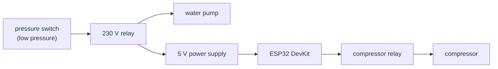

# Tank firmware — business description

[← System documentation](../../../../docs/en/README.md) · **1. Business description** · [2. How it works](2-how-it-works.md) · [3. Technical documentation](3-technical-documentation.md) · [Polski](../1-opis-biznesowy.md)

## What this controller is for

The water pressure system ("hydrofor") has two 300 l tanks connected in parallel: a **galvanised tank with an air cushion** and a **membrane tank** (bladder). The air in the galvanised tank slowly dissolves in the water, so it has to be topped up by a compressor, which also aerates the water.

The controller (ESP32 DevKit with the WROOM-32 module, named "Hydrofor" in the application):

- at **every pump start** switches the **compressor** on once for the configured time (30 s by default);
- records **when and how long** the pump and the compressor ran, and sends it to the cloud;
- lets you **see the state** and **control the compressor** from a phone (over the controller's Wi-Fi): switch it on until switched off (30 min at most), switch it off, or run it for the configured time.

From the pump run time and water meter readings the cloud **calculates the water used**; see the [water-pressure-tank module](../../../../docs/en/moduly/water-pressure-tank/1-business-description.md). Manual compressor operation is subtracted from the pump time.

## Key property: the controller lives only while the pump runs

1. Pressure drops to the lower threshold: the pressure switch starts the pump and **powers the controller at the same time**.
2. After 1 s the controller switches the compressor on for the configured time, and only then connects to Wi-Fi.
3. The pump runs up to the upper threshold; the pressure switch stops it and **the controller goes dark with it**.

Every pump start is a new controller start. There is no clock or battery; the cloud assigns the times.

## Controller pages (phone)

Near the controller its own Wi-Fi network is available (address `10.11.16.1`); on the home network, its IP address.

| Main page | Installation |
|---|---|
|  |  |

*Screenshots from the controller page emulator (the real HTML from the firmware, demo data); the main page is from before version 1.3.0, still with the "Zbiorniki" (tanks) card and a single button.*

- **Main page:** compressor state ("WŁĄCZONY", "WŁĄCZONY RĘCZNIE" or "WYŁĄCZONY"), time left, compressor and pump run time, and buttons:
  - **"Włącz"** (on): the compressor runs until "Wyłącz", 30 min at most; meanwhile a large `mm:ss` countdown is shown below the state;
  - **"Wyłącz"** (off, red): switches the compressor off at once, also during the normal run after start;
  - **"Uruchom na N s"** (run for N s, N = compressor time from the settings): runs the compressor for the configured time (formerly "Uruchom kompresor ponownie").
- **Installation** (login and password): Wi-Fi, compressor run time, SN, Root ID, cloud connection state.

## Who it is for

- **The owner** — looks at water use in the application; opens the controller page to top up air.
- **The installer** — wires the controller, enters Wi-Fi, sets the relay jumper, changes the compressor time if needed.

## Before the first deployment (checklist)

The firmware **has not been flashed onto a board yet**; it was checked with PC tests and a page emulator.

1. **Server first:** deploy `main` on Render (manual build). The old server rejects registration of type `water-pressure-tank` (400).
2. **`src/secrets.h`** (local, outside git, template `secrets.example.h`): access point name and password (currently "Piwnica" without a password = open network), default Wi-Fi, `/install` login.
3. **Relay module:** the installed module is active-low (`RELAY_ACTIVE_HIGH = false`) with a 10 kΩ resistor from `IN` to the ESP32 `3V3`; without it the compressor may "click" when power is applied. A module with jumper H (active-high) needs a resistor to ground and `RELAY_ACTIVE_HIGH = true` in `src/firmware.hpp`.
4. **Flash:** `pio run -d devices/water-pressure-tank -t upload` through the board USB or a USB-TTL adapter ([part 3](3-technical-documentation.md#build-tests-flashing)); later versions over the network.
5. **After the first pump start**, in the application:
   - first water meter readings (Data → Water meter readings): from the second one on the application knows the pump flow and calculates water;
   - optionally the "default" star on the controller list.

## Limitations

- A settings change in the application reaches the controller **at the next pump start**.
- Without a network, runs go to a queue (up to 40) and are sent later with an approximate time.
- The compressor has no sensor: the controller only knows that it **switched the relay on**, not that the compressor started.
- The controller pages use HTTP; its network is open by default.

## Glossary

| Term | Meaning |
|---|---|
| **Run** (`runId`) | one pump start by the pressure switch = one controller start |
| **Pressure switch** | switches on pressure; lower and upper thresholds in gauge bar |
| **Air cushion** | air in the galvanised tank, topped up by the compressor |
| **Queue** | runs without a network, sent at later starts |
| **Restart** | manual compressor start from the controller page ("Uruchom na N s" or "Włącz"; `restarts`) |
| **Manual compressor time** | time from "Włącz" until switched off (`manualCompressorS`); the cloud subtracts it from the pump time |
