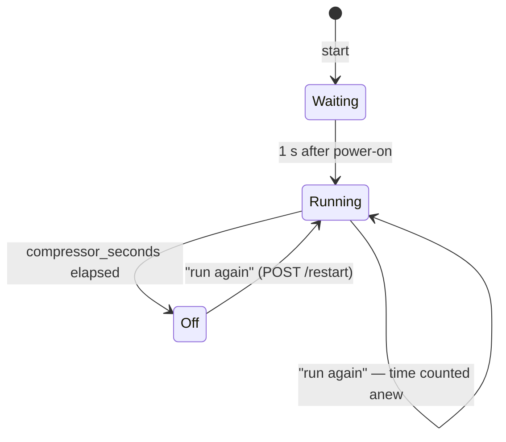
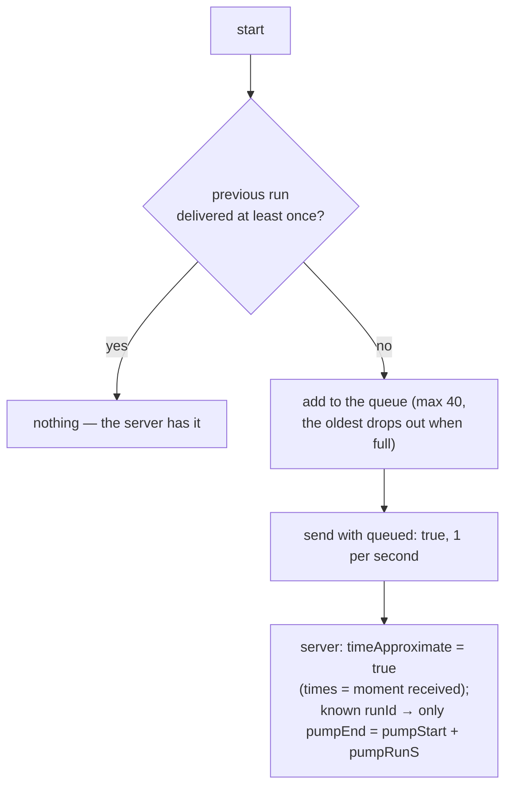

# Tank firmware — how it works

[← System documentation](../../../../docs/en/README.md) · [1. Business description](1-business-description.md) · **2. How it works** · [3. Technical documentation](3-technical-documentation.md) · [Polski](../2-zasada-dzialania.md)

## Controller start

```mermaid
sequenceDiagram
    participant Z as power (pressure switch)
    participant E as ESP32 DevKit
    participant K as compressor
    participant S as chpc-web
    Z->>E: 5 V (together with the pump)
    E->>E: relay pin = "off", only then OUTPUT
    E->>E: NVS: Wi-Fi, Root ID, settings
    E->>K: after 1 s: on for compressor_seconds
    E->>E: queue: previous run never delivered → queue;<br/>new runId
    E->>E: Wi-Fi STA + access point 10.11.16.1, web pages
    opt compressor time changed on /install
        E->>S: PUT /water-pressure-tank/settings {compressor_seconds}
    end
    E->>S: POST /devices/register {deviceId, deviceType, name, version, ip}
    S-->>E: {rootId, settings}
    loop every 1 s while powered
        E->>S: POST /water-pressure-tank/add {runId, pumpRunS, compressorStartS, compressorEndS, restarts}
    end
    Z--xE: pressure switch stops the pump — controller goes dark
```

- **The compressor does not wait for the network**: it starts before Wi-Fi, once, and stops once after its time.
- **The relay pin** is set to "off" before it becomes an output, so there is no pulse when the program starts. (A pulse at the moment power is applied depends on the relay module; see [part 3](3-technical-documentation.md#wiring).)

## Compressor



- The report keeps the **first start** and the **last stop**, plus the number of restarts (`restarts`).
- A new time (from the cloud or `/install`) applies from the **next** start; the current run ends after the old time.
- Time 0 s = the compressor does not start.

## Loop

On every `loop()` pass: web pages and compressor stop after its time. Every 1 s (`tick`):

1. Save the current run to NVS (relative times, pump run time).
2. No Wi-Fi — stop here.
3. Unsent compressor time from `/install` → `PUT .../settings` (every 10 s until it succeeds).
4. Not registered in this start → `POST /devices/register` (every 10 s until it succeeds); **nothing is sent before registration**.
5. Send the current run and, if the queue is not empty, one queued run as well (oldest first, `queued: true`).

There is one persistent HTTPS connection (keep-alive, 2 s timeout). A failed send is not retried; a new one goes a second later.

## Times without a clock

The controller sends only **seconds since start**. The server:
- on the first message of a run sets `pumpStart = now − pumpRunS`;
- on every following message sets `pumpEnd = now`, so **the last message before power-off is the end of the pump run** (1 s accuracy).

## A run without a network



`runId` is a counter in NVS; the first number is random, so clearing the memory does not overwrite old records.

## Settings

| Source | When | What |
|---|---|---|
| cloud (registration reply) | every start | compressor time, thresholds, tanks → NVS |
| `/install` → "save time" | immediately | compressor time → NVS + `comp_pending` flag; sent to the cloud **before** registration, and until then registration does not overwrite it with the cloud value |

Invalid settings from the cloud (e.g. a time outside 1–3600 s) are rejected and the previous ones stay. At most 4 tanks.

**409 conflict** (the stored Root ID belongs to another device, e.g. after the database was cleared): the controller drops its Root ID and registers again.

## Water estimate on the page

The main page shows the water estimate per run using **the same formula** as the server and the application (`src/settings.cpp`), from the settings stored in NVS. Formula: [water-pressure-tank module, how it works](../../../../docs/en/moduly/water-pressure-tank/2-how-it-works.md).
