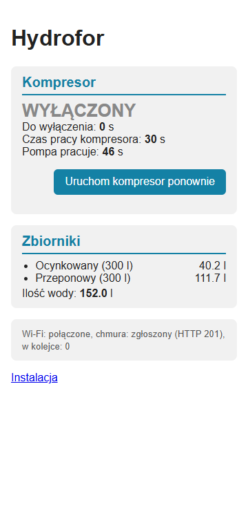
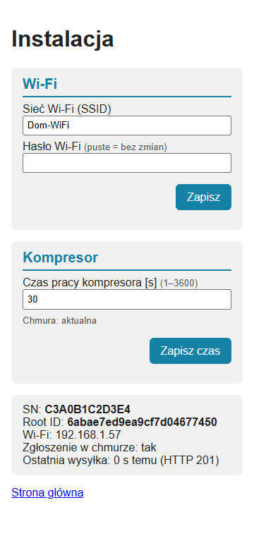

# Tank firmware — technical documentation

[← System documentation](../../../../docs/en/README.md) · [1. Business description](1-business-description.md) · [2. How it works](2-how-it-works.md) · **3. Technical documentation** · [Polski](../3-dokumentacja-techniczna.md)

The server side (API, collections, water from pump time, water meter) is described in the [water-pressure-tank module](../../../../docs/en/moduly/water-pressure-tank/3-technical-documentation.md). The original specification with the history of decisions (Polish): [water-pressure-tank.md](../water-pressure-tank.md).

## Hardware

| Part | Details |
|---|---|
| Board | **ESP32 DevKit with the ESP32-WROOM-32 module** (38 pins, USB-C, CP2102 USB-UART bridge, RST and BOOT buttons), PlatformIO `esp32dev`; UART0 console 115200 |
| Power | 230 V → 5 V supply (e.g. HLK-PM01) on the pump supply line (after the pressure switch relay), to the board **5V** pin |
| Compressor relay | 5 V active-low module (installed: two-channel with optocouplers, one channel used), `IN` on **GPIO26** (pin "P26") |
| Tanks | 300 l galvanised with an air cushion + 300 l membrane, in parallel (Hydro-Vacuum) |

## Wiring

**230 V circuit** (the controller has power only while the pressure switch runs the pump):

```text
            230 V from the pressure switch relay (together with the water pump)
              L ──┬─────────────────────────────────────┐
              N ──┼────────────────┐                    │
            ┌─────┴──────┐         │            ┌───────┴───────┐
            │ supply     │         │            │ COM           │
            │ 230V → 5V  │         │            │     relay     │
            └──┬──────┬──┘         │            │ NO ──┐        │
             +5V     GND           │            └──────┼────────┘
              │       │            │              ┌────┴─────┐
              ▼       ▼            └──────────────┤compressor│
         to the ESP32 board (below)               └──────────┘
```

**ESP32 DevKit board** — the pin row with `3V3` and `5V` (labels on the bottom of the board; numbers from the `3V3` end):

```text
  1   2   3   4   5   6   7   8   9   10  11  12  13  14  15  16  17  18  19
 3V3  EN SVP SVN P34 P35 P32 P33 P25 P26 P27 P14 P12 GND P13 SD2 SD3 CMD 5V
  │                                   │               │                   │
  │                                   │               │                   ├── +5 V from the supply
  │                                   │               │                   └── relay module VCC
  │                                   │               ├── supply GND (−)
  │                                   │               └── relay module GND
  │                                   └── relay module IN
  └──[ 10 kΩ ]──── relay module IN (resistor at the module)

  ✗ do not connect: P12 (GPIO12), SD2, SD3, CMD (and SD0, SD1, CLK on the other row)
```

| Connection | ESP32 DevKit pin | Notes |
|---|---|---|
| supply `+5 V` | **5V** (19th) | never to `3V3` |
| supply `GND` | **GND** (14th) | not to `CMD` (next to `5V`) |
| relay module `VCC` | **5V** | together with the supply |
| relay module `GND` | **GND** | |
| relay module `IN` | **P26** (10th) | `RELAY_PIN` in `firmware.hpp` |
| 10 kΩ resistor | between `IN` and **3V3** (1st) | prevents the click at power-up |
| service: USB-TTL adapter | `TX`→**RX** (GPIO3), `RX`←**TX** (GPIO1), `GND` | other pin row; only for flashing and the console |

- **Active-low module** (installed; `RELAY_ACTIVE_HIGH = false`): the relay switches on when `IN` is pulled to `GND`. The module gets 5 V before the ESP32 has 3.3 V, so `IN` is briefly pulled low through the pin's protection diodes and the relay clicks on regardless of the program. Hence **10 kΩ from `IN` to the ESP32 `3V3`**. Never to 5 V, and not to `GND`: that would keep the relay on permanently.
- **Pins not to use:** **SD0–SD3, CMD, CLK** are the internal flash lines (ground on `CMD` gave `invalid header: 0xffffffff` and a boot loop, 2026-10-02), and **GPIO12** high at boot switches the flash to 1.8 V (same symptom). `5V` and `CMD` sit next to each other at the end of the row: a two-wire supply plug easily lands on the wrong pair.
- **Alternative:** active-high module (jumper H) + 10 kΩ from `IN` to `GND` and `RELAY_ACTIVE_HIGH = true`. The relay is then certainly off without power and while the ESP32 boots.
- **Contacts** `COM`–`NO` in the compressor's live wire. Inrush current ≤ relay rating (usually 10 A / 250 V AC); motors above about 0.5 kW through a contactor.
- Installation only by a person qualified for 230 V work, in an enclosure, with a fuse.

## Files (`devices/water-pressure-tank`)

| File | Role |
|---|---|
| `src/water-pressure-tank.cpp` | `setup()` (relay, NVS, compressor before Wi-Fi, queue, `runId`), `loop()`/`tick()`, registration, sending, web pages |
| `src/firmware.hpp` | device type and name, version (`FW_VERSION` 1.3.0), relay pin and level, start delay, compressor times (including the manual run limit), `CLOUD_URL` |
| `src/compressor.*` | compressor state machine: start, restart, manual operation (`startManual`, `stop`, `manual()`, `manualSeconds()`), stop after time, `firstStartS`/`lastEndS`/`restarts` |
| `src/settings.*` | cloud settings (JSON ↔ struct, validation; only `compressorSeconds`), time from `/install` |
| `src/run_report.*` | `RunRecord` (with `manualCompressorS`), report JSON, queue of 40 runs in NVS (`BlobStore`, blob version 2), `queuePreviousRun` |
| `src/secrets.example.h` | template of `secrets.h` (outside git): `AP_SSID`, `AP_PASSWORD`, `INSTALL_USER`, `INSTALL_PASSWORD`, `WIFI_SSID`, `WIFI_PASSWORD` |
| `test/test_logic/test_main.cpp` | 25 `native` tests |

## Constants

| Constant | Value | Where |
|---|---|---|
| `DEVICE_TYPE` / `DEVICE_NAME` | `water-pressure-tank` / "Hydrofor" | `firmware.hpp` |
| `RELAY_PIN` / `RELAY_ACTIVE_HIGH` | 26 / `false` | `firmware.hpp` |
| `COMPRESSOR_START_DELAY_MS` | 1000 | `firmware.hpp` |
| `DEFAULT_COMPRESSOR_SECONDS` / `MAX_COMPRESSOR_SECONDS` | 30 / 3600 | `firmware.hpp` |
| `MANUAL_COMPRESSOR_MAX_SECONDS` | 1800 (run after "Włącz" at most 30 min) | `firmware.hpp` |
| `CLOUD_URL` | `https://chpc-web.onrender.com/api/` (an `http://` address works without TLS) | `firmware.hpp` |
| `REGISTER_RETRY_MS`, `COMPRESSOR_SEND_RETRY_MS` | 10 s | `water-pressure-tank.cpp` |
| `AP_ADDRESS` | `10.11.16.1` | `water-pressure-tank.cpp` |
| `RunQueue::CAPACITY` | 40 | `run_report.hpp` |

## NVS (namespace `wp`)

| Key | Content |
|---|---|
| `wifi_ssid`, `wifi_pass` | Wi-Fi from `/install` (empty = values from `secrets.h`) |
| `root_id` | Root ID from the registration reply (dropped on 409) |
| `settings` | cloud settings (JSON `{compressor_seconds}`; former tank and threshold fields are skipped when read) |
| `comp_pending` | compressor time from `/install` waits to be sent |
| `run_next` | next `runId` (the first one random) |
| `run_current` | current run (`RunRecord` blob, saved every 1 s, with a `delivered` flag) |
| `run_queue` | queue of undelivered runs (blob version 2; a different version or size = empty, so a queue from before 1.3.0 is lost on update) |
| `ota_tried` | version after downloading which the controller last restarted (guards against an update loop) |

## Cloud contract

| Request | Body | Reply |
|---|---|---|
| `POST devices/register` | `{deviceId: SN, deviceType, name, version, ip}` (`ip` = address in the home network, shown in the app Settings) | `{rootId, settings: {compressor_seconds, firmware?: {version, url, sha256}}}` |
| `POST water-pressure-tank/add?deviceId=&rootId=` | `{runId, pumpRunS, compressorStartS?, compressorEndS?, restarts, manualCompressorS?, queued?}` (`manualCompressorS` only when > 0) | `{}`; 404 unknown SN, 409 foreign Root ID |
| `PUT water-pressure-tank/settings?deviceId=&rootId=` | `{compressor_seconds}` | `{compressor_seconds}`; 400 invalid value (the flag is cleared anyway) |

SN = factory MAC from eFuse, 12 hex characters. The server certificate is not checked (as in `co`). The firmware version (`FW_VERSION` in `firmware.hpp`) is sent with the registration; the server does not store it yet.

## Web pages (port 80)

| Address | Access | Content |
|---|---|---|
| `GET /` | open | main page; JS fetches `/state.json` every 1 s; "Kompresor" card: state ("WŁĄCZONY RĘCZNIE" with a large `mm:ss` countdown during manual operation), buttons "Włącz" (disabled during manual operation), "Wyłącz" (red, disabled when off) and "Uruchom na N s"; "Wi-Fi" card (since 1.1.5): network, state with the disconnect reason in words, signal in dBm with a rating (good ≥ −67, fair ≥ −75, weak ≥ −85), without a connection the networks from a scan every 30 s |
| `GET /state.json` | open | `running`, `manual`, `manualMaxS`, `remainingS`, `compressorSeconds`, `pumpRunS`, `restarts`, `manualCompressorS`, `wifi`, `registered`, `network` (`ssid`, `status`, `rssi`, `ip`, `reason`, `scanAgeS`, `scan[]`), `lastStatus`, `queued` |
| `POST /restart` | open | "Uruchom na N s": the compressor for the full time from the settings |
| `POST /compressor/on` | open | "Włącz": manual operation until `/compressor/off`, at most 1800 s |
| `POST /compressor/off` | open | "Wyłącz": ends manual or normal operation at once |
| `GET`/`POST /install` | Basic Auth | Wi-Fi (empty password = unchanged; saving reconnects at once, **without a restart**, because a restart would start the compressor), SN, Root ID, IP, cloud state |
| `POST /install/compressor` | Basic Auth | compressor time 1–3600 s (whole seconds) |
| `POST /install/firmware` | Basic Auth | manual upload of `firmware.bin` (multipart); rejected while the compressor runs; restart afterwards |

An unknown address shows the main page.

The main page screenshot is from before version 1.3.0 (the "Zbiorniki" card, a single "Uruchom kompresor ponownie" button).

| Main page | Installation |
|---|---|
|  |  |

## Over-the-air update (OTA)

The flash layout is the default Arduino-ESP32 table with two app partitions (`app0`/`app1`, 1.28 MB each; the image uses about 77%), so no change is needed. The first flash goes over UART (below), later ones over the network.

1. The `.bin` file is stored in the server database (collections `firmware_images`, `firmware_offers`; the offered version and one previous). In the registration reply the server adds `firmware: {version, url, sha256}` to `settings`, where `url` is `<server>/api/firmware/water-pressure-tank/<version>.bin` and `sha256` is computed by the server on upload. With the offer disabled or no file there is no field.
2. The controller (`ota.cpp`) accepts an offer when the URL starts with `https://`, the version is non-empty and `sha256` is 64 hex characters. Offers without a checksum are ignored.
3. The download starts once per run when: registration succeeded, the current run was delivered, the queue is empty, **the compressor is not running** (the download blocks the loop for several seconds and would not watch the relay) and the offered version differs from `FW_VERSION` (an older one too: roll back to the previous release).
4. `downloadFirmware()` fetches the image (following redirects) straight into the inactive partition, computing SHA-256 on the fly. The image is activated only after the checksum matches (`Update.end`), so an interrupted download or power loss does not break the running firmware. Then it restarts; the compressor starts as on any boot.
5. After the image is written the version goes to NVS (`ota_tried`). If `FW_VERSION` still differs from the offer after the restart (forgotten version bump), the next attempt is skipped. A failed download is retried at the next pump run.
6. As a fallback, `firmware.bin` can be uploaded by hand on `/install` (the "Firmware" section).

**Releasing a new version:** bump `FW_VERSION` in `firmware.hpp`, `pio run -d devices/water-pressure-tank`, upload `.pio/build/esp32dev/firmware.bin` on the firmware page of the app (device list → the gear on the tank controller tile, the plus icon on the "Aktualna wersja" bar opens the "Dodaj wersję" popup: the same version as `FW_VERSION` and a change description) or from a console: `curl -X PUT -H "Content-Type: application/octet-stream" --data-binary @firmware.bin https://chpc-web.onrender.com/api/firmware/water-pressure-tank/1.0.1`. The server makes the file the offered one and keeps the previous version in the database (to roll back: `PUT /api/firmware/water-pressure-tank` with `{"version": "1.0.0"}`). The repository tag (`water-pressure-tank-v<version>`) only marks the sources. The controller downloads the image on the next pump run longer than the compressor time.

**Notes:** the download and the web server have no on-board tests (the `native` tests cover `ota.cpp`, the server has tests in `server/test/firmware.test.ts`); the certificate is not checked and image integrity rests on the SHA-256 from the cloud reply (the same channel, so it does not protect against server impersonation). The `/api/firmware/...` endpoints have no authorization yet: anyone who knows the server address can replace the offer. The restart after an update ends the current run record a few seconds before the pump actually stops and starts a new `runId`.

## Build, tests, flashing

```bash
cp devices/water-pressure-tank/src/secrets.example.h devices/water-pressure-tank/src/secrets.h   # once, fill in
pio test -d devices/water-pressure-tank -e native            # 25 tests
pio run  -d devices/water-pressure-tank                     # build (esp32dev)
pio run  -d devices/water-pressure-tank -t upload           # flash through the board USB bridge
pio device monitor                                         # console 115200 (through the board bridge opening the port may reset it)
```

**Flashing through a USB-TTL adapter.** On a computer with a code integrity policy (HVCI/WDAC) the CP210x bridge driver of the board is blocked (error 10, status `0xC000036C` STATUS_DRIVER_BLOCKED). An FT232RL adapter (FTDI driver from Windows) works: jumper 3.3 V, `TX`→`RX0` (GPIO3), `RX`←`TX0` (GPIO1), `GND`–`GND`; power the board from its USB cable or the 5V pin. Download mode by hand: hold BOOT, press RST, release BOOT (recognised by `boot:0x3 (DOWNLOAD_BOOT…) waiting for download` on the console). Full flash at 115200 baud (460800 broke off on loose wires): `esptool.py --chip esp32 --port COMx --baud 115200 --before no_reset --after no_reset write_flash --erase-all -z 0x1000 bootloader.bin 0x8000 partitions.bin 0xe000 boot_app0.bin 0x10000 firmware.bin` (files from `.pio/build/esp32dev/`, `boot_app0.bin` from `framework-arduinoespressif32/tools/partitions/`). After `--erase-all` set the Wi-Fi on `/install` through the "Piwnica" AP. Later versions go over the network (OTA).

**Console log (since 1.1.1).** Lines `[ms since start] text` on the UART0 console at 115200 (TX/RX pins, the board USB bridge or an adapter): start (version, SN, rootId, compressor time), AP, Wi-Fi (connection with IP and RSSI, or the status with the disconnect reason), registration with the cloud reply and the OTA offer, changes of the HTTP status of the report, the queue, the compressor and every OTA step. Every 10 s two status lines (`stan:` and `sieć:` with the network name, password length, last disconnect reason, channel and AP state), so a computer connected later still sees what is going on. Without a home network connection a background scan lists the visible networks with RSSI every 30 s (first after 15 s; also on the `/` page, "Wi-Fi" card). Lines go through a 2 KB transmit buffer, so they do not delay the loop that guards the relay. To watch without a reset, open the port with DTR and RTS set to 0 before opening (through an adapter without DTR/RTS wired there is no reset).

The `native` tests cover: the compressor (single start, stop after time, restart, time 0, a time change applies from the next start, manual operation until switched off and until the limit, "Wyłącz" during the normal run, manual operation time), the time from `/install` (valid and invalid inputs, `PUT` body, an unsent time is not overwritten by the cloud), settings (rejecting invalid data, NVS), the report JSON (including `manualCompressorS`), the queue (on a mock NVS) and the OTA offer. **Wi-Fi, HTTP and the pages have no automated tests**; without a board use the server-side simulator: `node scripts/simulate-water-pressure-tank.mjs [--fast] [--history]` with `npm run local`.

## Known issues and notes

- **Registration with an 8 s limit (since 1.2.1).** The first TLS connection to Render after a pause takes 2–5 s; with a 2 s limit the registration got through only on the 4th attempt (46 s after start). The 1 s report keeps 2 s and sometimes gets `-11` (the next one succeeds).
- **The first board (ESP32-C3 SuperMini, up to 1.1.5) was retired on 2026-10-02:** weak antenna (−83…−91 dBm where the WROOM-32 has −66 dBm), it did not reach the cloud in the basement.
- **`RELAY_ACTIVE_HIGH = false`** matches the current module; without the 10 kΩ resistor from `IN` to `3V3` the relay may click on briefly when power is applied (hardware, not the program).
- **Security:** the controller network is open by default, pages over HTTP, `POST /restart`, `/compressor/on` and `/compressor/off` without login.
- **The update to 1.3.0 clears the queue** (blob version 2): runs undelivered before the update never reach the cloud.
- The old sketch `D:\DevLocal\arduino_src\hydrofor\hydrofor.ino` (outside git) had the double compressor start bug; do not use it.
