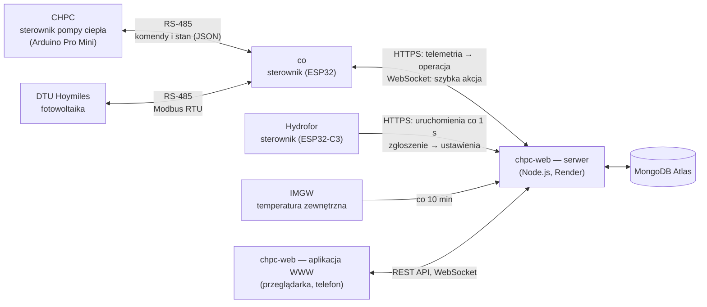

# Dokumentacja systemu chpc-web

System steruje domową pompą ciepła (CHPC) z chmury, zbiera dane z instalacji fotowoltaicznej i monitoruje hydrofor. Ten plik jest punktem wejścia: opisuje całość i prowadzi do dokumentacji poszczególnych modułów.

## Co robi system

- **Pompa ciepła.** Użytkownik ustawia w aplikacji WWW tryb pracy (CO, CWU, wyłączona), temperatury i harmonogramy. Serwer co minutę wylicza, co pompa ma robić, a sterownik `co` przekazuje to do sterownika pompy CHPC. Aplikacja pokazuje bieżący stan, historię, wykresy, koszty energii i błędy pompy.
- **Fotowoltaika.** Sterownik `co` co minutę czyta z mikrofalowników (DTU Hoymiles) moc i produkcję. Dane trafiają do osobnej kolekcji i do bilansu energii pompy.
- **Hydrofor.** Sterownik hydroforu przy każdym uruchomieniu pompy wody włącza na chwilę kompresor, a do chmury wysyła czasy pracy. Aplikacja szacuje z tego zużycie wody i porównuje je z odczytami wodomierza.

## Schemat systemu



Najważniejsza zasada: **sterowniki inicjują połączenie, serwer tylko odpowiada.** Sterownik `co` wysyła stan pompy co 10–30 s i w odpowiedzi dostaje operację do wykonania. WebSocket służy wyłącznie do przyspieszenia tej wysyłki.

## Moduły

| Moduł | Co robi | Kod | Dokumentacja |
|---|---|---|---|
| **core** | część wspólna aplikacji: urządzenia, zgłoszenie sterownika, wybór sterownika, menu, WebSocket, temperatura, kalendarz | `server/src/core`, `client/src/core` | [docs/moduly/core](moduly/core/) |
| **heat-pump** | pompa ciepła w aplikacji: telemetria, PV, operacje, scheduler, harmonogramy, widoki | `server/src/modules/heat-pump`, `client/src/devices/heat-pump` | [docs/moduly/heat-pump](moduly/heat-pump/) |
| **water-pressure-tank** | hydrofor w aplikacji: uruchomienia, szacunek wody, wodomierz, widoki | `server/src/modules/water-pressure-tank`, `client/src/devices/water-pressure-tank` | [docs/moduly/water-pressure-tank](moduly/water-pressure-tank/) |
| **firmware co** | sterownik ESP32 między pompą, PV i chmurą | `devices/co` | [devices/co/docs](../devices/co/docs/) |
| **firmware CHPC** | sterownik pompy ciepła (sprężarka, pompy obiegowe, EEV, zabezpieczenia) | `devices/chpc` | [devices/chpc/docs](../devices/chpc/docs/) |
| **firmware hydroforu** | sterownik ESP32-C3 kompresora hydroforu | `devices/water-pressure-tank` | [devices/water-pressure-tank/docs](../devices/water-pressure-tank/docs/) |

Rodzaj sterownika (`deviceType`) decyduje, którego modułu używa aplikacja: `heat_pump` (sterownik `co` z pompą CHPC) albo `water-pressure-tank` (hydrofor).

## Układ dokumentacji modułu

Każdy moduł ma trzy części, w osobnych plikach:

1. **`1-opis-biznesowy.md`** — po co moduł jest, dla kogo, co pozwala zrobić, ograniczenia i słownik pojęć. Bez szczegółów technicznych.
2. **`2-zasada-dzialania.md`** — jak moduł działa krok po kroku, ze schematami (Mermaid: przepływ danych, sekwencje, stany).
3. **`3-dokumentacja-techniczna.md`** — pliki i ich role, API, modele danych, kontrakty z innymi modułami, konfiguracja, testy, wdrożenie, znane problemy.

Schematy są w [Mermaid](https://mermaid.js.org/): wyświetla je GitHub i podgląd Markdown w VS Code.

Kod ma komentarze na dwóch poziomach: **nagłówek pliku** (do czego służy, kto go używa, z czym jest powiązany) i **komentarz przy logice nieoczywistej** (dlaczego tak, a nie inaczej).

## Zasady pracy nad całym systemem

- **Kontrakt** to pola telemetrii, klucze operacji, adresy API i komendy RS-485. Jego zmiana obejmuje wszystkie części, których dotyczy (serwer, klient, firmware), najlepiej w jednym commicie.
- **Kolejność wdrożenia:** najpierw serwer (gałąź `main`, build na Render uruchamiany ręcznie), potem firmware `co` albo hydroforu, na końcu CHPC. Serwer musi znać nowe pole lub adres, zanim wyśle je sterownik.
- **Gałęzie:** praca na `develop`; scalanie do `main` tylko na wyraźne polecenie.
- **Nowy rodzaj sterownika:** katalog w `server/src/modules/` i `client/src/devices/`, wpis w obu rejestrach (`server/src/core/device-types.ts`, `client/src/core/device-types.tsx`) i wartość w `DeviceType`. Szczegóły w [module core](moduly/core/).

## Szybki start

```bash
npm install
npm run local            # lokalna baza MongoDB (port 27027), serwer (4001) i aplikacja (5173)
npm test -w server -- --run
npm run build -w client
pio test -d devices/co -e native
pio test -d devices/chpc -e native
pio test -d devices/water-pressure-tank -e native
```

Lokalna baza jest w `.local-db/` (poza gitem). Serwer produkcyjny: `https://chpc-web.onrender.com`. Zmienne środowiskowe serwera (`MONGODB_URI`, `PORT`, `API_KEY`) są opisane w [module core](moduly/core/).

## Inne dokumenty

- [CLAUDE.md](../CLAUDE.md) — przewodnik dla Claude Code i szczegółowe zasady całego łańcucha.
- Historia zmian w firmware `co`: [devices/co/docs](../devices/co/docs/) (opis stanu przed i po przebudowie z 2026-09).
- Analiza pracy pompy z 2026-09-26: [devices/chpc/docs/analiza-pracy](../devices/chpc/docs/analiza-pracy/).
