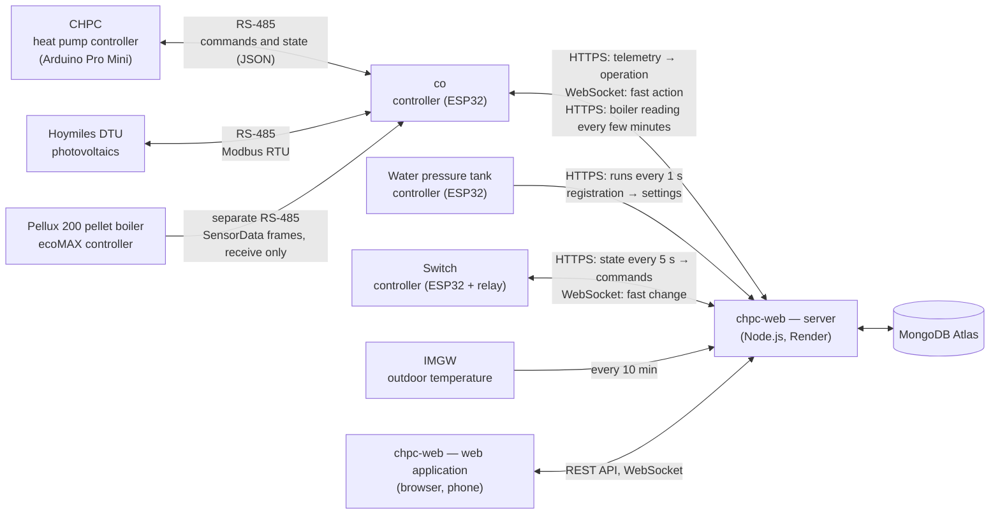

# chpc-web system documentation

[Polski](../README.md)

The system controls a domestic heat pump (CHPC) from the cloud, collects data from the photovoltaic installation, monitors a water pressure tank (hydrofor), shows the data of a pellet boiler and controls a 230 V switch. This file is the entry point: it describes the whole and leads to the documentation of each module. The Polish documentation is the primary one; the application's user interface is in Polish.

## What the system does

- **Heat pump.** In the web application the user sets the operating mode (central heating CO, domestic hot water CWU, off), temperatures and schedules. Every minute the server works out what the pump should do, and the `co` controller passes it to the CHPC pump controller. The application shows the current state, history, charts, energy costs and pump errors.
- **Photovoltaics.** Every minute the `co` controller reads power and production from the microinverters (Hoymiles DTU). The data goes to a separate collection and into the heat pump energy balance.
- **Water pressure tank.** At every start of the water pump the tank controller runs the air compressor for a while and sends the run times to the cloud. From that the application calculates water consumption: pump run time × pump flow derived from manual water meter readings.
- **Switch.** An ESP32 controller with a relay (the first one controls a water heater element) reports the relay states every 5 s and receives a command in the reply: on for a time, on without a limit, or off. The command follows from the mode chosen in the application and from the schedule (days as for the heat pump, no temperatures). The application shows the state and the activation history.
- **Pellet boiler.** The `co` controller (in its second role) listens over a separate RS-485 link to the ecoMAX controller of a Plum Pellux 200 boiler and sends the state, temperatures, fuel and outputs of the boiler to the cloud every few minutes. The application only displays it; there is no transmitting onto the boiler bus and no control (stage 2), and the frame format has not been verified on a boiler yet.

## System diagram



The key rule: **controllers start the connection, the server only replies.** The `co` controller sends the pump state every 10–30 s and receives the operation to perform in the reply. The WebSocket is used only to trigger that report sooner.

## Modules

| Module | What it does | Code | Documentation |
|---|---|---|---|
| **core** | shared application part: devices, controller registration, controller choice, menu, WebSocket, temperature, calendar | `server/src/core`, `client/src/core` | [docs/en/moduly/core](moduly/core/1-business-description.md) |
| **heat-pump** | heat pump in the application: telemetry, PV, operations, scheduler, schedules, screens | `server/src/modules/heat-pump`, `client/src/devices/heat-pump` | [docs/en/moduly/heat-pump](moduly/heat-pump/1-business-description.md) |
| **water-pressure-tank** | water pressure tank in the application: runs, water from pump time and the water meter, screens | `server/src/modules/water-pressure-tank`, `client/src/devices/water-pressure-tank` | [docs/en/moduly/water-pressure-tank](moduly/water-pressure-tank/1-business-description.md) |
| **pellet-boiler-pelux200** | pellet boiler in the application: boiler readings, polling interval, screens (view only) | `server/src/modules/pellet-boiler-pelux200`, `client/src/devices/pellet-boiler-pelux200` | [docs/en/moduly/pellet-boiler-pelux200](moduly/pellet-boiler-pelux200/1-business-description.md) |
| **switch** | switch in the application: relays, modes, schedules, activation history, screens | `server/src/modules/switch`, `client/src/devices/switch` | [docs/en/moduly/switch](moduly/switch/1-business-description.md) |
| **co firmware** | ESP32 controller between the pump, PV, the boiler and the cloud | `devices/co` | [devices/co/docs/en](../../devices/co/docs/en/1-business-description.md) |
| **CHPC firmware** | heat pump controller (compressor, circulation pumps, EEV, protections) | `devices/chpc` | [devices/chpc/docs/en](../../devices/chpc/docs/en/1-business-description.md) |
| **tank firmware** | ESP32 controller of the tank compressor | `devices/water-pressure-tank` | [devices/water-pressure-tank/docs/en](../../devices/water-pressure-tank/docs/en/1-business-description.md) |
| **switch firmware** | ESP32 controller with a 230 V relay ("ESP32 Relay AC X1" board) | `devices/switch` | [devices/switch/docs/en](../../devices/switch/docs/en/1-business-description.md) |

The controller kind (`deviceType`) decides which module the application uses: `heat_pump` (the `co` controller with the CHPC pump), `water-pressure-tank`, `pellet-boiler-pelux200` (a pellet boiler, the second role of the `co` controller) or `switch`. One physical controller may have several roles: in the application they are separate devices with the same `deviceId` but a different kind and `rootId` (described in the [core module](moduly/core/2-how-it-works.md)).

## Module documentation layout

Each module has three parts, in separate files:

1. **Business description** — why the module exists, for whom, what it enables, limitations and glossary. No technical details.
2. **How it works** — step by step, with diagrams (Mermaid: data flow, sequences, states).
3. **Technical documentation** — files and their roles, API, data models, contracts with other modules, configuration, tests, deployment, known issues.

Diagrams use [Mermaid](https://mermaid.js.org/); GitHub and the VS Code Markdown preview render them. Screenshots are shared with the Polish documentation.

Code comments (in Polish) exist on two levels: a **file header** (what it is for, who uses it, what it is linked to) and a **comment next to non-obvious logic** (why it is done this way).

## Rules for working on the whole system

- **The contract** means telemetry fields, operation keys, API paths and RS-485 commands. Changing it covers every part it affects (server, client, firmware), ideally in one commit.
- **Deployment order:** first the server (`main` branch, Render build started manually), then the `co`, tank or switch firmware, CHPC last. The server has to know a new field or path before a controller sends it.
- **Branches:** work on `develop`; merging to `main` only on explicit request.
- **A new controller kind:** a folder in `server/src/modules/` and `client/src/devices/`, an entry in both registries (`server/src/core/device-types.ts`, `client/src/core/device-types.tsx`) and a value in `DeviceType`. Details in the [core module](moduly/core/3-technical-documentation.md).

## Quick start

```bash
npm install
npm run local            # local MongoDB (port 27027), server (4001) and application (5173)
node scripts/seed-local.mjs   # demo data in the local database
npm test -w server -- --run
npm run build -w client
pio test -d devices/co -e native
pio test -d devices/chpc -e native
pio test -d devices/water-pressure-tank -e native
pio test -d devices/switch -e native
```

Production server: `https://chpc-web.onrender.com`. Server environment variables (`MONGODB_URI`, `PORT`, `API_KEY`) are described in the [core module](moduly/core/3-technical-documentation.md).
