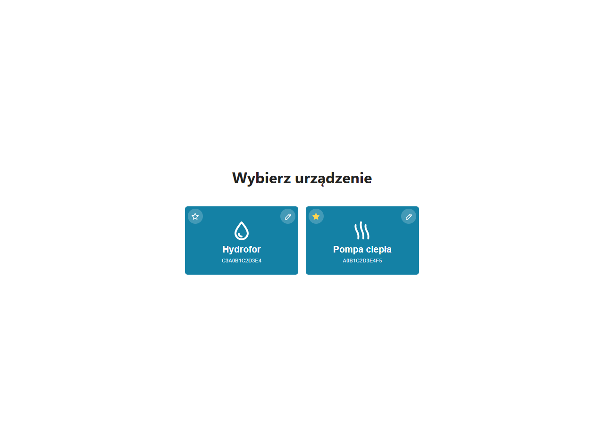
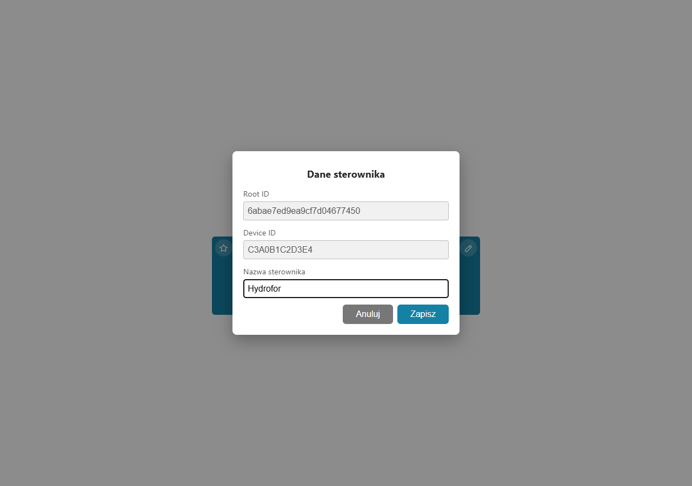
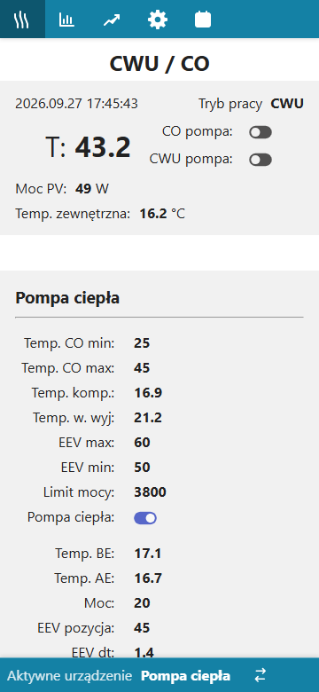
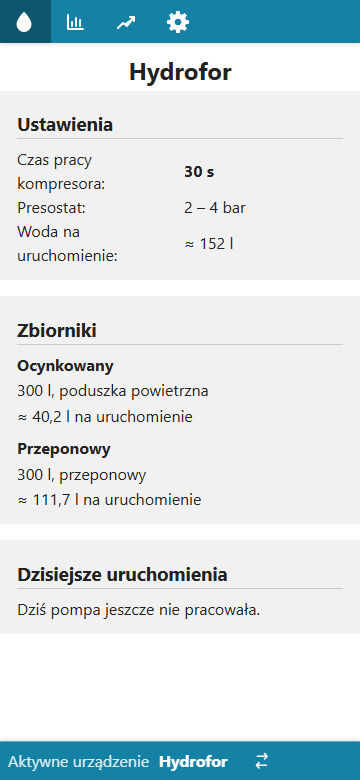

# Core module — business description

[← System documentation](../../README.md) · **1. Business description** · [2. How it works](2-how-it-works.md) · [3. Technical documentation](3-technical-documentation.md) · [Polski](../../../moduly/core/1-opis-biznesowy.md)

## Why this module exists

Core is the shared part of the chpc-web application, independent of the device kind. It lets one application handle several controllers of different kinds (today a heat pump, a water pressure tank and a pellet boiler), switch between them and add new kinds without rebuilding everything.

The module is responsible for:

- **the list of controllers** and choosing the one the user works with;
- **self-registration of controllers**: a new controller shows up in the application by itself once it is on the internet; nothing has to be typed in;
- **controller names** and the **default controller** opened when the application starts;
- **menus and screens that depend on the controller kind** (the heat pump has schedules, the water pressure tank and the boiler do not);
- **shared services**: outdoor temperature (IMGW), the Polish public holiday calendar, fast notifications to the controller and the browser (WebSocket).

## Who uses it

- **The installation owner** — chooses a controller, names it, sets the default one. Uses the application on a computer and on a phone.
- **The installer** (usually the same person) — connects a new controller; it is enough to give the controller Wi-Fi, the rest happens automatically.

## What the user can do

| Action | Where |
|---|---|
| See all controllers and choose one | "Wybierz urządzenie" screen (`/devices`) |
| Give or change a controller name | pencil on the tile, or "Zmień" in Settings |
| Set the default controller | star on the tile |
| Switch to another controller | "Aktywne urządzenie" footer (shown when there are at least two controllers) |
| See the Root ID and the controller identifier | "Dane sterownika" popup, "Sterownik" section in Settings |

The user interface is in Polish; the screenshots below show it as is.

*Controller list: a tile with the kind icon (drop — water pressure tank, waves — heat pump, flame — pellet boiler), the name and the identifier; the star marks the default controller, the pencil opens the controller data.*

*"Dane sterownika" popup: Root ID and Device ID are read-only, the name can be changed.*

| Phone — heat pump | Phone — water pressure tank |
|---|---|
|  |  |

*The menu depends on the controller kind: the heat pump has five items (including Schedules), the tank four, the pellet boiler three (Kocioł, Dane, Ustawienia). On a phone the menu shows icons only. At the bottom, the footer with the active controller and the switch button.*

## Typical scenarios

1. **A new controller.** The installer connects the controller and sets its Wi-Fi. The controller registers itself with the cloud and appears on the list — without a name, with its identifier (SN) only. The user names it with the pencil.
2. **Everyday use.** When opened, the application shows the default controller straight away. If there is only one controller, it picks it by itself.
3. **Several controllers.** The user switches in the footer. The choice lasts until the browser is closed; next time the default controller opens again.
4. **Replacing a controller or wiping its memory.** The controller registers again with the same SN and gets the same record back — the data history stays.
5. **A controller with several roles.** The `co` controller serves the heat pump and — when it is connected to a pellet boiler — the boiler as well. In the application these are two separate devices on the list (the pump and "Piec Pellux 200") with the same identifier (SN) but each with its own Root ID, menu and data history. The boiler appears only when the controller has received the first valid frame from it.

## Limitations and risks

- **No login and no API key.** The application assumes a single user. The API key check on the server is disabled, so anyone who knows the server address and a controller's Root ID can read data and send commands. The Root ID should not be published (the screenshots in this documentation use made-up identifiers).
- **A controller cannot be deleted in the application.** Deleting it requires a change in the database.
- **Some data lives in server memory** (latest telemetry, manual operations, device info). A server restart clears it; the controller restores it with its next report.
- **The outdoor temperature** comes from a single IMGW station (Zakopane) — for an installation elsewhere the station has to be changed in the code.

## Glossary

| Term | Meaning |
|---|---|
| **Controller** (sterownik) | the device at the installation that talks to the cloud: `co` (heat pump, second role: pellet boiler), the tank controller or the switch |
| **Controller kind** (`deviceType`) | `heat_pump`, `water-pressure-tank`, `pellet-boiler-pelux200` or `switch`; decides the menu, screens and data handling |
| **Controller role** | one task of a physical controller (e.g. `co` as the heat pump or as the boiler); each role is a separate device in the application |
| **SN** (`deviceId`) | the controller serial number — the factory MAC address of the ESP32, 12 hex characters; shared by all roles of the same controller |
| **Root ID** (`rootId`) | the device (role) identifier in the database; the application and the controller send it with every request |
| **Controller registration** (zgłoszenie) | the request a controller sends at start; creates the device or returns the existing one |
| **Default controller** | the controller opened when the application starts; at most one |
| **Settings** (`properties`) | controller settings stored in the cloud (e.g. heat pump temperatures, the tank compressor time) |
| **Controller kind registry** | the place in the code where each kind describes its menu, screens and default settings |
