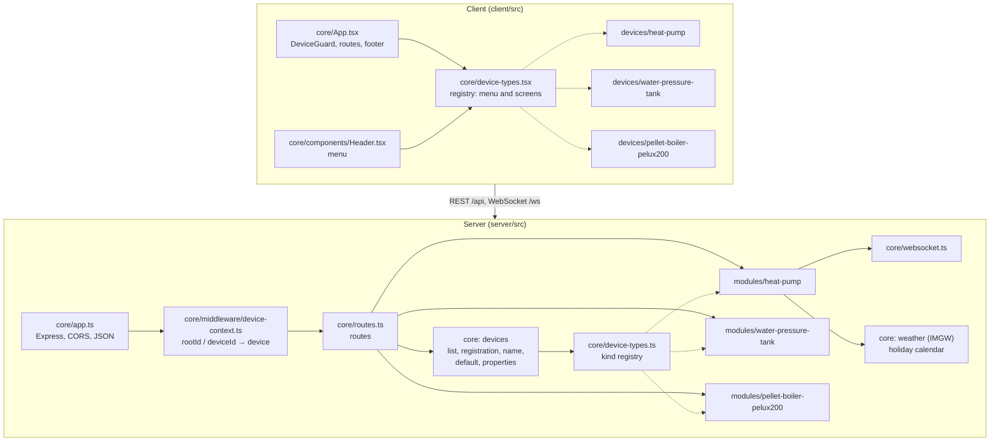
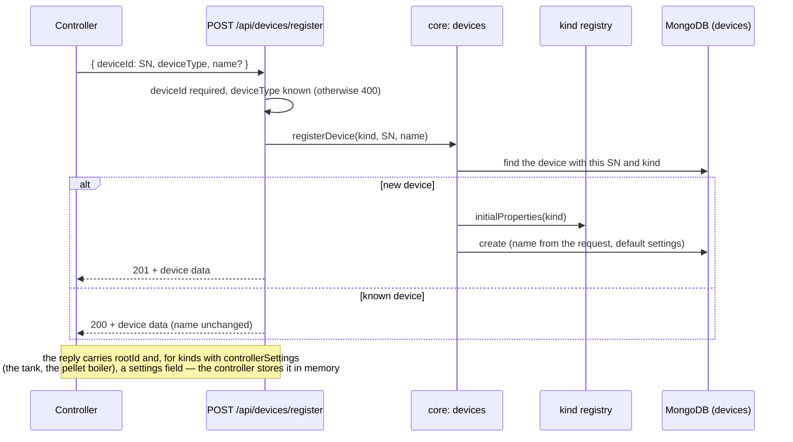
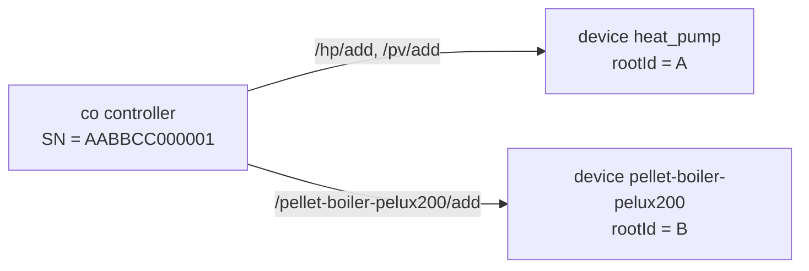
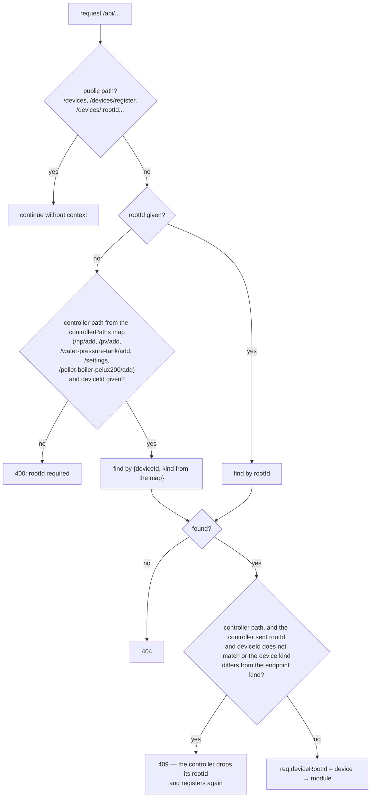
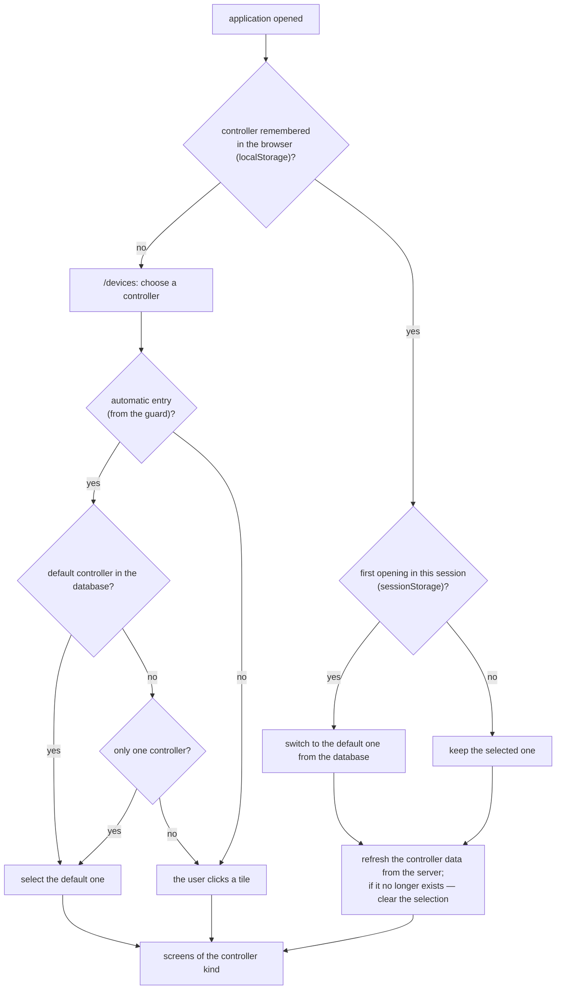
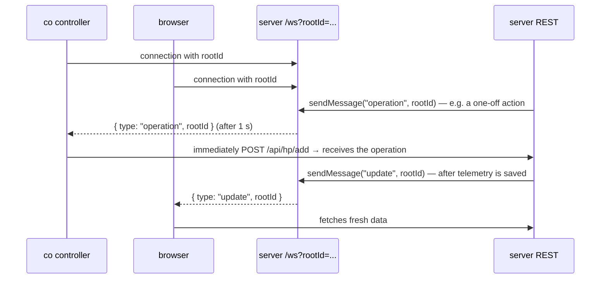

# Core module — how it works

[← System documentation](../../README.md) · [1. Business description](1-business-description.md) · **2. How it works** · [3. Technical documentation](3-technical-documentation.md) · [Polski](../../../moduly/core/2-zasada-dzialania.md)

## Place in the system

Core joins the controller-kind modules into one application. On the server it accepts every request, works out which controller it concerns and hands it to the module. On the client it keeps track of the selected controller and builds the menu from the module descriptions.

The controller-kind modules do not know about each other. Only core connects them: routes, the registry and the shared device document in the database.

## Controller registration

The tank controller registers at every start (it receives its settings in the reply); `co` registers at every start, after every IP address change and after a 409 reply, even when it already has the Root ID of the given role (a different `rootId` in the reply replaces the stored one); the pellet boiler role registers only after the first valid frame from the boiler. Both controllers send their IP address in the registration and the client shows it in Settings. The server recognises a device by the pair (kind, SN): a new one is created, a known one gets its record back.

The controller stores `rootId` in its memory (NVS; `co` separately for each role, the boiler under the key `pellet_root`). It may send data before registering too, with the SN only — the server accepts it if a device with that SN and the endpoint's kind already exists.

## One controller, several roles

A physical `co` controller may have several devices in the application: the heat pump (`heat_pump`) and the pellet boiler (`pellet-boiler-pelux200`). They share the `deviceId` (SN) but have a different `deviceType` and a different `rootId`; the `devices` model has no unique index on `deviceId`. So there is no "parent device": each role is an ordinary device with its own context, menu, data and settings.

Since the SN alone does not identify a device, the server picks the role by the **endpoint path** (the `controllerPaths` map in `device-context.ts`, below) and looks up the pair `{deviceId, deviceType}`. Registration (`POST /devices/register`) uses that pair too, so the same SN registered with a different kind creates a second device.

## Device context of every request

Almost every `/api` request has to point at a controller. The `device-context` middleware does it before the request reaches a module.

The 409 reply protects against a controller holding a `rootId` from a different database (e.g. after switching the server from local to production) or from another role (e.g. a pump `rootId` sent to the boiler endpoint).

For ordinary endpoints (outside `controllerPaths`) the context is determined by `rootId` alone, with no device kind check.

## Choosing a controller in the application

- The selected controller is kept in `localStorage` (`chpc.selectedDevice`), so it survives closing the browser.
- The switch to the default controller happens once per browser session (`sessionStorage` `chpc.defaultApplied`); a manual change in the footer lasts until the end of the session.
- A remembered controller that no longer exists in the database (e.g. after switching from the local to the production database) is removed from browser memory. A network error removes nothing.

## Menu and screens from the registry

Each controller kind lists its screens (path, label, icon, page) in its `device-type` file. The application:

1. creates routes for all paths of all kinds;
2. for the requested path shows the screen of the active controller's kind;
3. if that kind has no such path (e.g. the tank and `/schedules`), redirects to the home page;
4. draws the header menu from the screens of the active kind.

After a controller change the screen is created from scratch, so no data of the previous controller is left in it.

The server has a matching registry: each kind provides the settings of a new device and the settings returned on registration (tank: compressor time, thresholds, tanks; pellet boiler: `poll_interval_seconds`).

## WebSocket

The WebSocket carries nothing but a "come and get the data" signal. Operations always reach the controller in the reply to its own HTTP request. A connection without `rootId` is closed by the server.

## Shared services

- **Outdoor temperature.** At start and every 10 minutes the server fetches the reading of the IMGW synoptic station (Zakopane). The value is added to heat pump telemetry records (`t_out`) and sent back to the `co` controller, which shows it on its display.
- **Calendar.** All user dates are in the `Europe/Warsaw` time zone. The calendar knows fixed and movable Polish holidays (Christmas Eve included) and decides whether a day is a working day — the heat pump schedule uses it.

## Server start

1. Environment variables are loaded; without `MONGODB_URI` the server stops with an error.
2. MongoDB connection.
3. The heat pump scheduler starts (one run immediately, then every minute).
4. PV panel details older than 90 days are cleaned (immediately and every 24 h).
5. The IMGW temperature is fetched and then refreshed every 10 minutes.
6. HTTP and WebSocket listen on `PORT`.
