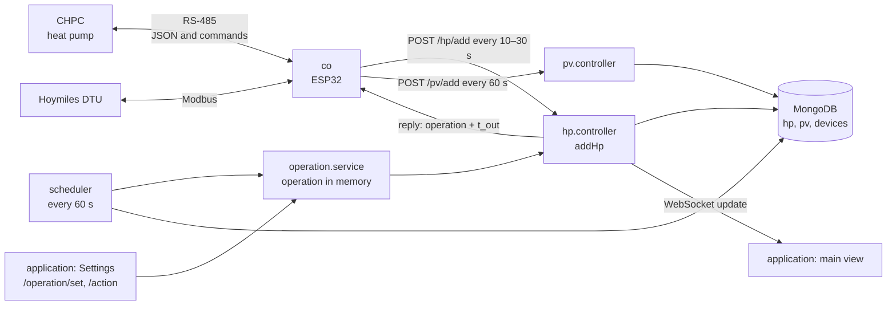
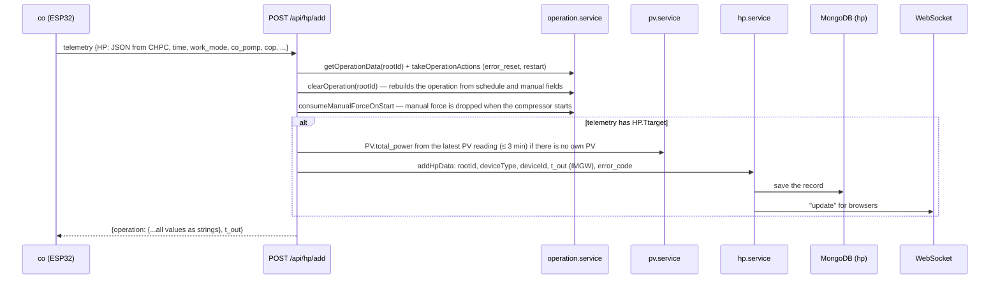
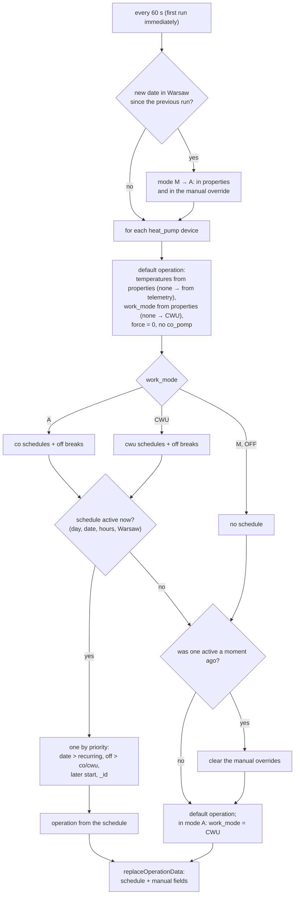
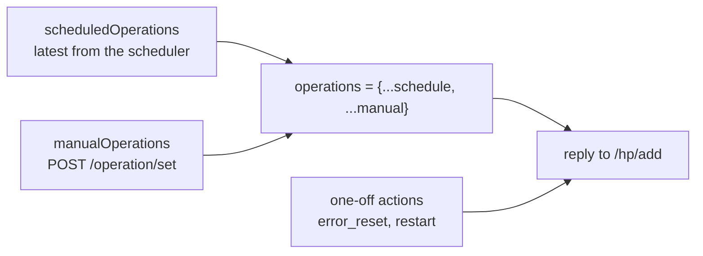

# Heat-pump module — how it works

[← System documentation](../../README.md) · [1. Business description](1-business-description.md) · **2. How it works** · [3. Technical documentation](3-technical-documentation.md) · [Polski](../../../moduly/heat-pump/2-zasada-dzialania.md)

## Control chain



The server never connects to the pump on its own. The operation waits in server memory and `co` receives it in the reply to its next telemetry report.

## Telemetry → operation cycle



When CHPC does not answer, `co` still sends telemetry (with an empty `HP`). The server does not store it but returns the operation, so the controller knows the operating mode even with the pump disconnected.

## Scheduler (every minute)



| Schedule type | `work_mode` | Temperatures | `force` |
|---|---|---|---|
| `off` (break) | `OFF` | default | always `0` |
| `co` | `A` | `co_min`, `co_max` (missing in the schedule → default) | `forceStart` |
| `cwu` | `CWU` | `cwu_min`, `cwu_max` (missing → default) | `forceStart` |

A time range may cross midnight (`21:30–05:30`); the end is exclusive. Days: a specific weekday, every day, working days (Mon–Fri without holidays) or days off (weekends and Polish holidays, Christmas Eve included). A specific date takes precedence over the weekday.

## Operations: schedule, manual fields and actions

The server keeps three maps per device in memory:



- **When the operation reaches `co`.** After telemetry is handled, `clearOperation` clears the current operation. Without manual overrides the operation is therefore sent once after each scheduler run (every minute) and the other replies are `{}` — `co` remembers the last values. With manual overrides every reply carries the full state.
- **Manual fields win** over the schedule, but only those actually sent.
- **Manual overrides disappear** when a schedule ends (transition "active → none"), after a server restart, and `force: "1"` alone — at the first compressor start (`HP.HPS`: idle → running). Without this a manual force would last forever, because CHPC clears forcing when it stops and `co` would send it again.
- **A mode change without `co_pomp`** stores `co_pomp: "1"`: `co` remembers the last value, so an earlier manual `"0"` would keep the CO/CWU relays off despite the mode change.
- **One-off actions** (`error_reset` — unlock, `restart` — CHPC restart) go into exactly one reply and are never merged with the operation. The server immediately sends `operation` over the WebSocket, so the action reaches the pump within seconds. **Note:** `co` applies the reply only in CLOUD mode; in other modes the action is lost.
- **The default mode never comes from telemetry** — the controller reports the mode it received, so the server would echo its own state back and e.g. `OFF` would stick forever.

On the `co` side changed values turn into RS-485 commands for CHPC. CHPC does not acknowledge commands, so after every reading `co` compares the pump state (`HP.CO`, `HP.F`, `HP.Tmax`, `HP.Tmin`) with the expected one and resends the command on a mismatch — details in the [co firmware documentation](../../../../devices/co/docs/en/2-how-it-works.md).

## Photovoltaics

```mermaid
sequenceDiagram
    participant CO as co
    participant PV as POST /api/pv/add
    participant S as pv.service
    participant M as MongoDB (pv)
    participant H as /hp/add, GET /hp
    CO->>PV: every 60 s {time, total_power, total_prod, total_prod_today, temperature, pv_power, panels[]}
    PV->>S: save + latest reading in memory (restored from the database after a restart)
    S->>M: pv document (panels removed after 90 days)
    H->>S: latest reading younger than 3 min?
    S-->>H: PV.total_power into the hp record; full summary for GET /hp
```

The `hp` record gets only `PV.total_power` — for the energy balance. **The `hp` and `pv` collections are never joined in an aggregation**: the production Atlas sorts at most 32 MB in memory and does not allow `allowDiskUse`.

## Pump errors

1. In every reply CHPC gives `ERR` (code of the last event), `ERRn` (event number, increasing) and `ERRc` (error counter; 5 = lock).
2. When `ERRn` differs from the previous record and `ERR` ≠ 0, the server stores `error_code` in the new record.
3. `GET /hp/last-error` returns the newest record with `error_code` from the last 24 h; while locked (`ERRc` ≥ 5) — with no time limit, until unlocked.
4. The application shows a red bell in the main view, a red row in the data table and a description in Settings.

| Code | Meaning | Code | Meaning |
|---|---|---|---|
| 1 | temperature sensor | 8 | Tae (after the evaporator) too low |
| 2 | overload (power) | 9 | Tco too low |
| 3 | no flow | 10 | relay (power while the compressor is off) |
| 4 | power too low | 11 | lock after 5 errors |
| 5 | Tho (outgoing water) too high | 12 | Tsump (crankcase) too low |
| 6 | Tsump too high | 13 | Tbe (before the evaporator) below −1 °C for more than 60 s |
| 7 | Tbc too high | | |

## Application screens

| Screen | Data | Refresh |
|---|---|---|
| **Main view** | `GET /hp` (latest telemetry + PV summary), `GET /hp/last-error` | on the WebSocket `update` message |
| **Data** | `GET /hp/dates` (day list), `GET /hp/4day?date=` (day); "Pobierz dane" — `GET /hp/all` to CSV | on day change |
| **Chart** | day: `/hp/4day`; month and year: `/hp/monthly-summary` (energy, PV, G12w cost) | on period change |
| **Settings** | `GET /operation` (form values), `POST /operation/set`, `POST /operation/action`, telemetry and error | on entry |
| **Schedules** | `GET/POST/PUT/DELETE /schedules`, `GET /schedules/current`, `GET/PUT /device/properties` | every minute and after saving (highlight of the active entry) |

The locks in Settings follow pump behaviour: "Pompy CO/CWU" are locked in `CWU` and `OFF` modes (there `co` keeps the relays off anyway); forced start and the cold/hot water pumps — while the compressor runs (`HPS` > 0), because the pump drives them itself and accepts forcing only when idle.
