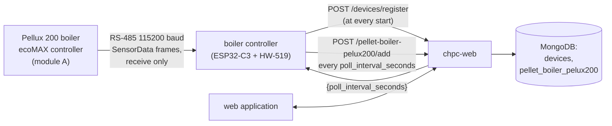
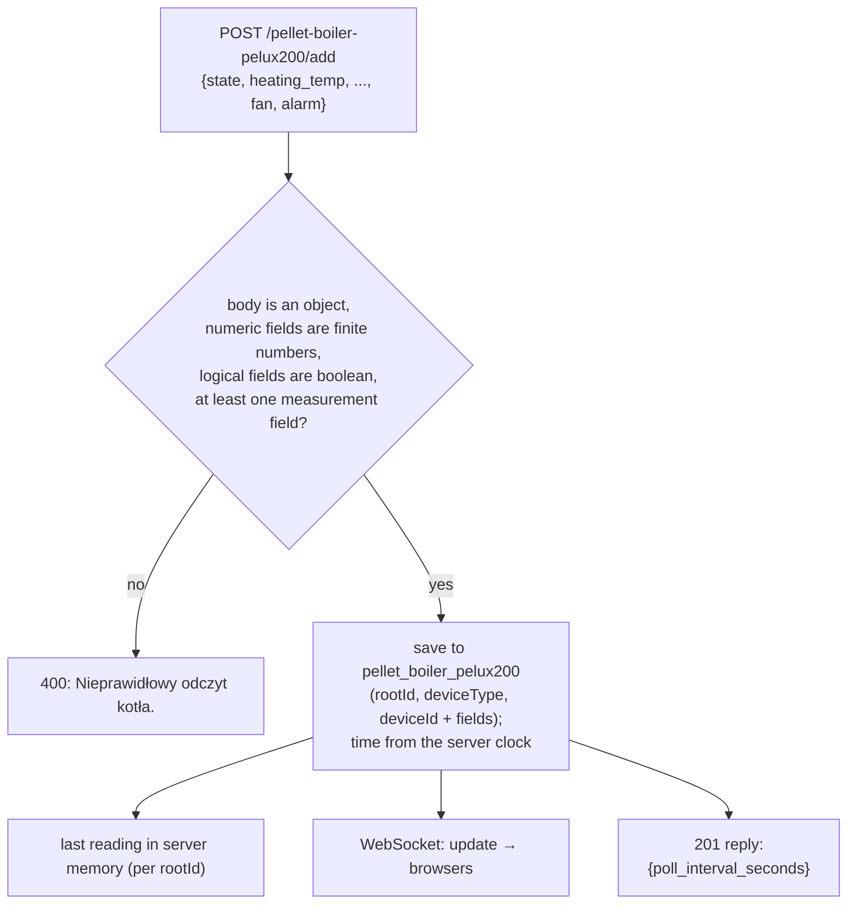
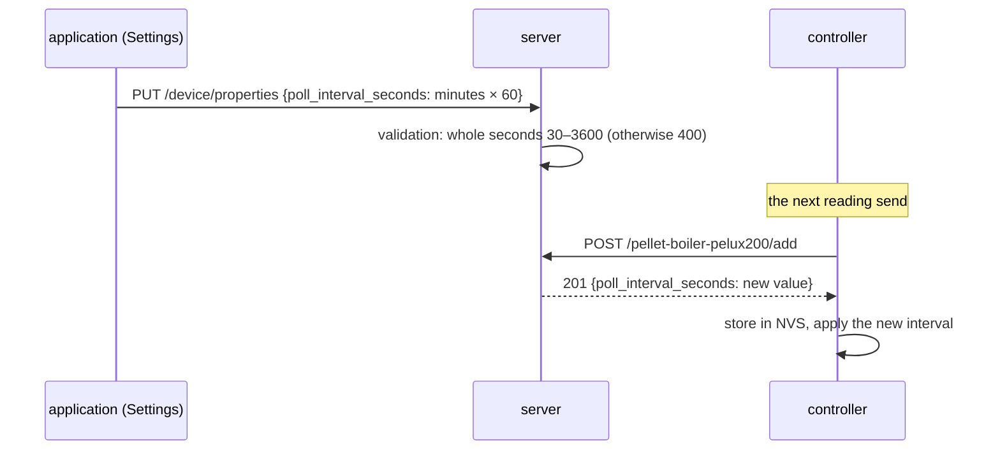

# Module pellet-boiler-pelux200 — how it works

[← System documentation](../../README.md) · [1. Business description](1-business-description.md) · **2. How it works** · [3. Technical documentation](3-technical-documentation.md) · [Polski](../../../moduly/pellet-boiler-pelux200/2-zasada-dzialania.md)

## Diagram



The controller side (wiring, frame parser, pins, protocol) is described in the [controller README](../../../../devices/pellet-boiler-pelux200/README.md) and [piec-pellux200.md](../../../../devices/pellet-boiler-pelux200/docs/piec-pellux200.md) (both Polish). This document describes the cloud and application side. The boiler is **only a data source**: the server has no scheduler, no operations and no control replies for it (the only value sent back to the controller is the polling interval).

## Stages

| Stage | Scope | Status |
|---|---|---|
| 1 | the boiler controller receives `SensorData` frames from the boiler bus and sends readings to the cloud | implemented; frame format from PyPlumIO **not verified on a boiler** |
| 2 | the boiler controller answers the ecoMAX controller's device-presence query (`CheckDevice`) and transmits on the bus, boiler control | **not implemented** |

## The boiler controller

Since 2026-10-03 the boiler is read by a separate boiler controller (an ESP32-C3 SuperMini board with an HW-519 RS-485 module, `devices/pellet-boiler-pelux200`). It has its own SN (the board's MAC), so in the cloud it is an ordinary device of kind `pellet-boiler-pelux200`. Until 2026-10-02 this role was played by the `co` controller: the same SN was then two devices in the cloud (the heat pump and the boiler, different `rootId`s). The server still supports several roles of one SN (described in the [core module](../core/2-how-it-works.md)): it tells them apart by the **endpoint path** (`controllerPaths` in `device-context`, lookup by the pair `{deviceId, deviceType}`), and a `rootId` of another role gives **409**.

## Registration: at every start

```mermaid
sequenceDiagram
    participant K as boiler (ecoMAX)
    participant C as boiler controller
    participant R as POST /devices/register
    participant A as POST /pellet-boiler-pelux200/add
    participant M as MongoDB
    C->>R: once on Wi-Fi: {deviceId: SN, deviceType: "pellet-boiler-pelux200", name: "Piec Pellux 200", version, ip}
    R->>M: create the device (properties.poll_interval_seconds = 300) or return the existing one
    R-->>C: {rootId, ..., settings: {poll_interval_seconds}}
    C->>C: store rootId and the interval in NVS (namespace pel)
    K->>C: SensorData frames (continuously, to the panel)
    loop every poll_interval_seconds
        C->>A: the last valid reading (younger than 60 s)
        A->>M: save the reading
        A-->>C: 201 {poll_interval_seconds}
        C->>C: store the new interval in NVS
    end
    Note over C,A: failed send: retry after 60 s;<br/>404 or 409 → the controller drops the Root ID and registers again
```

- A failed registration is retried every 30 s; until it succeeds nothing is sent. The controller registers even with no boiler connected (the device then has no readings).
- The name "Piec Pellux 200" goes only to a **new** device; a known device keeps its name.
- The controller may also send a reading with `deviceId` only (no `rootId`) if a device with that SN and kind `pellet-boiler-pelux200` already exists.

## Saving a reading in the cloud



- All measurement fields are optional: the controller sends what it managed to read. A single field of the wrong type rejects the whole reading (400).
- The `time` field and unknown keys are **ignored**: the record time (`createdAt`) is set by the server when it accepts the reading.
- The reply carries the current `poll_interval_seconds`, so a change in the application reaches the controller with the next send, without a new registration.

## Polling interval: application ↔ controller



The application form takes minutes (0.5–60) and saves `round(minutes × 60)` seconds. `PUT /device/properties` replaces the whole `properties`, so the application sends the loaded object with the new value of the field.

## Application screens

| Screen | Data | Refresh |
|---|---|---|
| **Kocioł** (`/`) | `GET /pellet-boiler-pelux200/last`, `GET /device/properties` (the interval, to judge freshness) | last reading every 30 s |
| **Dane** (`/data`) | `GET /pellet-boiler-pelux200/list?date=YYYY-MM-DD`, CSV in the browser | on entry and on date change |
| **Ustawienia** (`/settings`) | `GET/PUT /device/properties`; the "Sterownik" section with `DeviceEditModal` | on entry |

- **Data freshness.** A reading is stale when it is older than `3 × poll_interval_seconds` (or has no time): the view then shows "Dane nieaktualne". The default interval used for the judgement is 300 s until the properties are loaded.
- **Alarm state.** The title of the Kocioł view is red when `alarm` is `true` or `state` = 8 (Alarm).
- **No data.** An `{}` reply from `/last` gives the message "Brak danych od sterownika" (no data from the controller).
- Paths outside the boiler menu (`/schedules`, `/chart`, `/hp`) redirect to `/`.
