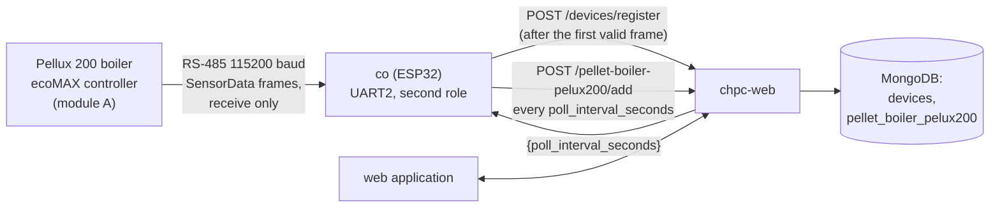
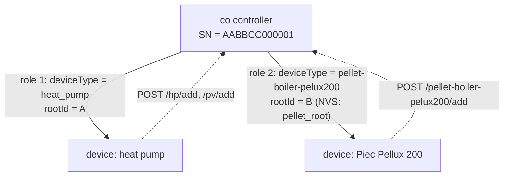
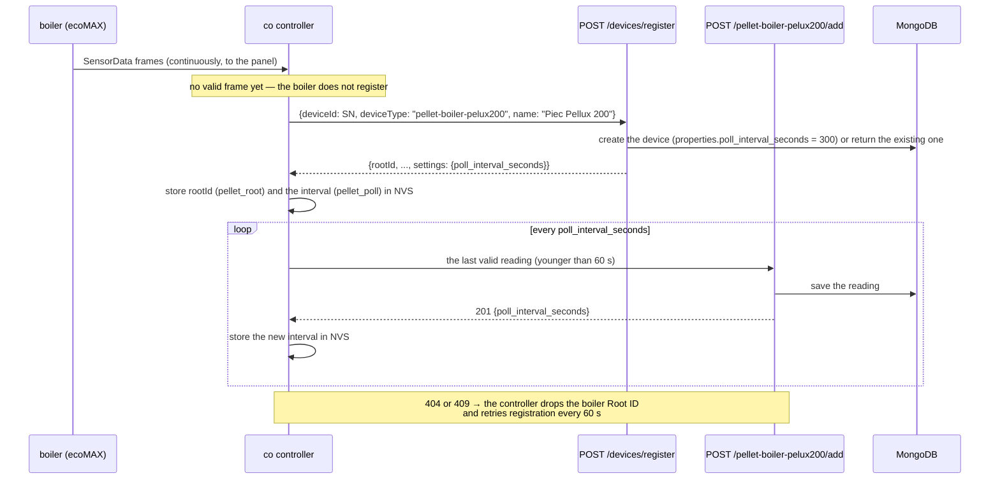
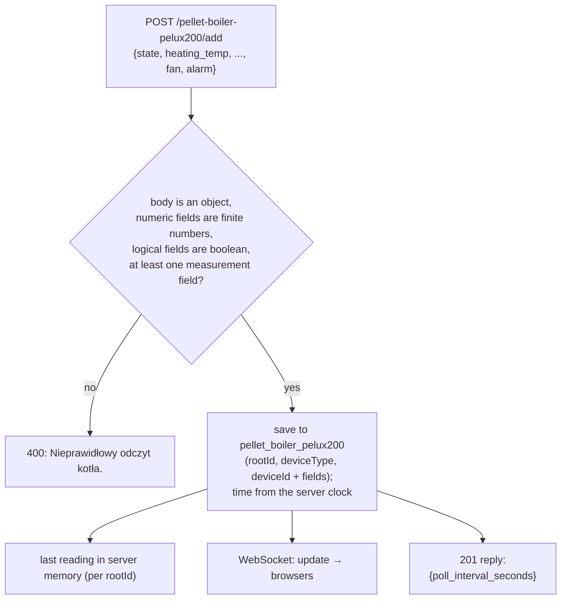
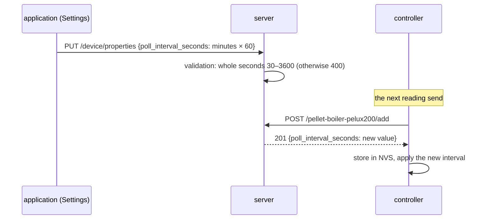

# Module pellet-boiler-pelux200 — how it works

[← System documentation](../../README.md) · [1. Business description](1-business-description.md) · **2. How it works** · [3. Technical documentation](3-technical-documentation.md) · [Polski](../../../moduly/pellet-boiler-pelux200/2-zasada-dzialania.md)

## Diagram

The controller side (wiring, frame parser, pins, protocol) is described in [piec-pellux200.md](../../../../devices/co/docs/piec-pellux200.md) (Polish). This document describes the cloud and application side. The boiler is **only a data source**: the server has no scheduler, no operations and no control replies for it (the only value sent back to the controller is the polling interval).

## Stages

| Stage | Scope | Status |
|---|---|---|
| 1 | `co` receives `SensorData` frames from the boiler bus and sends readings to the cloud | implemented; frame format from PyPlumIO **not verified on a boiler** |
| 2 | `co` answers the controller's device-presence query (`CheckDevice`) and transmits on the bus, boiler control | **not implemented** |

## Two roles of one controller

The same physical `co` controller is two devices in the cloud with the same `deviceId` (SN) but a different kind and a different `rootId`.

- The boiler has its own Root ID in the controller memory (key `pellet_root`), independent of the pump's Root ID.
- The server tells the roles apart by the **endpoint path**: `device-context` has a `controllerPaths` map (endpoint → kind) and looks the device up by the pair `{deviceId, deviceType}`. Registration also uses that pair. So `POST /pellet-boiler-pelux200/add?deviceId=SN` reaches the boiler and `POST /hp/add?deviceId=SN` reaches the pump.
- A `rootId` of the other role gives **409**: a pump `rootId` sent to the boiler endpoint (and the other way round) is rejected, so the controller drops the Root ID of that role and registers again.

## Registration: only after the first valid frame

- A controller with no boiler (no valid frame at all) does not create the boiler device.
- The name "Piec Pellux 200" goes only to a **new** device; a known device keeps its name.
- The controller may also send a reading with `deviceId` only (no `rootId`) if a device with that SN and kind `pellet-boiler-pelux200` already exists.

## Saving a reading in the cloud

- All measurement fields are optional: the controller sends what it managed to read. A single field of the wrong type rejects the whole reading (400).
- The `time` field and unknown keys are **ignored**: the record time (`createdAt`) is set by the server when it accepts the reading.
- The reply carries the current `poll_interval_seconds`, so a change in the application reaches the controller with the next send, without a new registration.

## Polling interval: application ↔ controller

The application form takes minutes (0.5–60) and saves `round(minutes × 60)` seconds. `PUT /device/properties` replaces the whole `properties`, so the application sends the loaded object with the new value of the field.

## Application screens

| Screen | Data | Refresh |
|---|---|---|
| **Kocioł** (`/`) | `GET /pellet-boiler-pelux200/last`, `GET /device/properties` (the interval, to judge freshness) | last reading every 30 s |
| **Dane** (`/data`) | `GET /pellet-boiler-pelux200/list?date=YYYY-MM-DD`, CSV in the browser | on entry and on date change |
| **Ustawienia** (`/settings`) | `GET/PUT /device/properties`; the "Sterownik" section with `DeviceEditModal` | on entry |

- **Data freshness.** A reading is stale when it is older than `3 × poll_interval_seconds` (or has no time): the view then shows "Dane nieaktualne". The default interval used for the judgement is 300 s until the properties are loaded.
- **Alarm state.** The title of the Kocioł view is red when `alarm` is `true` or `state` = 8 (Alarm).
- **No data.** An `{}` reply from `/last` gives the message "Brak danych od sterownika" (no data from the controller).
- Paths outside the boiler menu (`/schedules`, `/chart`, `/hp`) redirect to `/`.
