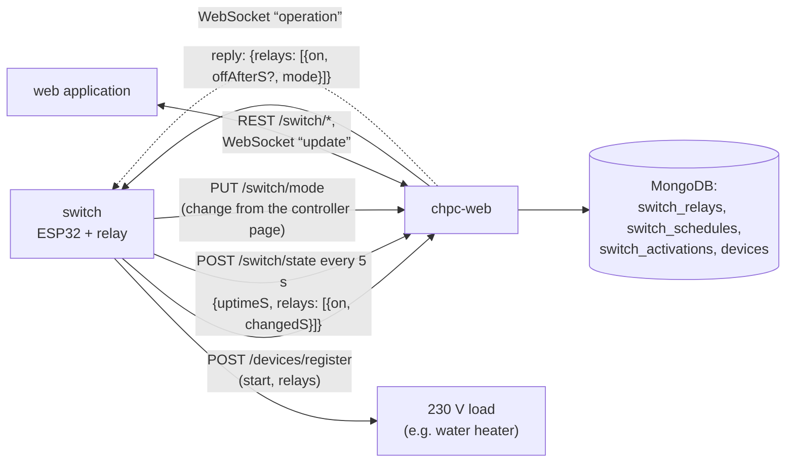
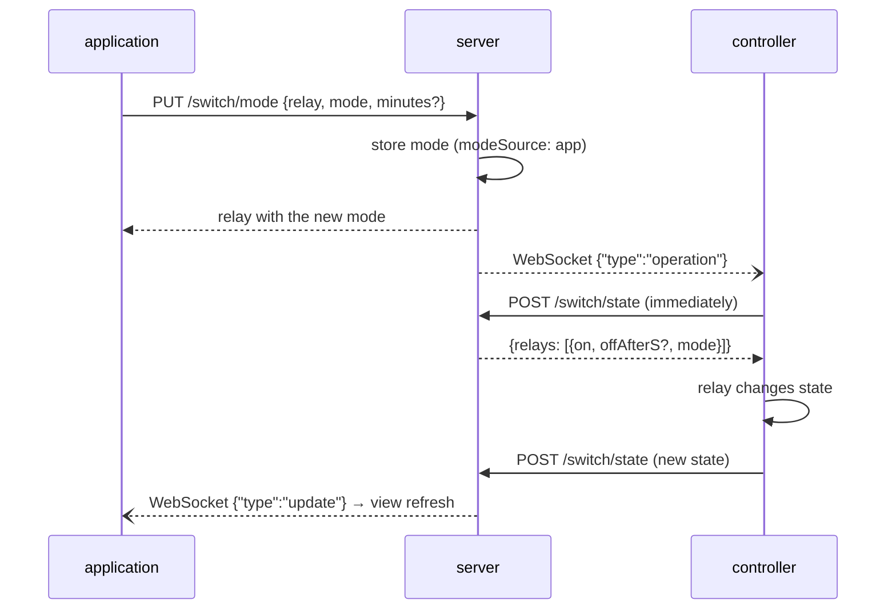
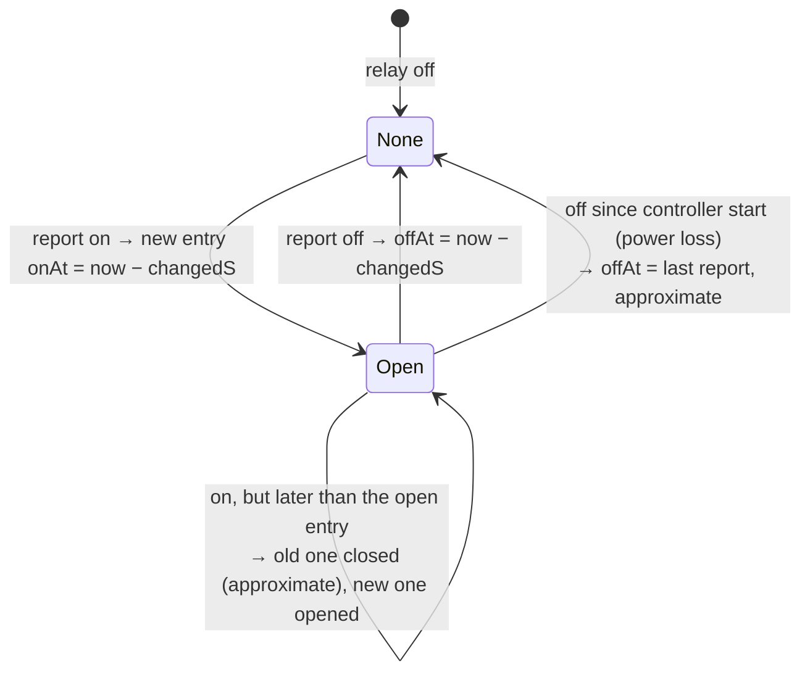

# Switch module — how it works

[← System documentation](../../README.md) · [1. Business description](1-business-description.md) · **2. How it works** · [3. Technical documentation](3-technical-documentation.md) · [Polski](../../../moduly/switch/2-zasada-dzialania.md)

## Diagram

The controller itself (countdown, pages, local changes, OTA) is described in the [switch firmware documentation](../../../../devices/switch/docs/en/2-how-it-works.md). This document covers the cloud and application side.

## Command computed on every report

The switch has no separate scheduler like the heat pump. Every 5 s the controller reports the relay states, and in the reply the server computes a command for each relay from the relay's **mode** and its **schedule**:

```mermaid
flowchart TD
    M{"relay mode<br/>(switch_relays.mode)"}
    M -- on --> ON["{on: true}<br/>no limit"]
    M -- off --> OFF["{on: false}<br/>schedule blocked"]
    M -- timer --> T{"until passed?"}
    T -- no --> TON["{on: true, offAfterS: until − now}"]
    T -- yes --> S
    M -- schedule --> S{"schedule window<br/>active?"}
    S -- yes --> SON["{on: true, offAfterS: window end − now}"]
    S -- no --> SOFF["{on: false}"]
```

- **`offAfterS`** is the number of seconds until switch-off. The controller counts it down by itself, so without the internet it finishes the activation and turns off. Every following report refreshes the countdown.
- **A timer after `until`** acts as the schedule; at the next report the server stores mode `schedule` in the database.
- **Modes are persistent** (collection `switch_relays`): a server restart does not clear them, unlike the manual operations of the heat pump.
- Every reply also carries `mode` (for display on the controller page only).

## Schedule

A schedule entry (collection `switch_schedules`) belongs to one relay: a day (`dayOfWeek`) or a single date (`date`, takes precedence), `startTime`, `endTime` (`HH:mm`, Warsaw time) and `enabled`. The days are the same as for the heat pump (`WeekDay` in `core/types.ts`): every day, working days without holidays, days off (weekends and Polish public holidays), a specific day of the week.

```mermaid
gantt
    title Relay windows (example, Monday–Tuesday)
    dateFormat HH:mm
    axisFormat %H:%M
    section entries
    Mon 06:00–07:00          :a1, 06:00, 60m
    Mon 07:00–08:00          :a2, 07:00, 60m
    Mon 22:00–06:00 (+1 day) :a3, 22:00, 120m
    section command
    one activation until 08:00 :b1, 06:00, 120m
    on until Tue 06:00       :b2, 22:00, 120m
```

- **A window across midnight** (`startTime > endTime`, e.g. 22:00–06:00) belongs to the day it starts on: the entry "Monday 22:00–06:00" lasts from Monday 22:00 to Tuesday 06:00. This differs from the heat pump scheduler, which compares the time with the current day.
- **The end is exclusive**: at `endTime` the window is no longer active. `startTime = endTime` means an empty window.
- **Touching or overlapping windows are merged**: 06:00–07:00 and 07:00–08:00 give one activation until 08:00 (`until` = the end of the last window), so the controller gets one continuous on time and the relay does not click at 07:00.
- **The next activation** (`nextStart`) is shown by the application when a relay in schedule mode is off; the server looks for it within 8 days.
- Disabled entries (`enabled: false`) are listed but do not run.

## Mode change

- A change from the **controller page** goes the other way: the controller switches the relay at once and sends `PUT /switch/mode` with `source: "controller"` (the `deviceId` alone is enough). The server stores it like a change from the application, with `modeSource: controller`.
- Creating, changing and deleting a schedule entry also wakes the controller with an `operation` message, so a new window takes effect immediately.
- "Włącz" for a time: `mode: timer` with `minutes` 1–10080 (7 days); `until = now + minutes`. "Włącz" with 0 h 0 min sends `mode: on`.

## Activation history

The history (collection `switch_activations`) is built from the **state reported by the controller**, not from cloud commands. For each relay the controller sends `changedS` — how many seconds it has been in its current state — so the server knows the moment of change (`now − changedS`) also after a connectivity gap.

- **Power loss.** After a restart the controller has its relays off since start. The server detects this from `uptimeS` (state off since the start, with a 5 s margin) and closes the open activation at the **last report before the restart** (`lastSeenAt`), flagged `approximate`.
- **Activation cause** (`source`): `schedule` in schedule mode, and in manual modes `app` or `controller` (who set the mode). The server stores it, but the application does not show it.
- When a relay has changed state, the server sends `update` over WebSocket to the browsers.

## Online

A relay is **online** when the controller reported within 30 s (`lastSeenAt`). The application then shows the normal state, and without a report — "Sterownik offline od …". "Czeka na sterownik…" means the controller is online but its state (`on`) does not match the command (`desiredOn`) yet.

## Number of relays

The controller sends the number of relays in the registration (`relays`) and in every state report (array length). The server creates the missing relays 1…N (schedule mode, off, no name) and deletes surplus ones together with their schedules. Thanks to that the application shows the relays right after the first registration.

## Application screens

| Screen | Data | Refresh |
|---|---|---|
| **Włącznik** (`/`) | `GET /switch/relays`, `GET /switch/activations?date=` (today), `GET /device/properties` (default time), `PUT /switch/mode` | every 5 s and on WebSocket `update`; countdown every 1 s in the browser |
| **Dane** (`/data`) | `GET /switch/activations?date=`, `GET /switch/relays` (names); relay filter and CSV in the browser | on day change |
| **Harmonogram** (`/schedules`) | `GET/POST /switch/schedules`, `PUT/DELETE /switch/schedules/:id`, `GET /switch/relays` (entry active now: `scheduleId`) | relays every minute and after saving |
| **Ustawienia** (`/settings`) | `GET /switch/relays`, `PUT /switch/relays/:relay` (names), `GET/PUT /device/properties` (`default_on_minutes`), `GET /devices` and `GET /firmware/switch` (controller card: IP, firmware version, update) | on entry |
