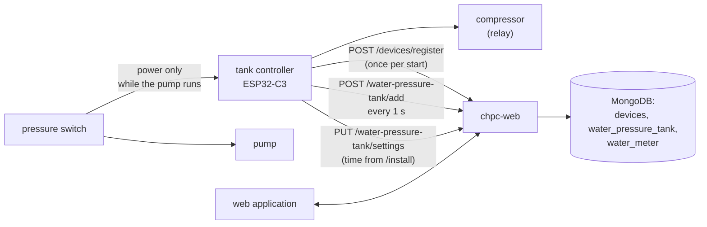
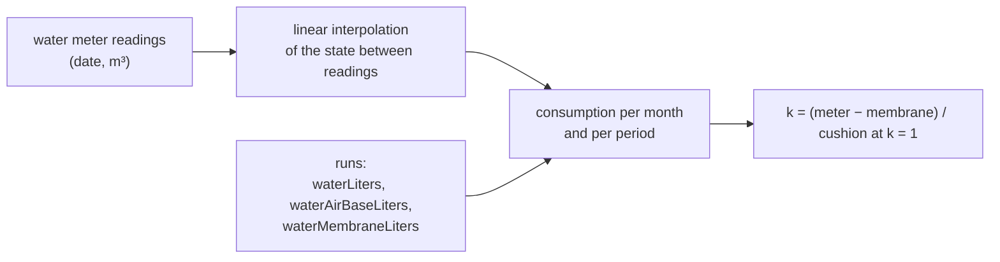
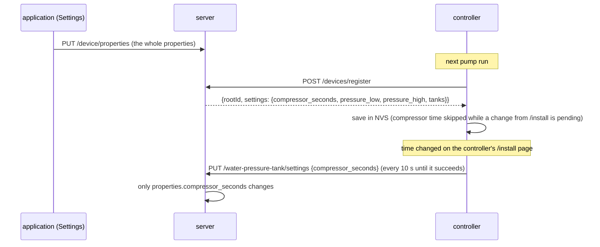

# Water-pressure-tank module — how it works

[← System documentation](../../README.md) · [1. Business description](1-business-description.md) · **2. How it works** · [3. Technical documentation](3-technical-documentation.md) · [Polski](../../../moduly/water-pressure-tank/2-zasada-dzialania.md)

## Diagram



How the controller itself works (compressor, queue, pages) is described in the [tank firmware documentation](../../../../devices/water-pressure-tank/docs/en/2-how-it-works.md). This document covers the cloud and application side.

## A run in the cloud: dates from relative times

The controller has no clock. Every message carries times counted from its own start, and the server turns them into dates using its own clock.

```mermaid
sequenceDiagram
    participant S as controller
    participant A as POST /water-pressure-tank/add
    participant M as MongoDB (water_pressure_tank)
    S->>A: {runId, pumpRunS: 1, compressorStartS: 1}
    A->>M: new run: pumpStart = now − pumpRunS,<br/>water = estimate from the current settings
    loop every 1 s
        S->>A: {runId, pumpRunS, compressorStartS, compressorEndS?, restarts}
        A->>M: pumpEnd = time received, lastSeenAt, compressor times
    end
    Note over S: the pressure switch stops the pump → the controller loses power
    Note over M: the last message sets the pump end (±1 s);<br/>"in progress" while the last message is younger than 5 s
```

- There is one record per `runId` (unique index `{rootId, runId}`); later messages update it.
- **A queued run** (`queued: true`) — one from which no message arrived at the previous start — gets dates from the time it is received and the `timeApproximate` flag. If the server already knows it, only the pump end (`pumpStart + pumpRunS`) is filled in.
- The compressor start is kept when a later message lacks it.

## Water estimate (Boyle's law)

The tanks work at the same pressure, so the water of one run is the sum over the enabled tanks. Pressures are absolute (manometer + 1.013 bar); `p_d` — lower threshold, `p_g` — upper.

```text
air cushion:        ΔV = k · V · 1.013 · (1/p_d − 1/p_g)
membrane (bladder): ΔV = V · p0 · (1/max(p_d, p0) − 1/p_g)     (0 when p0 ≥ p_g)
```

Example for the default settings (2–4 bar, 300 l air cushion at `k` = 1, 300 l membrane at `p0` = 1.8 bar): 40.2 l + 111.7 l ≈ 152 l per run.

The same formula lives in three places — the **server** (value stored in the record), the **application** (preview in Settings and on the main screen) and the **controller** (its `/` page). Change them together; a test checks that the server and the application agree.

## Water meter and the k factor



- Every run stores the membrane part and the cushion part at `k` = 1 separately — so `k` can be computed whatever `k` was in force.
- The suggested `k` is computed from the whole period covered by readings (not only the selected year); at least two readings are needed.
- Months outside the reading range have no water meter value.

## Settings: cloud ↔ controller



## Application screens

| Screen | Data | Refresh |
|---|---|---|
| **Hydrofor** | `GET /device/properties`, `GET /water-pressure-tank/runs?from=&to=` (today) | runs every 10 s |
| **Data → pump runs** | `GET /water-pressure-tank/runs?from=&to=` (month), CSV built in the browser | on month change |
| **Data → water meter readings** | `GET/POST /water-pressure-tank/meter`, `DELETE /water-pressure-tank/meter/:id` | after a change |
| **Chart** | `GET /water-pressure-tank/summary?period=day\|month\|year&date=`; year with meter: `GET /water-pressure-tank/meter/summary?year=` | on period change |
| **Settings** | `GET/PUT /device/properties`; validation in the browser | on entry |
