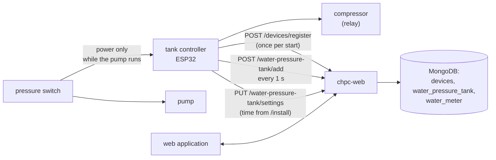
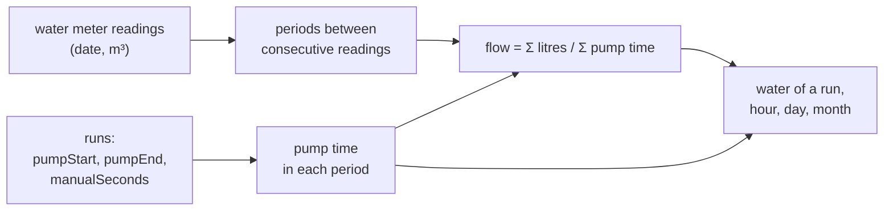
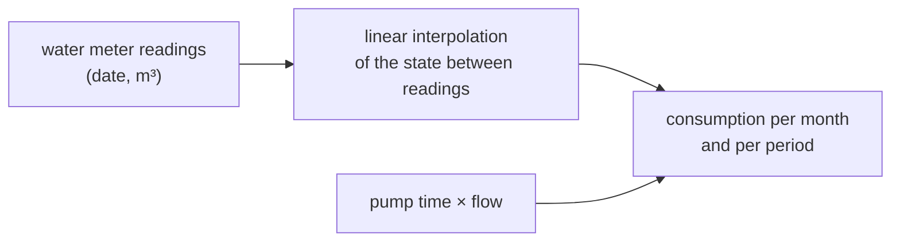
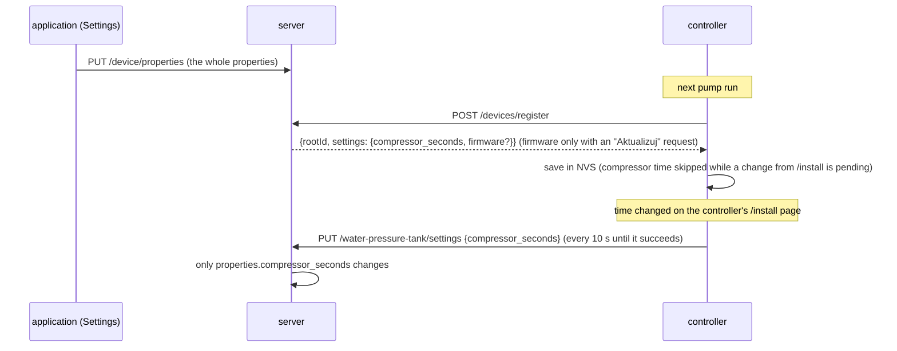

# Water-pressure-tank module — how it works

[← System documentation](../../README.md) · [1. Business description](1-business-description.md) · **2. How it works** · [3. Technical documentation](3-technical-documentation.md) · [Polski](../../../moduly/water-pressure-tank/2-zasada-dzialania.md)

## Diagram



How the controller itself works (compressor, queue, pages) is described in the [tank firmware documentation](../../../../devices/water-pressure-tank/docs/en/2-how-it-works.md). This document covers the cloud and application side.

## A run in the cloud: dates from relative times

The controller has no clock. Every message carries times counted from its own start, and the server turns them into dates using its own clock.

```mermaid
sequenceDiagram
    participant S as controller
    participant A as POST /water-pressure-tank/add
    participant M as MongoDB (water_pressure_tank)
    S->>A: {runId, pumpRunS: 1, compressorStartS: 1}
    A->>M: new run: pumpStart = now − pumpRunS
    loop every 1 s
        S->>A: {runId, pumpRunS, compressorStartS, compressorEndS?, restarts, manualCompressorS?}
        A->>M: pumpEnd = time received, lastSeenAt, compressor times,<br/>manualSeconds
    end
    Note over S: the pressure switch stops the pump → the controller loses power
    Note over M: the last message sets the pump end (±1 s);<br/>"in progress" while the last message is younger than 5 s
```

- There is one record per `runId` (unique index `{rootId, runId}`); later messages update it.
- **A queued run** (`queued: true`) — one from which no message arrived at the previous start — gets dates from the time it is received and the `timeApproximate` flag. If the server already knows it, only the pump end (`pumpStart + pumpRunS`) is filled in.
- The compressor start is kept when a later message lacks it.
- `manualCompressorS` is the total time the compressor was switched on manually ("Włącz" on the controller page) during this run; the server stores it as `manualSeconds`.

## Water from pump run time and the water meter

Water is **not stored** in run records. The server computes it on every read from two quantities:

```text
pump time  = (pumpEnd − pumpStart) − manualSeconds          [s]
flow       = Σ litres from the meter / Σ pump time          [l/s]
             (over all periods between consecutive readings)
water      = pump time · flow                               [l]
```



- **Pump time** leaves out manual compressor operation, because the pump does not deliver water to consumers during it.
- **The flow** is the average over all periods weighted by pump time, not the mean of the periods. A period with no pump run (only a meter change) or with a negative increase (a reading mistake) is skipped.
- **Without a flow** (fewer than two readings or no pump run between them) water is `null` and the application shows only the pump time.
- **A new water meter reading changes the flow**, so it also changes the water in the whole history.
- A run belongs to a period by its `pumpStart`.

Example: two periods, 1000 l in 1000 s of pump time and 3000 l in 2000 s → flow 4000 l / 3000 s ≈ 1.33 l/s (80 l/min); a run with 4 min 10 s of pump time gives about 333 l.

## Water meter per month



- Water meter consumption in a month comes from linear interpolation of the state between readings, so a period spanning two months is split in proportion to time.
- Next to it is the water "from pump time" in the same part of the month. There is one flow for the whole history, so differences between months show when the pump worked differently from the average.
- Months outside the reading range have no values.

## Settings: cloud ↔ controller



## Application screens

| Screen | Data | Refresh |
|---|---|---|
| **Hydrofor** | `GET /device/properties`, `GET /water-pressure-tank/flow`, `GET /water-pressure-tank/runs?from=&to=` (today) | runs every 5 s, the rest on entry |
| **Data → pump runs** | `GET /water-pressure-tank/runs?from=&to=` (month), CSV built in the browser | on month change |
| **Data → water meter readings** | `GET/POST /water-pressure-tank/meter`, `DELETE /water-pressure-tank/meter/:id` | after a change |
| **Chart** | `GET /water-pressure-tank/summary?period=day\|month\|year&date=` (water bars, pump time without a flow); year with meter: `GET /water-pressure-tank/meter/summary?year=` | on period change |
| **Settings** | `GET/PUT /device/properties` (compressor time, validation in the browser), `GET /water-pressure-tank/flow`; "Sterownik" card: `GET /devices`, `GET /firmware/water-pressure-tank`, `POST`/`DELETE /devices/:rootId/firmware-update` ("Aktualizuj" / "Anuluj aktualizację") | on entry; the "Sterownik" card every 15 s while an update request is pending |
