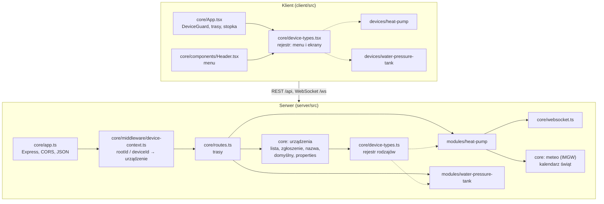
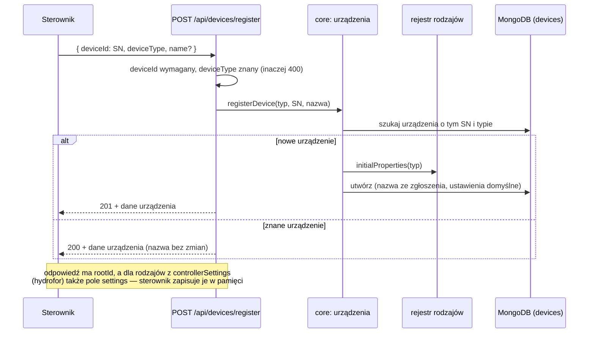
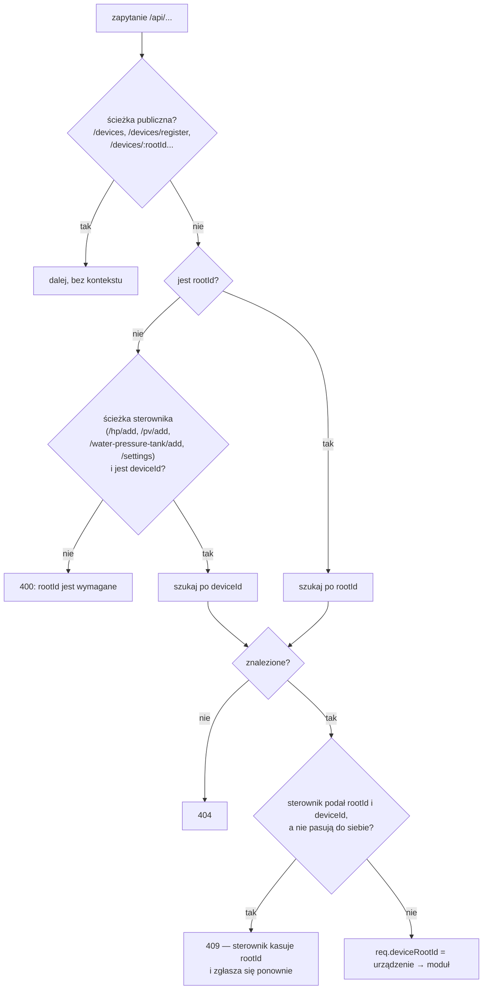
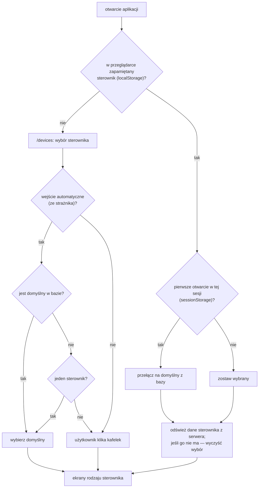
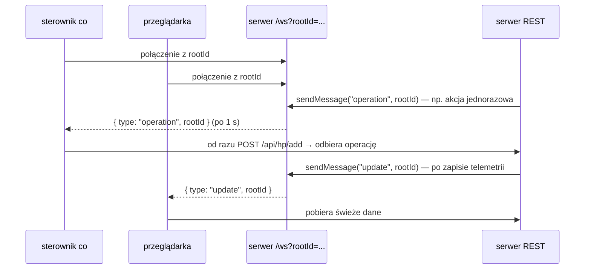

# Moduł core — zasada działania

[← Dokumentacja systemu](../../README.md) · [1. Opis biznesowy](1-opis-biznesowy.md) · **2. Zasada działania** · [3. Dokumentacja techniczna](3-dokumentacja-techniczna.md) · [English](../../en/moduly/core/2-how-it-works.md)

## Miejsce w systemie

Core łączy moduły rodzajów sterowników w jedną aplikację. Po stronie serwera przyjmuje każde zapytanie, ustala, którego sterownika dotyczy, i przekazuje je do modułu. Po stronie klienta pilnuje wybranego sterownika i buduje menu z opisów modułów.

Moduły rodzajów sterowników nie znają się nawzajem. Łączy je tylko core: trasy, rejestr i wspólny dokument urządzenia w bazie.

## Zgłoszenie sterownika

Hydrofor wysyła zgłoszenie przy każdym starcie (odbiera w nim ustawienia), a `co` tylko wtedy, gdy nie ma jeszcze Root ID (także po odpowiedzi 409). Serwer rozpoznaje sterownik po SN: nowy tworzy, znanemu oddaje jego rekord.

Sterownik zapisuje `rootId` w swojej pamięci (NVS). Telemetrię może wysyłać także przed zgłoszeniem, z samym SN — serwer przyjmie ją, jeśli urządzenie o tym SN już istnieje.

## Kontekst urządzenia w każdym zapytaniu

Prawie każde zapytanie do `/api` musi wskazać sterownik. Robi to middleware `device-context` przed przekazaniem zapytania do modułu.

Odpowiedź 409 chroni przed sytuacją, w której sterownik ma w pamięci `rootId` z innej bazy (np. po przełączeniu serwera z lokalnego na produkcyjny).

## Wybór sterownika w aplikacji

- Wybrany sterownik jest w `localStorage` (`chpc.selectedDevice`), więc przetrwa zamknięcie przeglądarki.
- Przełączenie na sterownik domyślny następuje raz na sesję przeglądarki (`sessionStorage` `chpc.defaultApplied`); ręczna zmiana w stopce obowiązuje do końca sesji.
- Zapamiętany sterownik, którego nie ma w bazie (np. po przełączeniu z bazy lokalnej na produkcyjną), jest usuwany z pamięci przeglądarki. Błąd sieci niczego nie usuwa.

## Menu i ekrany z rejestru

Każdy rodzaj sterownika podaje w swoim pliku `device-type` listę ekranów (ścieżka, nazwa, ikona, strona). Aplikacja:

1. tworzy trasy dla wszystkich ścieżek wszystkich rodzajów;
2. dla wybranej ścieżki pokazuje ekran rodzaju aktywnego sterownika;
3. jeśli ten rodzaj nie ma takiej ścieżki (np. hydrofor i `/schedules`), przekierowuje na stronę główną;
4. menu w nagłówku rysuje z ekranów aktywnego rodzaju.

Po zmianie sterownika ekran jest tworzony od nowa, więc nie zostają w nim dane poprzedniego sterownika.

Serwer ma analogiczny rejestr: każdy rodzaj podaje ustawienia nowego urządzenia i ustawienia odsyłane przy zgłoszeniu.

## WebSocket

WebSocket niczego nie przenosi poza sygnałem „zajrzyj po dane”. Operacje zawsze trafiają do sterownika w odpowiedzi na jego zapytanie HTTP. Połączenie bez `rootId` serwer zamyka.

## Usługi wspólne

- **Temperatura zewnętrzna.** Przy starcie i co 10 minut serwer pobiera pomiar ze stacji synoptycznej IMGW (Zakopane). Wartość jest dopisywana do rekordów telemetrii pompy (`t_out`) i odsyłana sterownikowi `co`, który pokazuje ją na ekranie.
- **Kalendarz.** Wszystkie daty użytkownika są w strefie `Europe/Warsaw`. Kalendarz zna polskie święta stałe i ruchome (także Wigilię) i rozstrzyga, czy dzień jest roboczy — korzysta z tego scheduler harmonogramów pompy.

## Start serwera

1. Wczytanie zmiennych środowiskowych; bez `MONGODB_URI` serwer kończy start błędem.
2. Połączenie z MongoDB.
3. Start schedulera pompy ciepła (przebieg od razu, potem co minutę).
4. Czyszczenie szczegółów paneli PV starszych niż 90 dni (od razu i co 24 h).
5. Pobranie temperatury IMGW i odświeżanie co 10 minut.
6. Nasłuch HTTP i WebSocket na porcie `PORT`.
