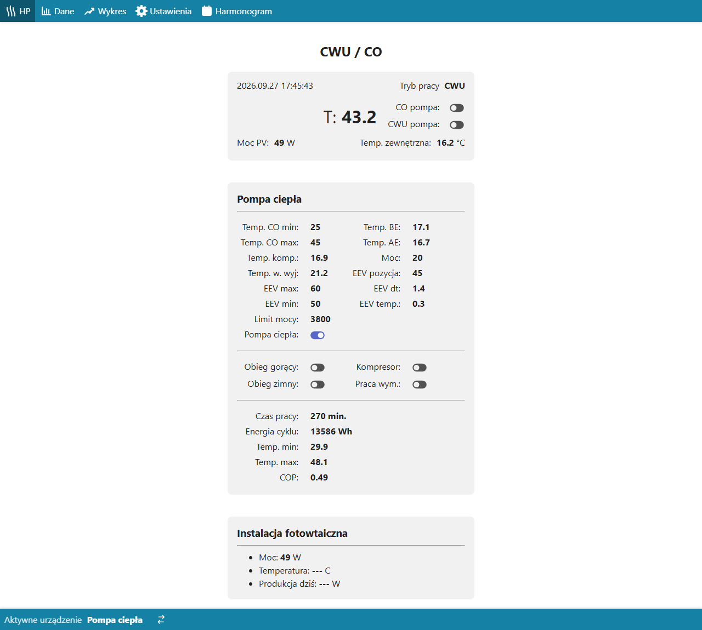
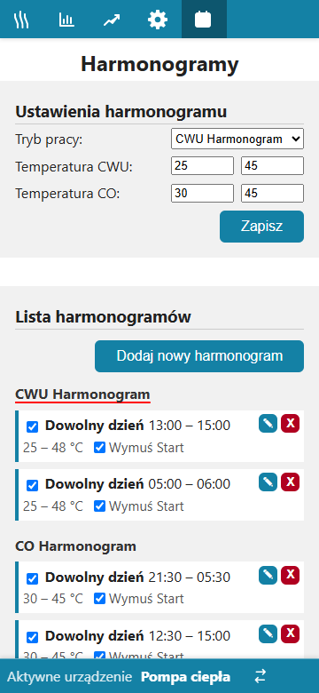
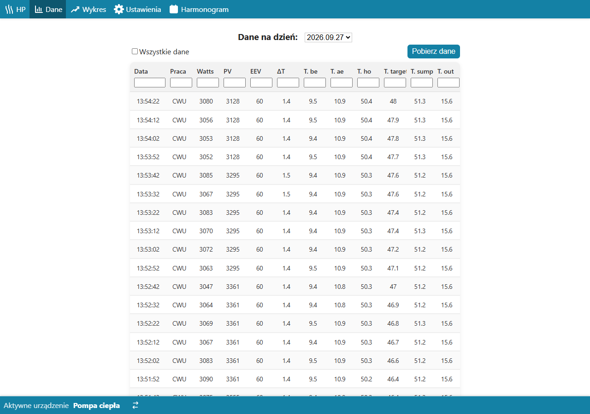
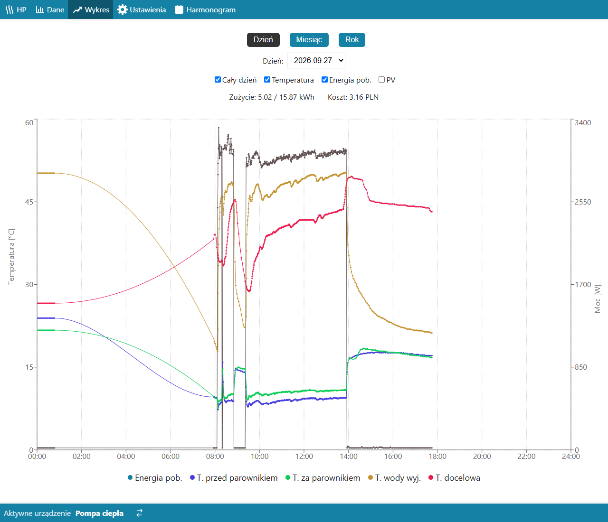
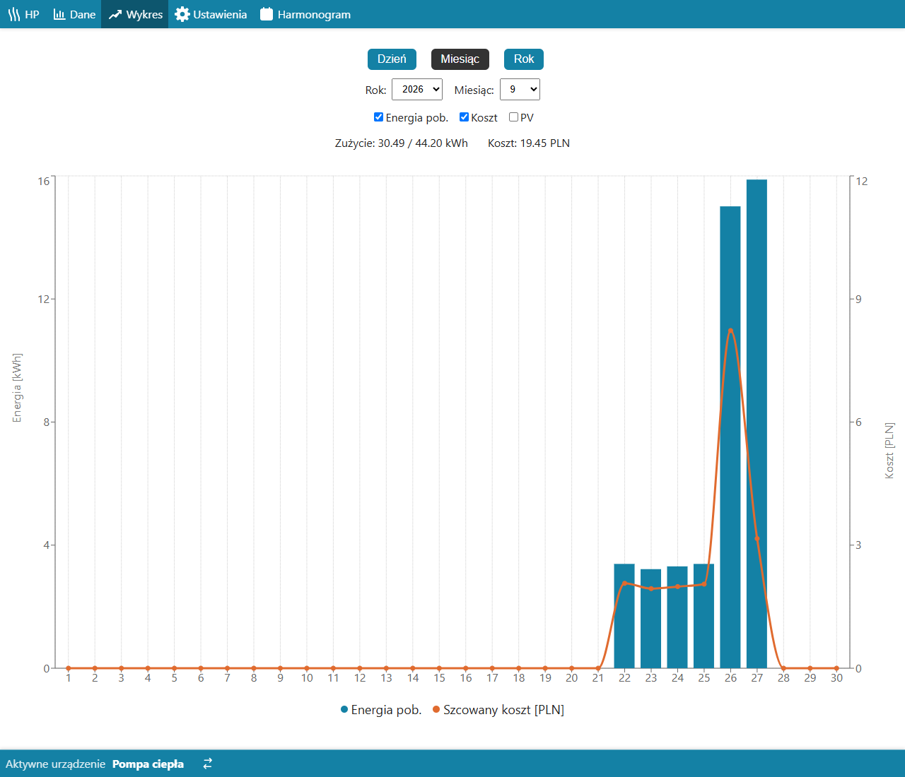
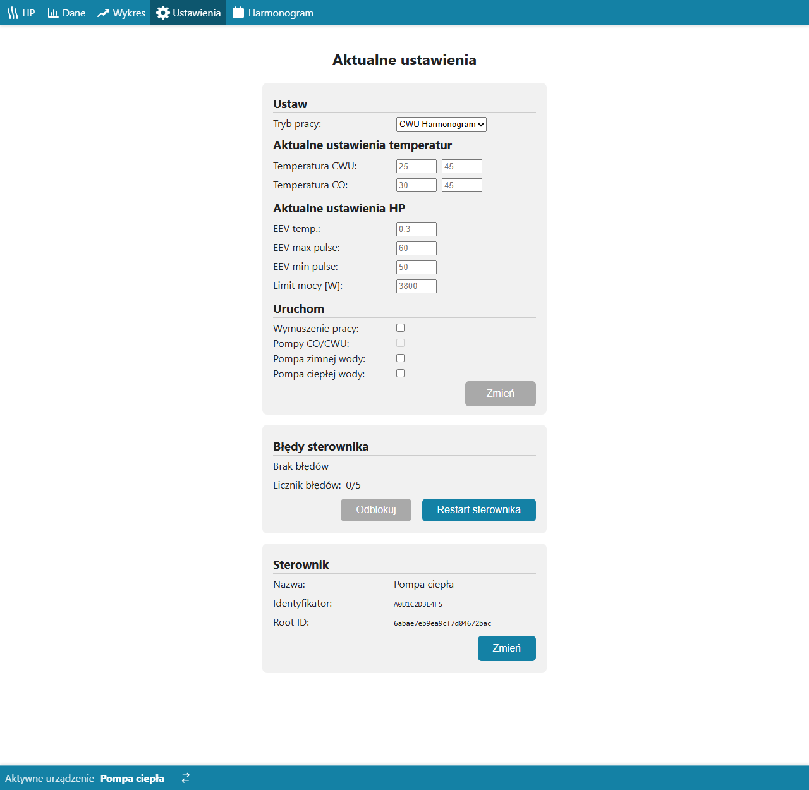
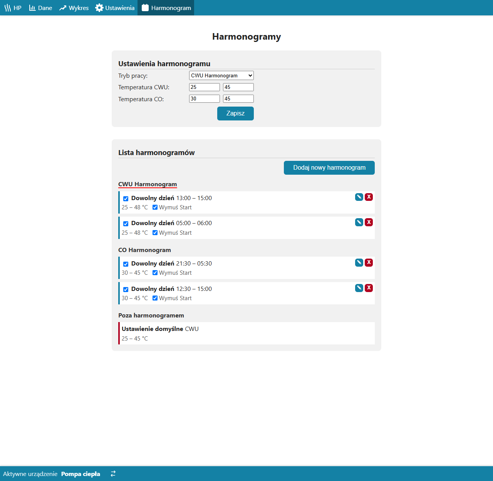

# Moduł heat-pump — opis biznesowy

[← Dokumentacja systemu](../../README.md) · **1. Opis biznesowy** · [2. Zasada działania](2-zasada-dzialania.md) · [3. Dokumentacja techniczna](3-dokumentacja-techniczna.md) · [English](../../en/moduly/heat-pump/1-business-description.md)

## Po co jest ten moduł

Moduł obsługuje w aplikacji **pompę ciepła** sterowaną przez sterownik CHPC, połączoną z chmurą przez sterownik `co`. Pozwala z telefonu albo komputera:

- zdecydować, **co pompa ma grzać i kiedy**: centralne ogrzewanie (CO), ciepłą wodę użytkową (CWU) albo nic;
- ustawić **temperatury** i **harmonogramy** (godziny, dni robocze i wolne z polskimi świętami, konkretne daty, przerwy);
- wydać **polecenie ręczne**: wymuszenie startu, pompy obiegowe, zawór rozprężny (EEV), limit mocy;
- widzieć **stan pompy na żywo**, **historię** pomiarów, **wykresy** energii i temperatur oraz **koszt energii** w taryfie G12w;
- widzieć **błędy sterownika pompy**, odblokować go i zrestartować zdalnie;
- śledzić **produkcję fotowoltaiki**, bo nadwyżkę PV opłaca się zużyć na grzanie.

Serwer sam, co minutę, wylicza z harmonogramów, co pompa ma robić. Aplikacja nie musi być otwarta.

## Dla kogo

**Właściciel domu** z pompą ciepła CHPC i sterownikiem `co` — jedna osoba, bez kont użytkowników.

## Tryby pracy

| Tryb | W aplikacji | Co robi pompa |
|---|---|---|
| `A` | **CO Harmonogram** | działają harmonogramy ogrzewania (CO) i przerwy; poza nimi pompa grzeje ciepłą wodę (CWU) |
| `CWU` | **CWU Harmonogram** | działają harmonogramy ciepłej wody i przerwy; poza nimi ustawienie domyślne |
| `M` | **ręczny** | harmonogramy nie działają, obowiązuje ustawienie domyślne; o północy tryb wraca na `A` |
| `OFF` | **wyłączona** | sprężarka nie startuje |

## Ekrany

*Widok główny (HP): tryb pracy, temperatura w środku zbiornika (T), stan pomp CO i CWU, moc PV, temperatura zewnętrzna, parametry pompy (temperatury, moc, EEV, limit mocy), stan obiegów i sprężarki, dane bieżącego cyklu (czas pracy, energia, COP) i fotowoltaika. Odświeża się sam po każdej wysyłce sterownika.*

| Telefon | Harmonogramy na telefonie |
|---|---|
|  |  |

*Dane: tabela pomiarów z wybranego dnia (co 10–30 s), filtr w każdej kolumnie, „Wszystkie dane” pokazuje też postój sprężarki, „Pobierz dane” zapisuje plik CSV.*

*Wykres dnia: temperatury (przed i za parownikiem, wody wychodzącej, docelowa) i pobierana moc; nad wykresem zużycie energii i koszt dnia.*

*Wykres miesiąca: energia pobrana w kolejnych dniach i szacowany koszt w taryfie G12w; opcjonalnie produkcja PV. Widok roku pokazuje to samo w miesiącach.*

*Ustawienia: tryb pracy i temperatury na teraz, parametry pompy (EEV, limit mocy), wymuszenie pracy i pompy obiegowe, błędy sterownika z przyciskami „Odblokuj” i „Restart sterownika”, dane sterownika.*

*Harmonogramy: tryb pracy i temperatury domyślne, lista harmonogramów w grupach CWU / CO / przerwy. Czerwona linia pod nazwą grupy oznacza, że ta grupa działa w wybranym trybie; czerwona kreska po lewej wskazuje wpis, który obowiązuje teraz (tu: ustawienie domyślne).*

## Typowe scenariusze

1. **Zima, tania taryfa nocna.** Tryb „CO Harmonogram”, harmonogram CO 21:30–5:30 (noc G12w) i 12:30–15:00; w pozostałych godzinach pompa podgrzewa CWU.
2. **Lato.** Tryb „CWU Harmonogram”, harmonogramy CWU w godzinach produkcji PV z wymuszeniem startu.
3. **Wyjazd.** Tryb `OFF` albo przerwa `off` na konkretne daty.
4. **Awaria.** W widoku głównym pojawia się czerwony dzwonek, w Ustawieniach opis błędu i data. Po pięciu błędach sterownik pompy się blokuje — „Odblokuj” zdejmuje blokadę, „Restart sterownika” uruchamia go ponownie.
5. **Kontrola kosztów.** Wykres miesiąca pokazuje zużycie i koszt; porównanie z produkcją PV pokazuje, ile energii pochodziło z fotowoltaiki.

## Ograniczenia

- **Brak walidacji zakresów w aplikacji.** Wartość spoza zakresu zostaje „ustawiona” w aplikacji, ale sterownik `co` albo pompa ją odrzuca. To, czego pompa naprawdę używa, widać w danych (limit mocy, EEV, temperatury).
- **Zwykłe polecenia docierają do pompy po 10–30 s** (przy najbliższej wysyłce sterownika); natychmiast działają tylko „Odblokuj” i „Restart” — i tylko wtedy, gdy `co` jest w trybie CLOUD.
- **Polecenia ręczne są w pamięci serwera** — restart serwera je kasuje; wygasają też, gdy kończy się harmonogram.
- **Czas błędu jest przybliżony** (do 10–30 s), bo pompa nie ma zegara.
- **Koszt energii to szacunek** według taryfy G12w wpisanej w kod.
- **Pompa ma jeden czujnik w zbiorniku** — „T” w widoku głównym to temperatura środka zbiornika, a nie temperatura zadana.

## Słownik

| Pojęcie | Znaczenie |
|---|---|
| **CO** | centralne ogrzewanie |
| **CWU** | ciepła woda użytkowa |
| **CHPC** | sterownik pompy ciepła (Arduino Pro Mini): sprężarka, pompy obiegowe, zawór EEV, zabezpieczenia |
| **co** | sterownik ESP32 między pompą, fotowoltaiką i chmurą |
| **Telemetria** | stan pompy wysyłany przez `co` co 10 s (sprężarka pracuje) albo 30 s (postój) |
| **Operacja** | to, co pompa ma robić (tryb, temperatury, wymuszenie…); serwer odsyła ją w odpowiedzi na telemetrię |
| **Harmonogram** | przedział godzin w wybrane dni, w którym obowiązuje rodzaj pracy `co` / `cwu` albo przerwa `off` |
| **Ustawienie domyślne** | tryb i temperatury obowiązujące poza harmonogramami |
| **Wymuszenie** (`force`) | start sprężarki bez czekania na spadek temperatury; pompa przyjmuje je tylko w postoju i kasuje przy zatrzymaniu |
| **HPS** | stan sprężarki (pracuje / postój) |
| **EEV** | elektroniczny zawór rozprężny; „EEV temp.” to zadane przegrzanie |
| **COP** | współczynnik efektywności: ciepło oddane / energia pobrana (szacunek dla zbiornika 300 l) |
| **G12w** | taryfa dwustrefowa z tańszą nocą, weekendem i częścią dnia |
| **PV** | fotowoltaika; odczyt z mikrofalowników Hoymiles (DTU) |
