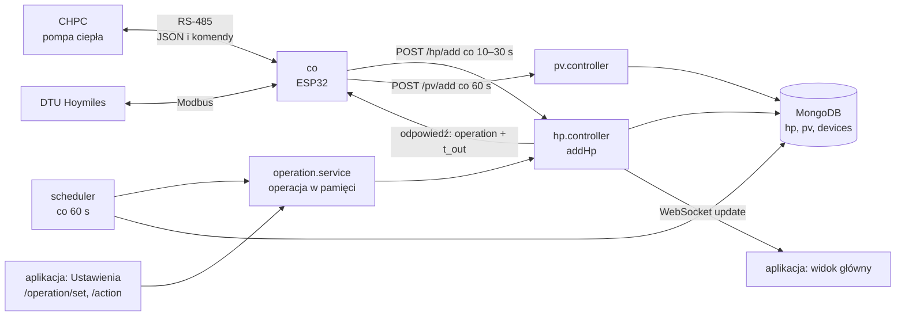
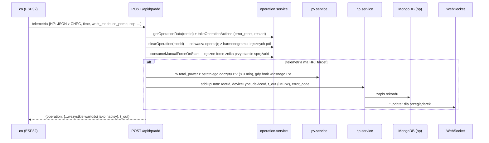
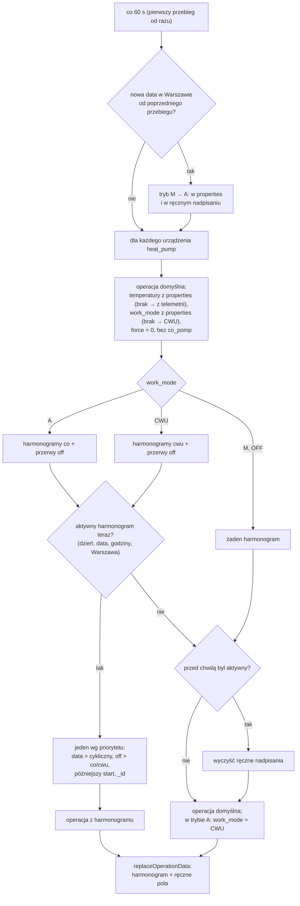
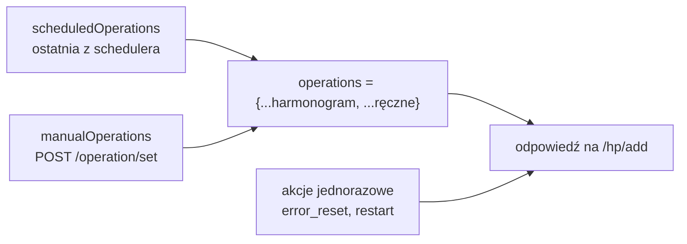

# Moduł heat-pump — zasada działania

[← Dokumentacja systemu](../../README.md) · [1. Opis biznesowy](1-opis-biznesowy.md) · **2. Zasada działania** · [3. Dokumentacja techniczna](3-dokumentacja-techniczna.md) · [English](../../en/moduly/heat-pump/2-how-it-works.md)

## Łańcuch sterowania



Serwer nigdy sam nie łączy się z pompą. Operacja czeka w pamięci serwera, a `co` odbiera ją w odpowiedzi na swoją najbliższą telemetrię.

## Cykl telemetria → operacja



Gdy CHPC nie odpowiada, `co` i tak wysyła telemetrię (z pustym `HP`). Serwer jej nie zapisuje, ale odsyła operację, więc sterownik zna tryb pracy także przy odłączonej pompie.

## Scheduler (co minutę)



| Rodzaj harmonogramu | `work_mode` | Temperatury | `force` |
|---|---|---|---|
| `off` (przerwa) | `OFF` | domyślne | zawsze `0` |
| `co` | `A` | `co_min`, `co_max` (brak w harmonogramie → domyślne) | `forceStart` |
| `cwu` | `CWU` | `cwu_min`, `cwu_max` (brak → domyślne) | `forceStart` |

Zakres godzin może przechodzić przez północ (`21:30–05:30`); koniec jest wyłączny. Dni: konkretny dzień tygodnia, każdy dzień, robocze (pon–pt bez świąt) albo wolne (weekendy i polskie święta, także Wigilia). Konkretna data ma pierwszeństwo przed dniem tygodnia.

## Operacje: harmonogram, ręczne pola i akcje

Serwer trzyma w pamięci trzy mapy na urządzenie:



- **Kiedy operacja idzie do `co`.** Po obsłużeniu telemetrii `clearOperation` czyści bieżącą operację. Bez ręcznych nadpisań operacja jest więc wysyłana raz po każdym przebiegu schedulera (co minutę), a pozostałe odpowiedzi to `{}` — `co` pamięta ostatnie wartości. Z ręcznymi nadpisaniami każda odpowiedź niesie pełny stan.
- **Ręczne pola wygrywają** z harmonogramem, ale tylko te, które faktycznie wysłano.
- **Ręczne nadpisania znikają**, gdy harmonogram się kończy (przejście „aktywny → brak”), po restarcie serwera, a samo `force: "1"` — przy pierwszym starcie sprężarki (`HP.HPS`: postój → praca). Bez tego ręczne wymuszenie działałoby bez końca, bo CHPC kasuje wymuszenie przy zatrzymaniu, a `co` wysyłałby je ponownie.
- **Zmiana trybu bez `co_pomp`** zapisuje `co_pomp: "1"`: `co` pamięta ostatnią wartość, więc wcześniejsze ręczne `"0"` wyłączałoby przekaźniki CO/CWU mimo zmiany trybu.
- **Akcje jednorazowe** (`error_reset` — odblokowanie, `restart` — restart CHPC) trafiają do dokładnie jednej odpowiedzi i nie łączą się z operacją. Serwer od razu wysyła przez WebSocket `operation`, więc akcja dociera do pompy w kilka sekund. **Uwaga:** `co` stosuje odpowiedź tylko w trybie CLOUD; w innych trybach akcja przepada.
- **Tryb domyślny nigdy nie pochodzi z telemetrii** — sterownik raportuje tryb, który dostał, więc serwer odsyłałby mu jego własny stan i np. `OFF` utrwaliłby się na zawsze.

Po stronie `co` zmienione wartości zamieniają się na komendy RS-485 do CHPC. CHPC nie potwierdza komend, więc `co` po każdym odczycie porównuje stan pompy (`HP.CO`, `HP.F`, `HP.Tmax`, `HP.Tmin`) z oczekiwanym i przy różnicy wysyła komendę ponownie — szczegóły w [dokumentacji firmware co](../../../devices/co/docs/2-zasada-dzialania.md).

## Fotowoltaika

```mermaid
sequenceDiagram
    participant CO as co
    participant PV as POST /api/pv/add
    participant S as pv.service
    participant M as MongoDB (pv)
    participant H as /hp/add, GET /hp
    CO->>PV: co 60 s {time, total_power, total_prod, total_prod_today, temperature, pv_power, panels[]}
    PV->>S: zapis + ostatni odczyt w pamięci (po restarcie z bazy)
    S->>M: dokument pv (panels usuwane po 90 dniach)
    H->>S: ostatni odczyt młodszy niż 3 min?
    S-->>H: PV.total_power do rekordu hp; pełne podsumowanie do GET /hp
```

Rekord `hp` dostaje tylko `PV.total_power` — do bilansu energii. **Kolekcji `hp` i `pv` nie łączy się w agregacji**: produkcyjny Atlas sortuje w pamięci najwyżej 32 MB i nie pozwala na `allowDiskUse`.

## Błędy pompy

1. CHPC w każdej odpowiedzi podaje `ERR` (kod ostatniego zdarzenia), `ERRn` (numer zdarzenia, rośnie) i `ERRc` (licznik błędów; 5 = blokada).
2. Gdy `ERRn` różni się od poprzedniego rekordu, a `ERR` ≠ 0, serwer zapisuje `error_code` w nowym rekordzie.
3. `GET /hp/last-error` zwraca najnowszy rekord z `error_code` z ostatnich 24 h; przy blokadzie (`ERRc` ≥ 5) — bez limitu czasu, aż do odblokowania.
4. Aplikacja pokazuje czerwony dzwonek w widoku głównym, czerwony wiersz w tabeli danych i opis w Ustawieniach.

| Kod | Znaczenie | Kod | Znaczenie |
|---|---|---|---|
| 1 | czujnik temperatury | 8 | Tae (za parownikiem) za niska |
| 2 | przeciążenie (moc) | 9 | Tco za niska |
| 3 | brak przepływu | 10 | przekaźnik (moc przy wyłączonej sprężarce) |
| 4 | za mała moc | 11 | blokada po 5 błędach |
| 5 | Tho (woda wychodząca) za wysoka | 12 | Tsump (karter) za niska |
| 6 | Tsump za wysoka | 13 | Tbe (przed parownikiem) poniżej −1 °C dłużej niż 60 s |
| 7 | Tbc za wysoka | | |

## Ekrany aplikacji

| Ekran | Dane | Odświeżanie |
|---|---|---|
| **Widok główny** | `GET /hp` (ostatnia telemetria + podsumowanie PV), `GET /hp/last-error` | po komunikacie WebSocket `update` |
| **Dane** | `GET /hp/dates` (lista dni), `GET /hp/4day?date=` (dzień); „Pobierz dane” — `GET /hp/all` do CSV | przy zmianie dnia |
| **Wykres** | dzień: `/hp/4day`; miesiąc i rok: `/hp/monthly-summary` (energia, PV, koszt G12w) | przy zmianie okresu |
| **Ustawienia** | `GET /operation` (wartości do formularza), `POST /operation/set`, `POST /operation/action`, telemetria i błąd | przy wejściu |
| **Harmonogramy** | `GET/POST/PUT/DELETE /schedules`, `GET /schedules/current`, `GET/PUT /device/properties` | co minutę i po zapisie (zaznaczenie aktywnego wpisu) |

Blokady w Ustawieniach wynikają z zachowania pompy: „Pompy CO/CWU” są zablokowane w trybach `CWU` i `OFF` (tam `co` i tak trzyma przekaźniki wyłączone); wymuszenie i pompy zimnej/ciepłej wody — gdy sprężarka pracuje (`HPS` > 0), bo pompa steruje nimi wtedy sama, a wymuszenie przyjmuje tylko w postoju.
