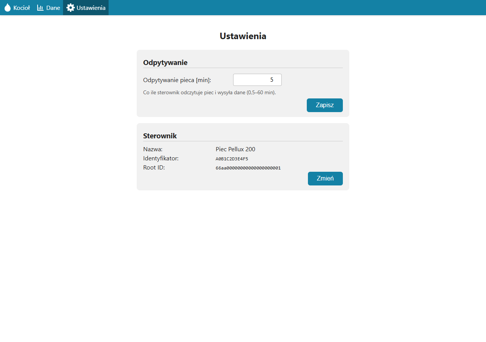

# Moduł pellet-boiler-pelux200 — opis biznesowy

[← Dokumentacja systemu](../../README.md) · **1. Opis biznesowy** · [2. Zasada działania](2-zasada-dzialania.md) · [3. Dokumentacja techniczna](3-dokumentacja-techniczna.md) · [English](../../en/moduly/pellet-boiler-pelux200/1-business-description.md)

## Po co jest ten moduł

Moduł obsługuje w aplikacji **kocioł pelletowy Plum Pellux 200 Touch** z regulatorem ecoMAX. Pokazuje w aplikacji to, co kocioł „wie o sobie”: stan pracy, temperatury, poziom paliwa, moc i stany wyjść (wentylator, podajnik, pompy, zapalarka, alarm), a każdy odczyt zapisuje w historii.

Kocioł nie ma własnego modułu internetowego, dlatego dane pobiera osobny **sterownik pieca**: płytka ESP32-C3 SuperMini z modułem RS-485 HW-519 ([devices/pellet-boiler-pelux200](../../../devices/pellet-boiler-pelux200/README.md)). Podsłuchuje on łącze, którym regulator ecoMAX rozmawia ze swoim panelem dotykowym, i wysyła do chmury ostatni odczyt co kilka minut. Do 2026-10-02 robił to sterownik `co` (pompy ciepła) jako swoją drugą rolę; od 2026-10-03 kocioł ma własny sterownik, a moduł w aplikacji się nie zmienił.

Moduł pozwala:

- **zobaczyć bieżący stan kotła** — także z telefonu, bez podchodzenia do panelu;
- **przejrzeć odczyty z wybranego dnia** i pobrać je jako plik CSV;
- **ustawić, jak często sterownik odczytuje kocioł** (od pół minuty do godziny; domyślnie co 5 minut).

**Moduł tylko pokazuje dane.** Nie steruje kotłem, nie ma harmonogramów ani wykresów.

## Stan wdrożenia

- **Etap 1 — tylko odbiór (zaimplementowany).** Sterownik pieca nasłuchuje magistrali kotła, niczego na niej nie nadaje. Serwer i aplikacja są gotowe.
- **Format ramek niezweryfikowany na kotle.** Sposób kodowania danych na magistrali pochodzi z biblioteki PyPlumIO (inżynieria wsteczna, nie dokumentacja producenta). Nie był sprawdzony na prawdziwym kotle, a punkt wpięcia w kotle nie był sprawdzony przy kotle. Płytkę sterownika sprawdzono 2026-10-03 na biurku, z komputerem udającym kocioł. Dopóki nasłuch nie zostanie sprawdzony, dane mogą się nie pojawić albo być błędnie odczytane.
- **Etap 2 — nadawanie i sterowanie (niezaimplementowany).** Wysyłanie czegokolwiek na magistralę kotła (odpowiedź na pytanie regulatora o obecność urządzenia) i zmiana nastaw kotła z aplikacji nie istnieją.

Sterownik pieca (płytka, strony, wgrywanie): [devices/pellet-boiler-pelux200/README.md](../../../devices/pellet-boiler-pelux200/README.md). Podłączenie, protokół i lista odczytywanych pól: [devices/pellet-boiler-pelux200/docs/piec-pellux200.md](../../../devices/pellet-boiler-pelux200/docs/piec-pellux200.md). Dokumentacja producenta kotła: [devices/pellet-boiler-pelux200/docs/pellux200-dokumentacja/](../../../devices/pellet-boiler-pelux200/docs/pellux200-dokumentacja/README.md).

## Dla kogo

**Właściciel domu** z kotłem pelletowym Pellux 200 i sterownikiem pieca podłączonym do jego regulatora. Kocioł pojawia się w aplikacji sam, gdy sterownik pierwszy raz połączy się z chmurą — nie trzeba go dodawać.

## Ekrany

Zrzuty pokazują **przykładowe dane**: odpowiedzi API zostały podstawione w przeglądarce, nie pochodzą z prawdziwego kotła.

*Kocioł: stan pracy w tytule (alarm na czerwono), temperatury, wartości zadane, praca kotła (paliwo, wentylator, obciążenie, moc, zużycie paliwa) i wyjścia. Widok odświeża się co 30 s; gdy ostatni odczyt jest starszy niż trzy interwały odpytywania, pod czasem odczytu pojawia się „Dane nieaktualne”. Brak wartości to `---`. Dane są przykładowe.*

*Ten sam widok na telefonie (360 px): karty sięgają krawędzi ekranu, a menu ma same ikony. Dane są przykładowe.*

*Dane: odczyty z wybranego dnia, od najnowszego (jeden wiersz na odczyt, przy domyślnym interwale co 5 minut), z eksportem CSV. Tabela ma 12 kolumn i przewija się poziomo we własnym kontenerze. Dane są przykładowe.*

*Ustawienia: „Odpytywanie pieca [min]” (0,5–60 min) i sekcja „Sterownik” z nazwą, identyfikatorem i Root ID. Dane są przykładowe.*

## Pierwsze uruchomienie

1. Podłączyć sterownik pieca do regulatora kotła według [opisu podłączenia](../../../devices/pellet-boiler-pelux200/docs/piec-pellux200.md) i ustawić mu Wi-Fi (punkt dostępowy `Piec-setup`, strona `/install`; [README sterownika](../../../devices/pellet-boiler-pelux200/README.md)).
2. Po połączeniu z Wi-Fi sterownik sam zgłasza się do chmury jako „Piec Pellux 200”. Kocioł pojawia się na liście urządzeń; dane pojawią się, gdy sterownik odbierze z kotła poprawne ramki.
3. Wybrać kocioł na liście, opcjonalnie zmienić mu nazwę (ołówek na kafelku) albo oznaczyć gwiazdką jako domyślny.
4. W Ustawieniach zmienić odstęp odpytywania, jeśli 5 minut nie odpowiada.

Sterownik zgłasza się także bez podłączonego kotła (wtedy kocioł jest na liście, ale bez odczytów). Diagnostykę magistrali (bajty, ramki, polaryzacja) pokazuje strona `/` sterownika.

## Ograniczenia

- **Dane niepotwierdzone na kotle** (punkt „Stan wdrożenia”).
- **Tylko podgląd.** Aplikacja niczego w kotle nie zmienia.
- **Odczyt co kilka minut**, nie na żywo: sterownik wysyła ostatni odebrany odczyt co ustawiony interwał (domyślnie 300 s). Zmiana interwału w aplikacji działa od następnej wysyłki.
- **Sterownik wysyła dane tylko, gdy ostatnia ramka z kotła ma mniej niż 60 s.** Przy braku ramek kocioł w aplikacji zostaje z ostatnim odczytem i po trzech interwałach dostaje znacznik „Dane nieaktualne”.
- **Niektóre pola kontraktu nie są jeszcze wypełniane.** Poziom tlenu w spalinach (`lambda_level`) jest w kontrakcie i w widoku, ale sterownik go nie odczytuje — w aplikacji pokazuje `---`. Widok Kocioł pokazuje też wartości „Status CO” i „Status CWU”, których znaczenie nie jest udokumentowane.
- **Brak wykresów i agregatów.** Historia to lista odczytów z jednego dnia.
- Restart serwera czyści tylko pamięć podręczną ostatniego odczytu; historia jest w bazie.

## Słownik

| Pojęcie | Znaczenie |
|---|---|
| **Kocioł pelletowy** | kocioł na pellet drzewny; tu Plum Pellux 200 Touch |
| **ecoMAX** | rodzina regulatorów kotłów Plum; regulator kotła, z osobnym panelem dotykowym na łączu RS-485 |
| **Odczyt** | zestaw pomiarów i stanów kotła zapisany jako jeden rekord (`SensorData`) |
| **Odstęp odpytywania** (`poll_interval_seconds`) | co ile sekund sterownik wysyła odczyt do chmury (30–3600, domyślnie 300) |
| **Sterownik pieca** | płytka ESP32-C3 SuperMini z modułem RS-485 HW-519 (`devices/pellet-boiler-pelux200`); do 2026-10-02 tę rolę pełnił sterownik `co` (ten sam SN co pompa, osobny Root ID) |
| **Stan kotła** | 0 Wyłączony, 1 Stabilizacja, 2 Rozpalanie, 3 Praca, 4 Nadzór, 5 Pauza, 6 Czuwanie, 7 Wygaszanie, 8 Alarm, 9 Ręczny, 10 Rozszczelnianie, 11 Inny |
| **Etap 1 / etap 2** | etap 1: sam odbiór ramek; etap 2: nadawanie na magistralę kotła (niezaimplementowane) |
