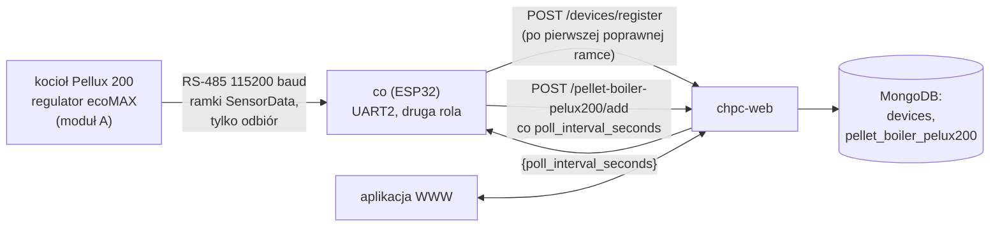
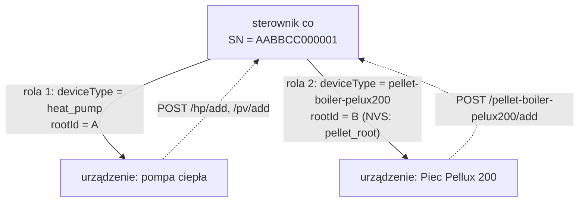
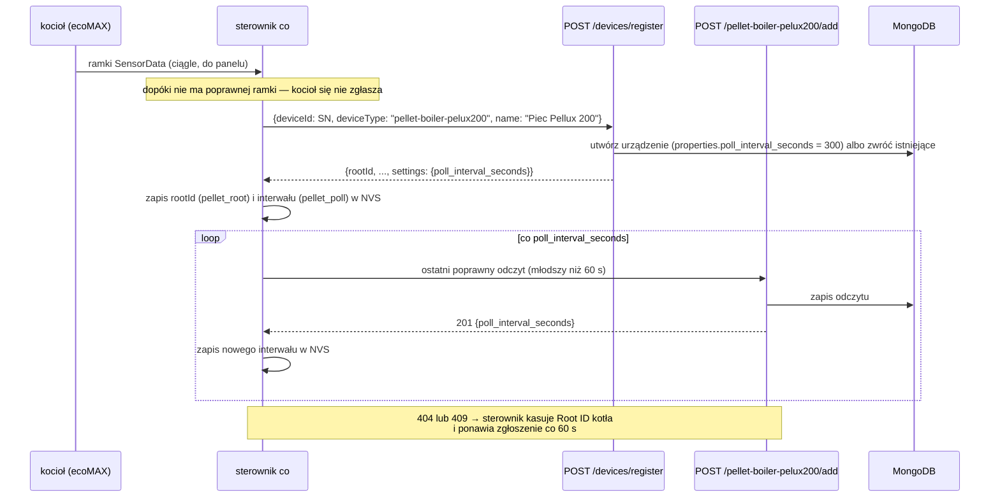
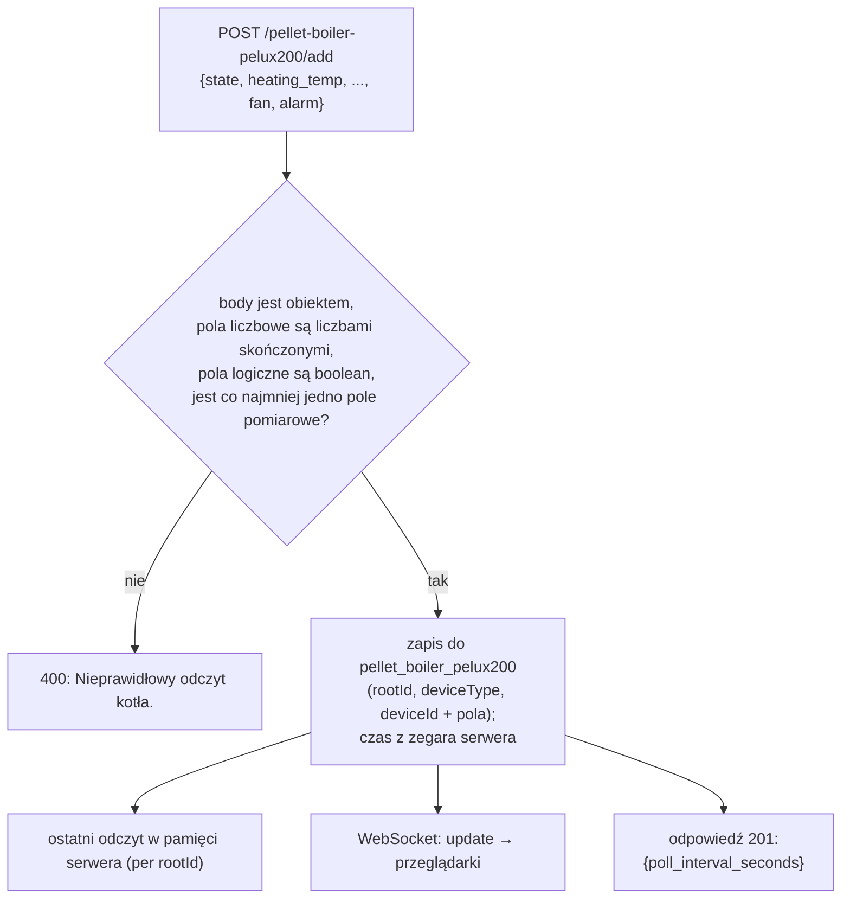
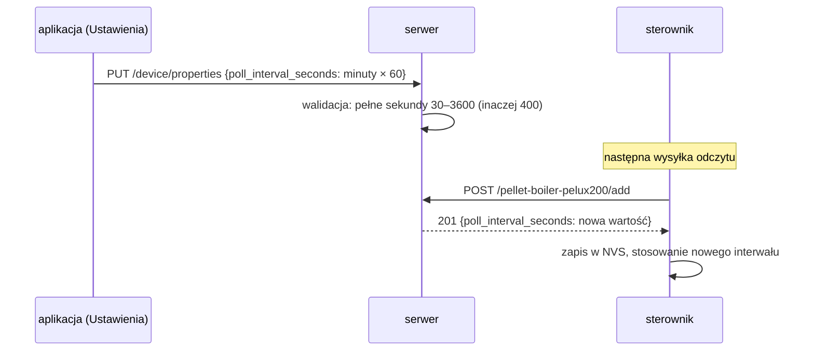

# Moduł pellet-boiler-pelux200 — zasada działania

[← Dokumentacja systemu](../../README.md) · [1. Opis biznesowy](1-opis-biznesowy.md) · **2. Zasada działania** · [3. Dokumentacja techniczna](3-dokumentacja-techniczna.md) · [English](../../en/moduly/pellet-boiler-pelux200/2-how-it-works.md)

## Schemat

Działanie sterownika (podłączenie, parser ramek, piny, protokół) opisuje [piec-pellux200.md](../../../devices/co/docs/piec-pellux200.md). Ten dokument opisuje stronę chmury i aplikacji. Kocioł jest **tylko źródłem danych**: serwer nie ma dla niego schedulera, operacji ani odpowiedzi ze sterowaniem (jedyna wartość odsyłana sterownikowi to odstęp odpytywania).

## Stan etapów

| Etap | Zakres | Stan |
|---|---|---|
| 1 | `co` odbiera ramki `SensorData` z magistrali kotła i wysyła odczyty do chmury | zaimplementowany; format ramek z PyPlumIO **niezweryfikowany na kotle** |
| 2 | `co` odpowiada na pytanie regulatora o obecność urządzenia (`CheckDevice`) i nadaje na magistralę, sterowanie kotłem | **niezaimplementowany** |

## Dwie role jednego sterownika

Ten sam fizyczny sterownik `co` jest w chmurze dwoma urządzeniami o tym samym `deviceId` (SN), ale innym rodzaju i innym `rootId`.

- Kocioł ma własny Root ID w pamięci sterownika (klucz `pellet_root`), niezależny od Root ID pompy.
- Serwer rozróżnia role po **ścieżce endpointu**: `device-context` ma mapę `controllerPaths` (endpoint → rodzaj) i szuka urządzenia po parze `{deviceId, deviceType}`. Zgłoszenie też szuka po tej parze. Dlatego `POST /pellet-boiler-pelux200/add?deviceId=SN` trafia w kocioł, a `POST /hp/add?deviceId=SN` w pompę.
- `rootId` z innej roli daje **409**: `rootId` pompy wysłany na endpoint kotła (i odwrotnie) jest odrzucany, więc sterownik kasuje Root ID tej roli i rejestruje się ponownie.

## Zgłoszenie: dopiero po pierwszej poprawnej ramce

- Sterownik bez kotła (bez żadnej poprawnej ramki) nie tworzy urządzenia kotła.
- Nazwa „Piec Pellux 200” trafia tylko do **nowego** urządzenia; znane urządzenie zachowuje nazwę.
- Sterownik może też wysłać odczyt z samym `deviceId` (bez `rootId`), jeśli urządzenie o tym SN i rodzaju `pellet-boiler-pelux200` już istnieje.

## Zapis odczytu w chmurze

- Wszystkie pola pomiarowe są opcjonalne: sterownik wysyła to, co udało się odczytać. Jedno pole niewłaściwego typu odrzuca cały odczyt (400).
- Pole `time` i nieznane klucze są **ignorowane**: czas rekordu (`createdAt`) ustawia serwer w chwili przyjęcia.
- Odpowiedź niesie aktualny `poll_interval_seconds`, więc zmiana w aplikacji dociera do sterownika przy następnej wysyłce, bez ponownego zgłoszenia.

## Odstęp odpytywania: aplikacja ↔ sterownik

Formularz w aplikacji przyjmuje minuty (0,5–60) i zapisuje `round(minuty × 60)` sekund. `PUT /device/properties` podmienia całe `properties`, więc aplikacja wysyła wczytany obiekt z nową wartością pola.

## Ekrany aplikacji

| Ekran | Dane | Odświeżanie |
|---|---|---|
| **Kocioł** (`/`) | `GET /pellet-boiler-pelux200/last`, `GET /device/properties` (interwał do oceny aktualności) | ostatni odczyt co 30 s |
| **Dane** (`/data`) | `GET /pellet-boiler-pelux200/list?date=YYYY-MM-DD`, CSV w przeglądarce | przy wejściu i zmianie daty |
| **Ustawienia** (`/settings`) | `GET/PUT /device/properties`; sekcja „Sterownik” z `DeviceEditModal` | przy wejściu |

- **Aktualność danych.** Odczyt jest nieaktualny, gdy jest starszy niż `3 × poll_interval_seconds` (albo nie ma czasu): wtedy widok pokazuje „Dane nieaktualne”. Domyślny interwał do oceny to 300 s, dopóki właściwości nie zostaną wczytane.
- **Stan alarmu.** Tytuł widoku Kocioł jest czerwony, gdy `alarm` jest `true` albo `state` = 8 (Alarm).
- **Brak danych.** Odpowiedź `{}` z `/last` daje komunikat „Brak danych od sterownika”.
- Ścieżki spoza menu kotła (`/schedules`, `/chart`, `/hp`) przekierowują na `/`.
