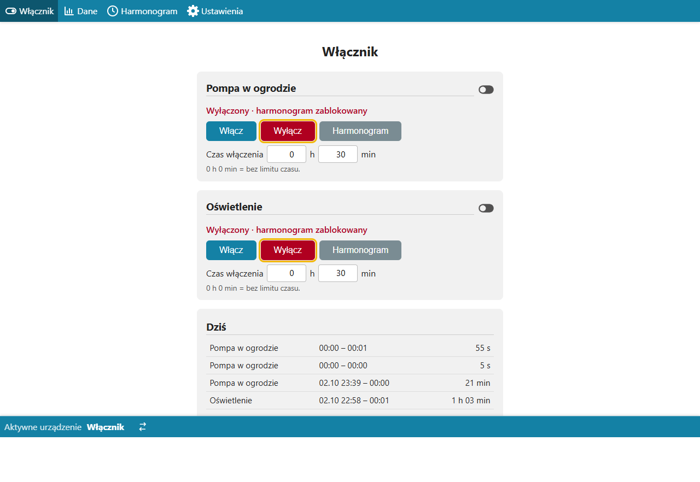
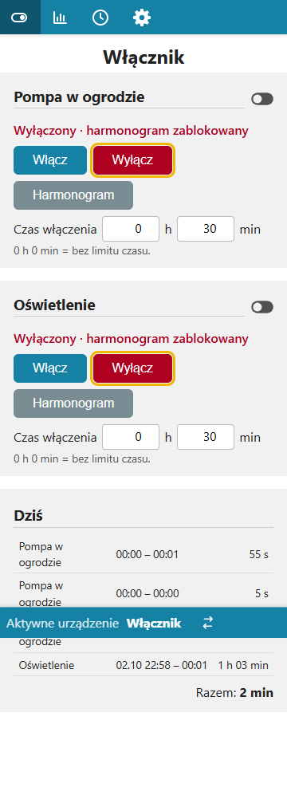
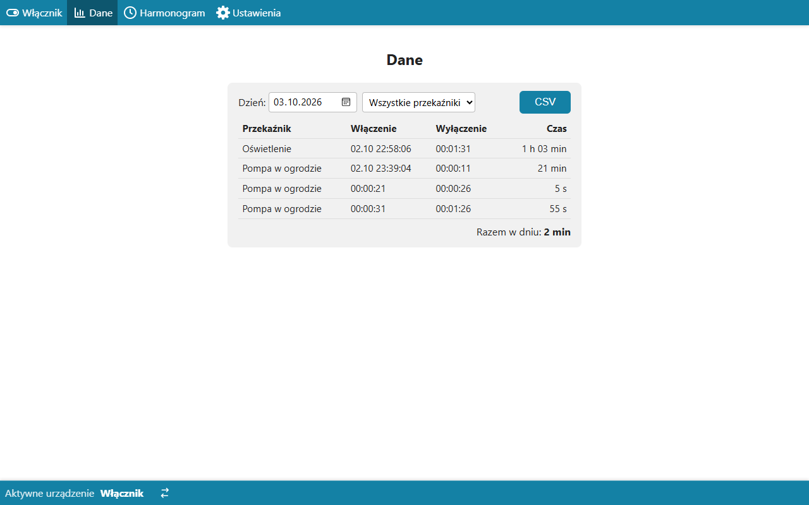
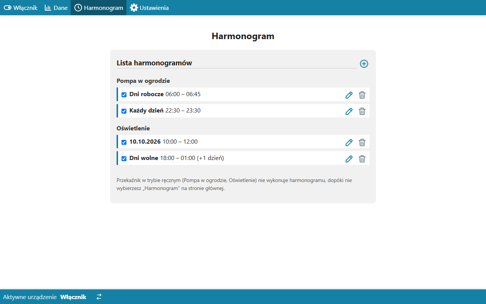
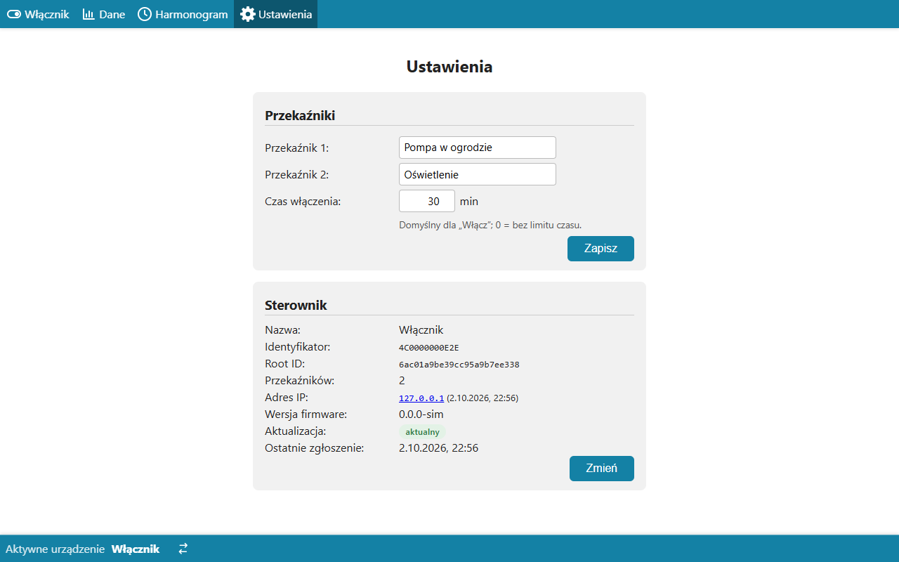

# Moduł switch — opis biznesowy

[← Dokumentacja systemu](../../README.md) · **1. Opis biznesowy** · [2. Zasada działania](2-zasada-dzialania.md) · [3. Dokumentacja techniczna](3-dokumentacja-techniczna.md) · [English](../../en/moduly/switch/1-business-description.md)

## Po co jest ten moduł

Moduł obsługuje w aplikacji **włącznik**: sterownik ESP32 z przekaźnikiem (albo kilkoma), który włącza i wyłącza odbiornik 230 V, np. grzałkę bojlera, pompę w ogrodzie albo oświetlenie. Działa jak harmonogram pompy ciepła, ale bez temperatur: przekaźnik jest włączony w oknach czasowych albo na polecenie użytkownika.

Moduł pozwala:

- **włączyć przekaźnik od razu**: na czas (np. 30 min) albo bez limitu;
- **wyłączyć go i zablokować harmonogram**, dopóki użytkownik nie wróci do harmonogramu;
- **ustawić harmonogram** każdego przekaźnika: dni (każdy dzień, robocze, wolne z polskimi świętami, dzień tygodnia albo jedna data) i godziny, także przez północ;
- **widzieć historię włączeń**: kiedy i jak długo przekaźnik był włączony, z sumą w dniu i eksportem CSV;
- **nadać przekaźnikom nazwy** („Bojler”, „Oświetlenie”).

Pierwszy włącznik działa od 2026-10-03 i steruje grzałką bojlera (przekaźnik „Bojler”).

## Dla kogo

**Właściciel domu**, który chce sterować odbiornikiem 230 V z telefonu i według harmonogramu. Sterownik zgłasza się do chmury sam; po montażu wystarczy nazwać przekaźnik i dodać harmonogram.

## Ekrany

*Widok główny (dane z symulatora z dwoma przekaźnikami): dla każdego przekaźnika przełącznik stanu po prawej (jak „CO pompa” pompy ciepła; stan zgłoszony przez sterownik), opis trybu (tu „Wyłączony · harmonogram zablokowany” na czerwono), przyciski „Włącz”, „Wyłącz” i „Harmonogram” (wybrany tryb ma obwódkę) i pole „Czas włączenia”. Pod kartami tabela „Dziś” z dzisiejszymi włączeniami i sumą „Razem”. Widok odświeża się co 5 s.*

| Telefon | Opis |
|---|---|
|  | Na telefonie (360 px) karty mają pełną szerokość, a menu pokazuje same ikony. Przy włączeniu na czas albo w oknie harmonogramu pod opisem trybu jest duże odliczanie do wyłączenia. Gdy sterownik nie zgłasza się dłużej niż 30 s, karta pokazuje „Sterownik offline od …”, a gdy stan przekaźnika jeszcze nie odpowiada poleceniu — „Czeka na sterownik…”. |

*Dane: włączenia z wybranego dnia (włączenie, wyłączenie, czas), filtr przekaźnika (przy więcej niż jednym), „Razem w dniu” i eksport CSV. Włączenie zaczęte dzień wcześniej ma przy godzinie datę. „≈” przed godziną wyłączenia oznacza czas przybliżony: sterownik stracił zasilanie albo łączność.*

*Harmonogram: wpisy pogrupowane po przekaźnikach. Czerwona kreska z lewej oznacza wpis, który działa teraz; „(+1 dzień)” — okno przez północ. Ikona plusa otwiera formularz (przekaźnik, dzień albo data jednorazowa, od–do, aktywny). Pod listą uwaga, które przekaźniki są w trybie ręcznym i nie wykonują harmonogramu.*

*Ustawienia: nazwy przekaźników, domyślny „Czas włączenia” w minutach (0 = bez limitu) i karta „Sterownik” z liczbą przekaźników, adresem IP, wersją firmware i stanem aktualizacji.*

## Tryby przekaźnika

| Tryb | Przycisk | Co robi |
|---|---|---|
| **Harmonogram** | „Harmonogram” | przekaźnik jest włączony w oknach harmonogramu, poza nimi wyłączony; tryb domyślny |
| **Włączony na czas** | „Włącz” z czasem > 0 | włączony do końca czasu, potem wraca do harmonogramu |
| **Włączony bez limitu** | „Włącz” z czasem 0 h 0 min | włączony, dopóki użytkownik nie zmieni trybu |
| **Wyłączony** | „Wyłącz” | wyłączony; **harmonogram go nie włączy**, dopóki użytkownik nie wybierze „Harmonogram” |

Ten sam wybór jest na stronie samego sterownika (sieć lokalna), więc włącznik da się obsłużyć także bez internetu.

## Pierwsze uruchomienie

1. Montaż sterownika i wpisanie sieci Wi-Fi na jego stronie `/install` ([firmware włącznika](../../../devices/switch/docs/1-opis-biznesowy.md)).
2. Sterownik sam zgłasza się do chmury; na liście sterowników pojawia się kafelek z ikoną przełącznika i nazwą „Włącznik”.
3. W Ustawieniach nadać przekaźnikom nazwy i ewentualnie zmienić domyślny czas włączenia (30 min).
4. W zakładce Harmonogram dodać okna włączeń.
5. Opcjonalnie oznaczyć włącznik gwiazdką jako sterownik domyślny.

## Ograniczenia

- **Harmonogram liczy chmura.** Bez internetu sterownik dokończy bieżące włączenie (zna czas wyłączenia) i się wyłączy, ale kolejnego okna nie włączy.
- **Po restarcie sterownika** (np. zanik zasilania) przekaźniki są wyłączone, dopóki sterownik nie połączy się z chmurą.
- **Stan jest odświeżany co 5 s.** Zmiana w aplikacji dociera do sterownika od razu (WebSocket), a gdy WebSocket nie działa — w ciągu 5 s.
- **Czas włączenia i wyłączenia w historii** pochodzi ze sterownika (z dokładnością do sekund); przy utracie zasilania koniec włączenia to ostatnie zgłoszenie przed nią (czas przybliżony, „≈”).
- **Domyślny czas włączenia** zmieniony w aplikacji trafia na stronę sterownika dopiero po jego restarcie (aplikacja używa nowej wartości od razu).
- **Strona sterownika nie wymaga logowania**: w sieci domowej (i w otwartej sieci sterownika po starcie) każdy może przełączyć przekaźnik.
- Najdłuższe włączenie na czas: 7 dni.

## Słownik

| Pojęcie | Znaczenie |
|---|---|
| **Włącznik** | sterownik ESP32 z przekaźnikami (`deviceType: switch`) |
| **Przekaźnik** | wyjście sterownika, numerowane od 1; może mieć nazwę |
| **Tryb** | harmonogram, włączony na czas, włączony bez limitu albo wyłączony |
| **Okno harmonogramu** | wpis „dzień + od–do”; okno przez północ należy do dnia, w którym się zaczyna |
| **Włączenie** | jeden okres od włączenia do wyłączenia przekaźnika w historii |
| **Czas przybliżony** (≈) | koniec włączenia oszacowany, bo sterownik stracił zasilanie albo łączność |
| **Offline** | sterownik nie zgłosił się od ponad 30 s |
