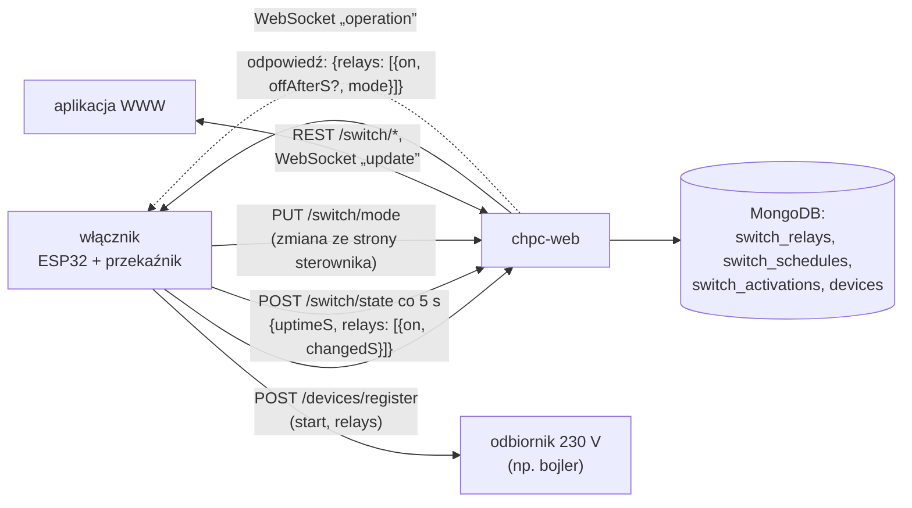
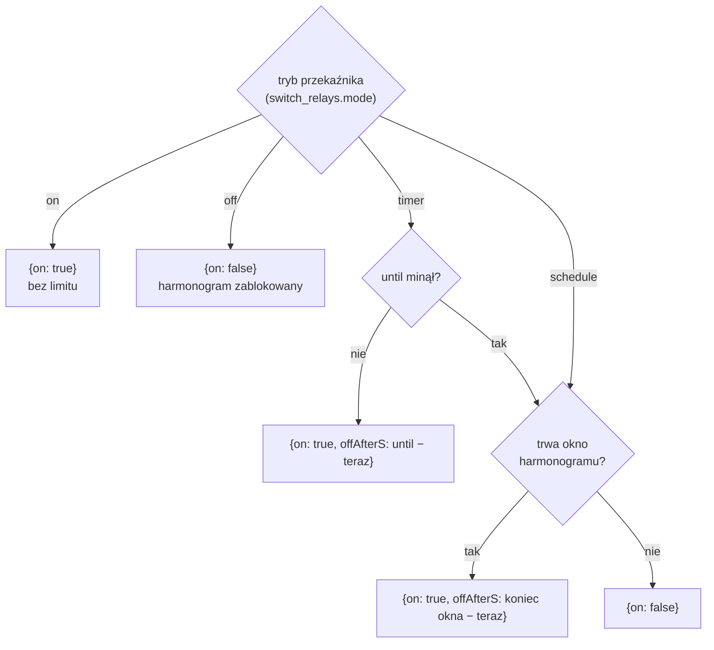
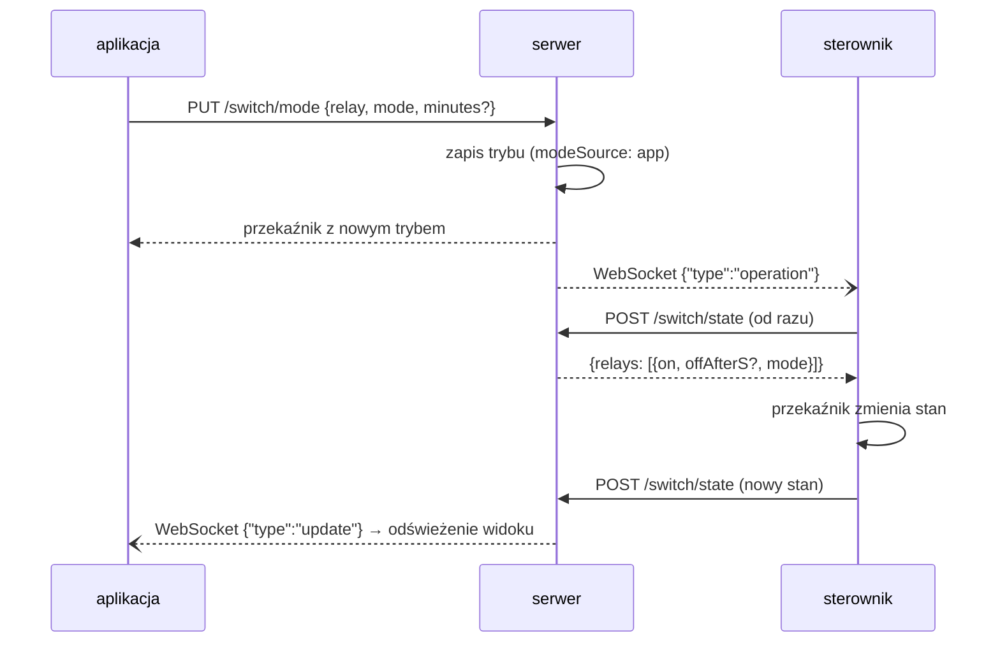
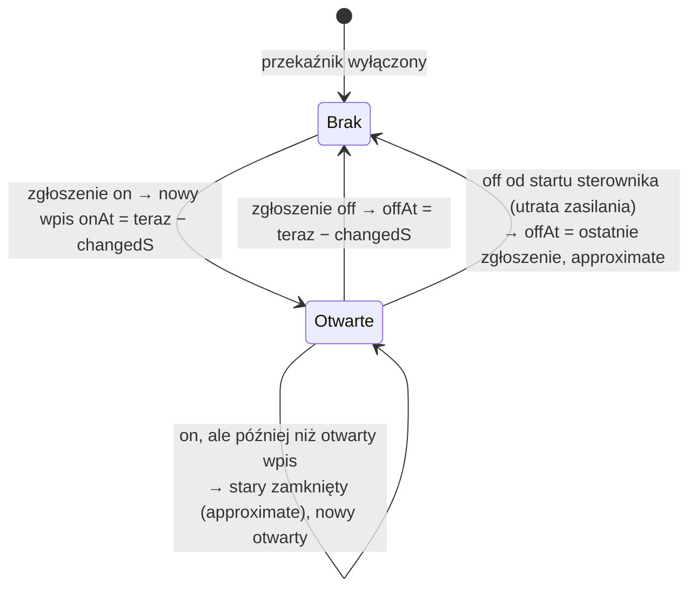

# Moduł switch — zasada działania

[← Dokumentacja systemu](../../README.md) · [1. Opis biznesowy](1-opis-biznesowy.md) · **2. Zasada działania** · [3. Dokumentacja techniczna](3-dokumentacja-techniczna.md) · [English](../../en/moduly/switch/2-how-it-works.md)

## Schemat

Działanie samego sterownika (odliczanie, strony, zmiany lokalne, OTA) opisuje [dokumentacja firmware włącznika](../../../devices/switch/docs/2-zasada-dzialania.md). Ten dokument opisuje stronę chmury i aplikacji.

## Polecenie liczone przy każdym zgłoszeniu

Włącznik nie ma osobnego schedulera jak pompa ciepła. Sterownik co 5 s zgłasza stan przekaźników, a serwer w odpowiedzi wylicza polecenie dla każdego z nich z **trybu** przekaźnika i jego **harmonogramu**:

- **`offAfterS`** to liczba sekund do wyłączenia. Sterownik odlicza ją sam, więc bez internetu dokończy włączenie i się wyłączy. Każde kolejne zgłoszenie odświeża odliczanie.
- **Timer po upływie `until`** działa jak harmonogram; przy najbliższym zgłoszeniu serwer zapisuje w bazie tryb `schedule`.
- **Tryby są trwałe** (kolekcja `switch_relays`): restart serwera ich nie kasuje, inaczej niż ręczne operacje pompy ciepła.
- Każda odpowiedź niesie też `mode` (tylko do wyświetlenia na stronie sterownika).

## Harmonogram

Wpis harmonogramu (kolekcja `switch_schedules`) dotyczy jednego przekaźnika: dzień (`dayOfWeek`) albo jedna data (`date`, ma pierwszeństwo), `startTime`, `endTime` (`HH:mm`, czas warszawski) i `enabled`. Dni są te same co w pompie ciepła (`WeekDay` w `core/types.ts`): każdy dzień, dni robocze bez świąt, dni wolne (weekendy i polskie święta), konkretny dzień tygodnia.

```mermaid
gantt
    title Okna przekaźnika (przykład, poniedziałek–wtorek)
    dateFormat HH:mm
    axisFormat %H:%M
    section wpisy
    pon 06:00–07:00          :a1, 06:00, 60m
    pon 07:00–08:00          :a2, 07:00, 60m
    pon 22:00–06:00 (+1 dzień) :a3, 22:00, 120m
    section polecenie
    jedno włączenie do 08:00 :b1, 06:00, 120m
    włączony do wt 06:00     :b2, 22:00, 120m
```

- **Okno przez północ** (`startTime > endTime`, np. 22:00–06:00) należy do dnia, w którym się zaczyna: wpis „poniedziałek 22:00–06:00” trwa od poniedziałku 22:00 do wtorku 06:00. To inaczej niż w schedulerze pompy, który porównuje godzinę z dniem bieżącym.
- **Koniec jest wyłączny**: o `endTime` okno już nie trwa. `startTime = endTime` oznacza puste okno.
- **Stykające się albo nakładające okna są łączone**: 06:00–07:00 i 07:00–08:00 dają jedno włączenie do 08:00 (`until` = koniec ostatniego okna), więc sterownik dostaje jeden ciągły czas pracy i przekaźnik nie klika o 07:00.
- **Najbliższe włączenie** (`nextStart`) aplikacja pokazuje przy wyłączonym przekaźniku w trybie harmonogramu; serwer szuka go w ciągu 8 dni.
- Wyłączone wpisy (`enabled: false`) są na liście, ale nie działają.

## Zmiana trybu

- Zmiana ze **strony sterownika** idzie odwrotnie: sterownik przełącza przekaźnik od razu i wysyła `PUT /switch/mode` z `source: "controller"` (wystarczy sam `deviceId`). Serwer zapisuje ją jak zmianę z aplikacji, z `modeSource: controller`.
- Zapis, zmiana i usunięcie wpisu harmonogramu także budzą sterownik komunikatem `operation`, więc nowe okno działa od razu.
- „Włącz” na czas: `mode: timer` z `minutes` 1–10080 (7 dni); `until = teraz + minutes`. „Włącz” z czasem 0 h 0 min wysyła `mode: on`.

## Historia włączeń

Historia (kolekcja `switch_activations`) powstaje ze **stanu zgłaszanego przez sterownik**, a nie z poleceń chmury. Sterownik podaje przy każdym przekaźniku `changedS` — od ilu sekund jest w obecnym stanie — więc serwer zna chwilę zmiany (`teraz − changedS`) także po przerwie w łączności.

- **Utrata zasilania.** Po restarcie sterownik ma przekaźniki wyłączone od startu. Serwer rozpoznaje to po `uptimeS` (stan wyłączony od chwili startu, z zapasem 5 s) i kończy otwarte włączenie na **ostatnim zgłoszeniu przed restartem** (`lastSeenAt`), ze znacznikiem `approximate`.
- **Przyczyna włączenia** (`source`): `schedule` w trybie harmonogramu, a w trybach ręcznych `app` albo `controller` (kto ustawił tryb). Serwer ją zapisuje, ale aplikacja jej nie pokazuje.
- Gdy któryś przekaźnik zmienił stan, serwer wysyła przeglądarkom WebSocket `update`.

## Online

Przekaźnik jest **online**, gdy sterownik zgłosił się w ciągu 30 s (`lastSeenAt`). Aplikacja pokazuje wtedy normalny stan, a bez zgłoszenia — „Sterownik offline od …”. „Czeka na sterownik…” oznacza, że sterownik jest online, ale jego stan (`on`) jeszcze nie odpowiada poleceniu (`desiredOn`).

## Liczba przekaźników

Sterownik podaje liczbę przekaźników w zgłoszeniu (`relays`) i w każdym zgłoszeniu stanu (długość tablicy). Serwer tworzy brakujące przekaźniki 1…N (tryb harmonogramu, wyłączone, bez nazwy), a nadmiarowe usuwa razem z ich harmonogramami. Dzięki temu aplikacja pokazuje przekaźniki zaraz po pierwszym zgłoszeniu.

## Ekrany aplikacji

| Ekran | Dane | Odświeżanie |
|---|---|---|
| **Włącznik** (`/`) | `GET /switch/relays`, `GET /switch/activations?date=` (dziś), `GET /device/properties` (domyślny czas), `PUT /switch/mode` | co 5 s i po WebSocket `update`; odliczanie co 1 s w przeglądarce |
| **Dane** (`/data`) | `GET /switch/activations?date=`, `GET /switch/relays` (nazwy); filtr przekaźnika i CSV w przeglądarce | przy zmianie dnia |
| **Harmonogram** (`/schedules`) | `GET/POST /switch/schedules`, `PUT/DELETE /switch/schedules/:id`, `GET /switch/relays` (wpis działający teraz: `scheduleId`) | przekaźniki co minutę i po zapisie |
| **Ustawienia** (`/settings`) | `GET /switch/relays`, `PUT /switch/relays/:relay` (nazwy), `GET/PUT /device/properties` (`default_on_minutes`), `GET /devices` i `GET /firmware/switch` (karta Sterownik: IP, wersja firmware, aktualizacja) | przy wejściu |
