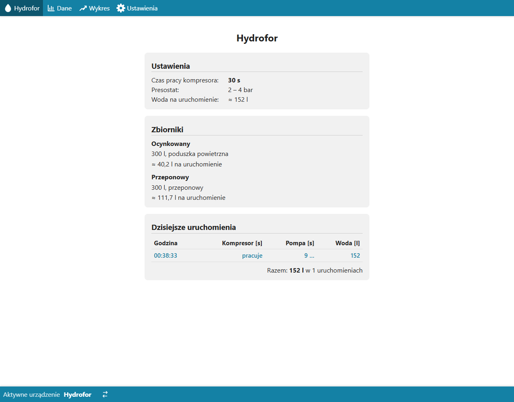
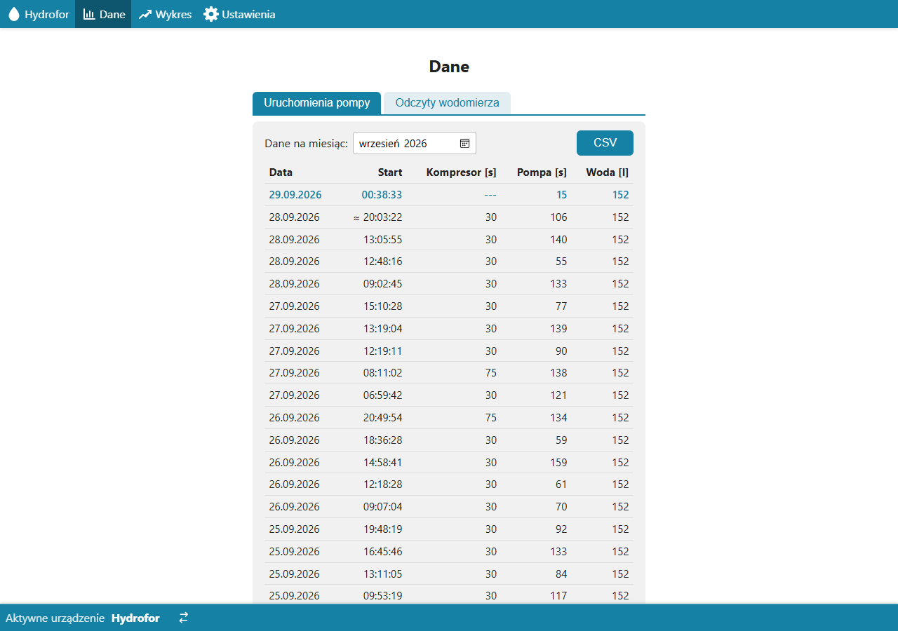
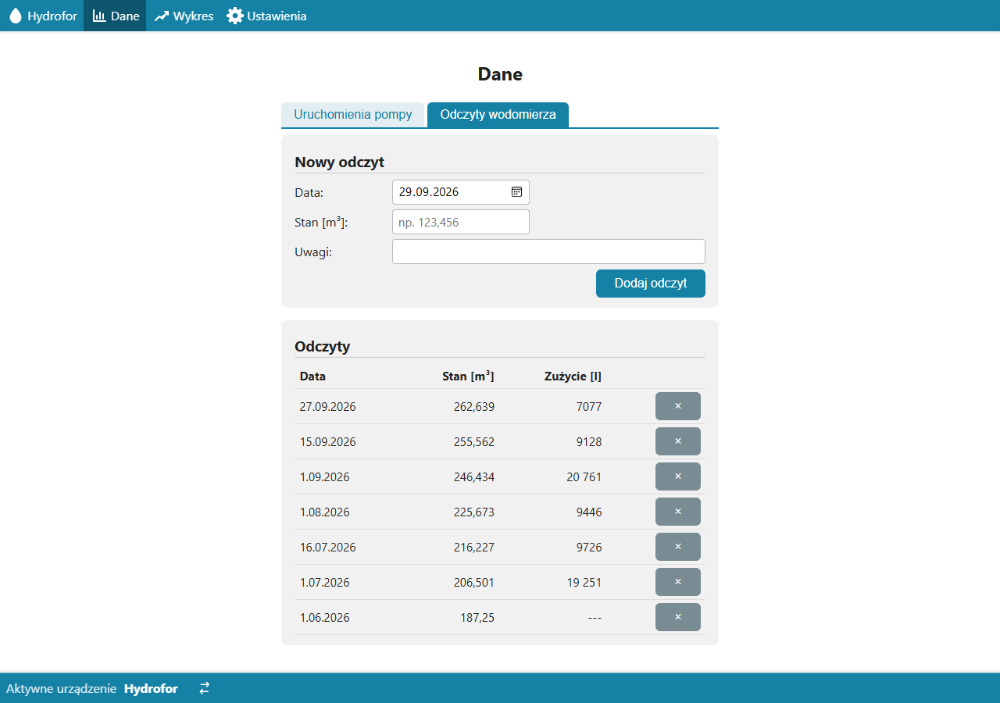
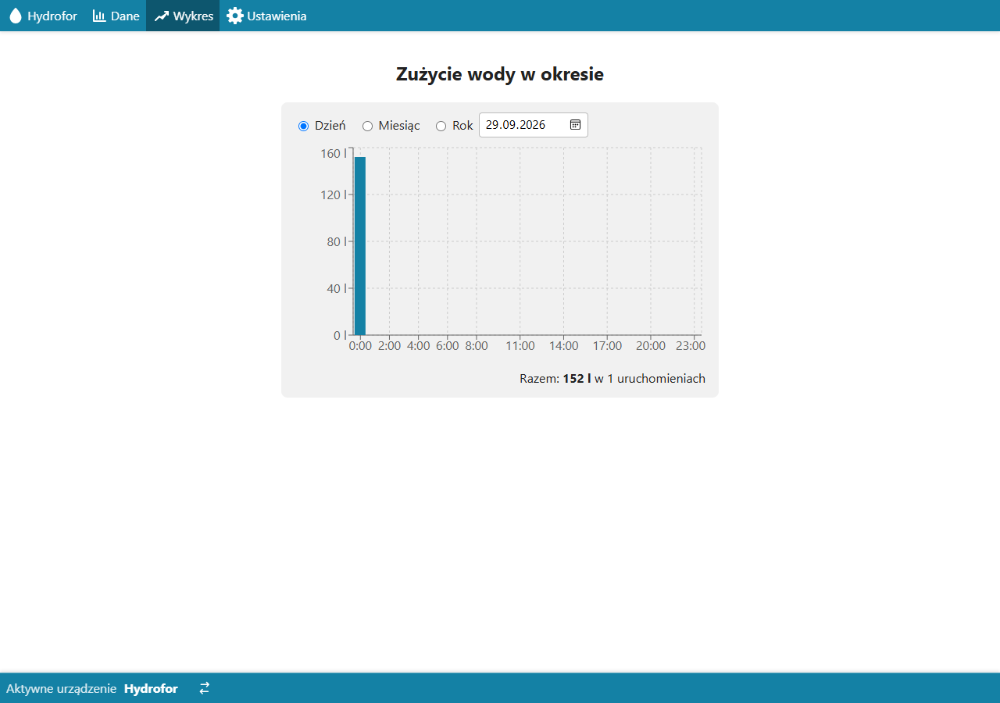
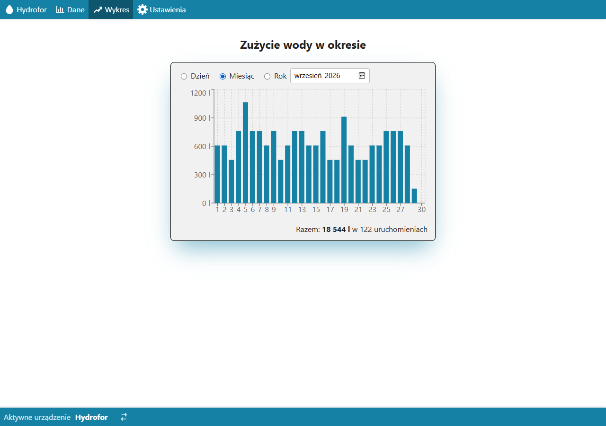
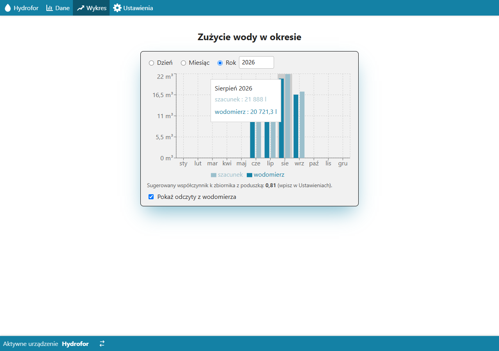
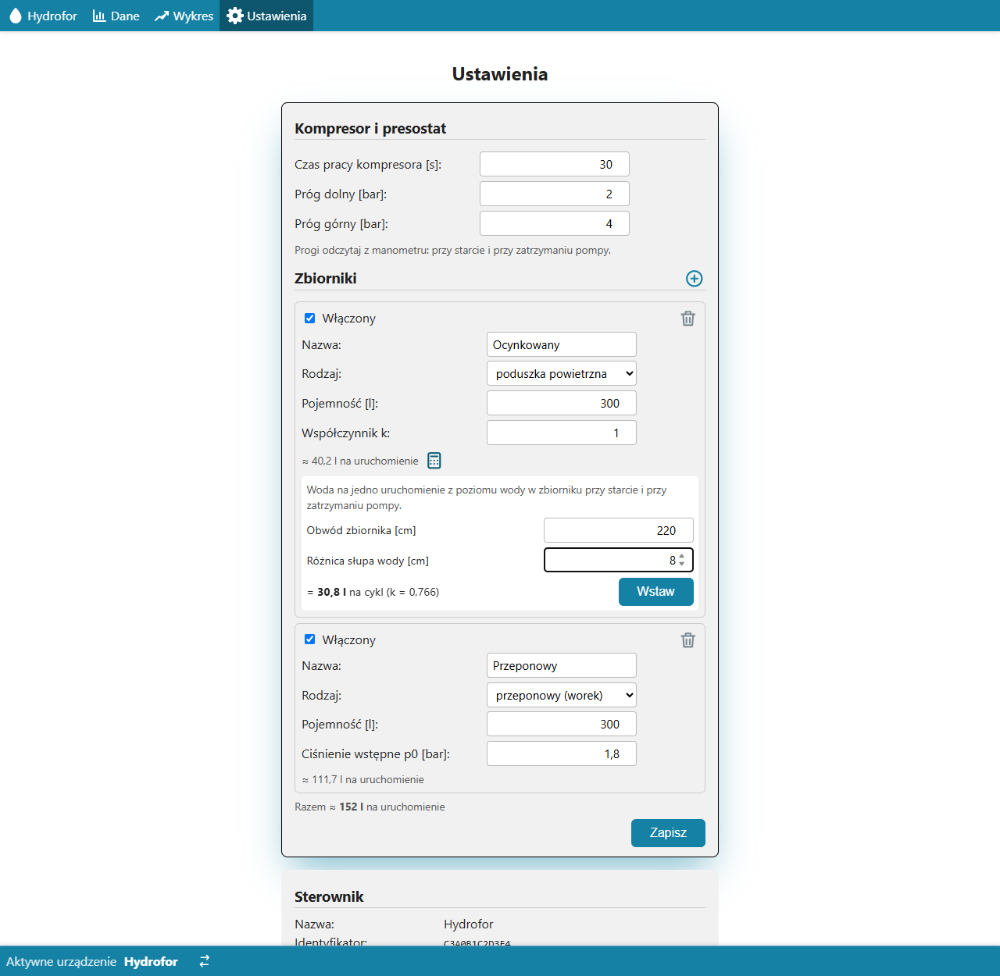

# Moduł water-pressure-tank — opis biznesowy

[← Dokumentacja systemu](../../README.md) · **1. Opis biznesowy** · [2. Zasada działania](2-zasada-dzialania.md) · [3. Dokumentacja techniczna](3-dokumentacja-techniczna.md) · [English](../../en/moduly/water-pressure-tank/1-business-description.md)

## Po co jest ten moduł

Moduł obsługuje w aplikacji **hydrofor**: domową instalację wody ze studni, w której pompa napełnia zbiorniki ciśnieniowe, a presostat włącza ją przy spadku ciśnienia i wyłącza po jego odbudowie. W zbiorniku z poduszką powietrzną powietrze stopniowo rozpuszcza się w wodzie, dlatego przy każdym starcie pompy sterownik hydroforu włącza na chwilę **kompresor**, który uzupełnia powietrze.

Moduł pozwala:

- **ustawić czas pracy kompresora** i opisać instalację (progi presostatu, zbiorniki);
- **widzieć każde uruchomienie pompy**: kiedy, jak długo pracowała pompa i kompresor;
- **szacować zużycie wody** bez wodomierza elektronicznego — z praw fizyki (prawo Boyle'a), na podstawie ciśnień i objętości zbiorników;
- **porównać szacunek z wodomierzem** — użytkownik wpisuje odczyty, a aplikacja podpowiada, jak skorygować szacunek.

## Dla kogo

**Właściciel domu** z hydroforem i sterownikiem hydroforu (ESP32-C3). Sterownik ma zasilanie tylko wtedy, gdy pracuje pompa — nie trzeba go obsługiwać.

## Ekrany

*Hydrofor: ustawienia (czas kompresora, progi presostatu, woda na jedno uruchomienie), zbiorniki z szacunkiem wody i dzisiejsze uruchomienia. Uruchomienie w toku jest wyróżnione kolorem („pracuje”, „…”); widok odświeża się co 10 s.*

| Dane — uruchomienia pompy | Dane — odczyty wodomierza |
|---|---|
|  |  |

*Dane: zakładka „Uruchomienia pompy” (tabela z wybranego miesiąca i eksport CSV; „≈” oznacza czas przybliżony — uruchomienie wysłane później, bo zabrakło sieci) i zakładka „Odczyty wodomierza” (dodawanie i usuwanie odczytów, zużycie między odczytami).*

| Wykres — dzień | Wykres — miesiąc |
|---|---|
|  |  |

*Wykres roku z włączonym „Pokaż odczyty z wodomierza”: w każdym miesiącu zużycie z wodomierza i szacunek; pod wykresem sugerowany współczynnik `k` zbiornika z poduszką (tu 0,81 — szacunek jest o ok. 5% za wysoki).*

*Ustawienia: czas kompresora, progi presostatu, zbiorniki (dodawanie ⊕, usuwanie koszem, włączony/wyłączony) i kalkulator wody na cykl przy zbiorniku z poduszką: z obwodu zbiornika i różnicy słupa wody „Wstaw” dobiera `k`.*

## Pierwsze uruchomienie

1. Sterownik po pierwszym starcie sam zgłasza się do chmury i dostaje ustawienia domyślne (30 s, 2–4 bar, zbiornik z poduszką 300 l i przeponowy 300 l).
2. W Ustawieniach wpisać **rzeczywiste progi presostatu** — odczytane z manometru przy starcie i przy zatrzymaniu pompy.
3. Wpisać **ciśnienie wstępne `p0` zbiornika przeponowego** — manometrem na zaworze powietrza, przy spuszczonej wodzie.
4. Dodać **odczyty wodomierza** (co najmniej dwa, najlepiej co kilka tygodni) — wtedy aplikacja podpowie `k`. Alternatywnie zmierzyć spadek poziomu wody w zbiorniku z poduszką i użyć kalkulatora.
5. Opcjonalnie oznaczyć hydrofor gwiazdką jako sterownik domyślny.

Zmiana ustawień w aplikacji dociera do sterownika **przy następnym uruchomieniu pompy** (sterownik ma zasilanie tylko w czasie pracy pompy). Czas kompresora można też zmienić na stronie sterownika `/install` — trafi wtedy do chmury.

## Ograniczenia

- **Szacunek wody jest przybliżony.** Zakłada pełne napełnienie między progami presostatu i znane ilości powietrza; dlatego jest korekta `k` z wodomierza.
- **Szacunek jest zapisywany w chwili uruchomienia** — późniejsza zmiana zbiorników nie zmienia historii.
- **Bez sieci** uruchomienie trafia do chmury przy następnym starcie, z czasem przybliżonym.
- **Czas uruchomienia** jest dokładny do ok. 1 s (sterownik nie ma zegara; czas liczy serwer).
- Sterownik obsługuje najwyżej 4 zbiorniki.

## Słownik

| Pojęcie | Znaczenie |
|---|---|
| **Hydrofor** | pompa + zbiorniki ciśnieniowe + presostat |
| **Presostat** | włącznik ciśnieniowy: włącza pompę przy progu dolnym, wyłącza przy górnym |
| **Zbiornik z poduszką powietrzną** | zbiornik (np. ocynkowany), w którym woda styka się z powietrzem; powietrza ubywa, stąd kompresor |
| **Zbiornik przeponowy** | zbiornik z workiem; ilość powietrza wyznacza ciśnienie wstępne `p0` |
| **Uruchomienie** | jeden cykl pompy od włączenia do wyłączenia przez presostat |
| **`k`** | współczynnik korekty zbiornika z poduszką: ile z teoretycznej poduszki naprawdę pracuje |
| **Wodomierz** | licznik wody; odczyty wpisuje użytkownik |
