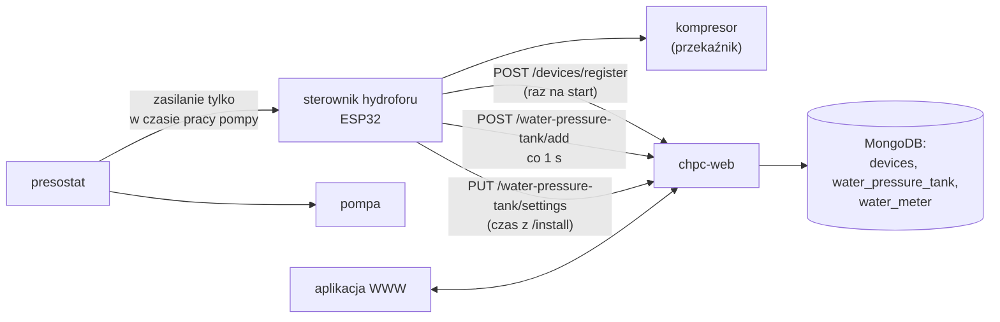
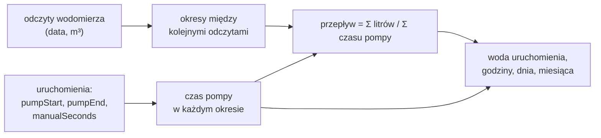
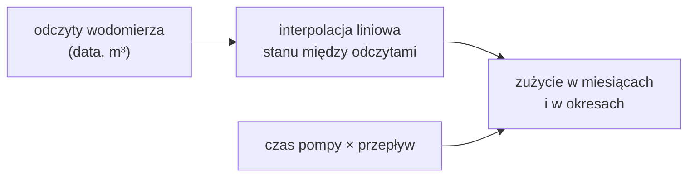
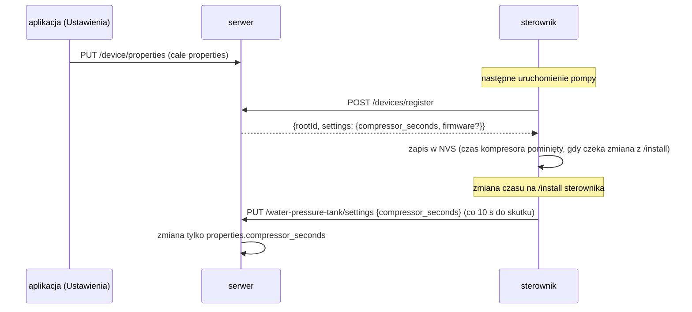

# Moduł water-pressure-tank — zasada działania

[← Dokumentacja systemu](../../README.md) · [1. Opis biznesowy](1-opis-biznesowy.md) · **2. Zasada działania** · [3. Dokumentacja techniczna](3-dokumentacja-techniczna.md) · [English](../../en/moduly/water-pressure-tank/2-how-it-works.md)

## Schemat



Działanie samego sterownika (kompresor, kolejka, strony) opisuje [dokumentacja firmware hydroforu](../../../devices/water-pressure-tank/docs/2-zasada-dzialania.md). Ten dokument opisuje stronę chmury i aplikacji.

## Uruchomienie w chmurze: daty z czasów względnych

Sterownik nie ma zegara. W każdej wiadomości podaje czasy liczone od swojego startu, a serwer zamienia je na daty według własnego zegara.

```mermaid
sequenceDiagram
    participant S as sterownik
    participant A as POST /water-pressure-tank/add
    participant M as MongoDB (water_pressure_tank)
    S->>A: {runId, pumpRunS: 1, compressorStartS: 1}
    A->>M: nowe uruchomienie: pumpStart = teraz − pumpRunS
    loop co 1 s
        S->>A: {runId, pumpRunS, compressorStartS, compressorEndS?, restarts, manualCompressorS?}
        A->>M: pumpEnd = chwila odebrania, lastSeenAt, czasy kompresora,<br/>manualSeconds
    end
    Note over S: presostat wyłącza pompę → sterownik traci zasilanie
    Note over M: ostatnia wiadomość wyznacza koniec pracy pompy (±1 s);<br/>„w toku”, gdy ostatnia wiadomość ma mniej niż 5 s
```

- Rekord jest jeden na `runId` (unikalny indeks `{rootId, runId}`); kolejne wiadomości go aktualizują.
- **Uruchomienie z kolejki** (`queued: true`) — z którego przy poprzednim starcie nie doszła żadna wiadomość — dostaje daty z chwili przyjęcia i znacznik `timeApproximate`. Jeśli serwer już je zna, uzupełnia tylko koniec pracy pompy (`pumpStart + pumpRunS`).
- Początek kompresora zostaje zachowany, gdy kolejna wiadomość go nie ma.
- `manualCompressorS` to łączny czas ręcznego włączenia kompresora („Włącz” na stronie sterownika) w tym uruchomieniu; serwer zapisuje go jako `manualSeconds`.

## Woda z czasu pracy pompy i wodomierza

Woda **nie jest zapisywana** w rekordach uruchomień. Serwer liczy ją przy każdym odczycie z dwóch wielkości:

```text
czas pompy  = (pumpEnd − pumpStart) − manualSeconds          [s]
przepływ    = Σ litrów z wodomierza / Σ czasu pompy           [l/s]
              (ze wszystkich okresów między kolejnymi odczytami)
woda        = czas pompy · przepływ                           [l]
```



- **Czas pompy** pomija ręczną pracę kompresora, bo wtedy pompa nie tłoczy wody do odbioru.
- **Przepływ** jest średnią ze wszystkich okresów ważoną czasem pompy, a nie średnią z okresów. Okres bez pracy pompy (sama zmiana wodomierza) albo z ujemnym przyrostem (pomyłka w odczycie) jest pomijany.
- **Bez przepływu** (mniej niż dwa odczyty albo brak pracy pompy między nimi) woda jest `null`, a aplikacja pokazuje sam czas pompy.
- **Nowy odczyt wodomierza zmienia przepływ**, więc zmienia też wodę w całej historii.
- Uruchomienie należy do okresu według `pumpStart`.

Przykład: dwa okresy, 1000 l w 1000 s pompy i 3000 l w 2000 s pompy → przepływ 4000 l / 3000 s ≈ 1,33 l/s (80 l/min); uruchomienie z 4 min 10 s pracy pompy daje ok. 333 l.

## Wodomierz w miesiącach



- Zużycie z wodomierza w miesiącu wynika z interpolacji liniowej stanu między odczytami, więc okres rozciągnięty na dwa miesiące dzieli się proporcjonalnie do czasu.
- Obok jest woda „z czasu pompy” w tej samej części miesiąca. Przepływ jest jeden dla całej historii, więc różnice między miesiącami pokazują, kiedy pompa pracowała inaczej niż średnio.
- Miesiące poza zakresem odczytów nie mają wartości.

## Ustawienia: chmura ↔ sterownik



## Ekrany aplikacji

| Ekran | Dane | Odświeżanie |
|---|---|---|
| **Hydrofor** | `GET /device/properties`, `GET /water-pressure-tank/flow`, `GET /water-pressure-tank/runs?from=&to=` (dziś) | uruchomienia co 5 s, reszta przy wejściu |
| **Dane → Uruchomienia pompy** | `GET /water-pressure-tank/runs?from=&to=` (miesiąc), CSV w przeglądarce | przy zmianie miesiąca |
| **Dane → Odczyty wodomierza** | `GET/POST /water-pressure-tank/meter`, `DELETE /water-pressure-tank/meter/:id` | po zmianie |
| **Wykres** | `GET /water-pressure-tank/summary?period=day\|month\|year&date=` (słupki wody, bez przepływu czasu pompy); rok z wodomierzem: `GET /water-pressure-tank/meter/summary?year=` | przy zmianie okresu |
| **Ustawienia** | `GET/PUT /device/properties` (czas kompresora, walidacja w przeglądarce), `GET /water-pressure-tank/flow` | przy wejściu |
