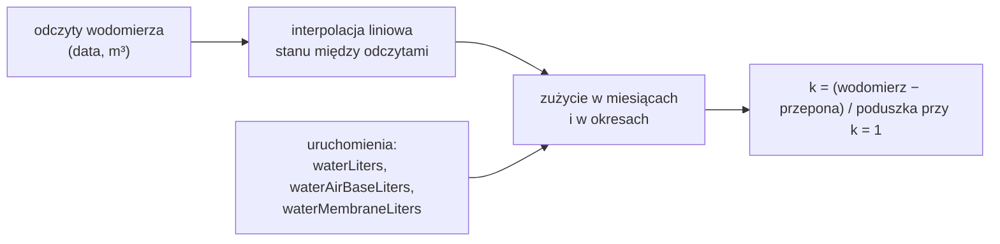
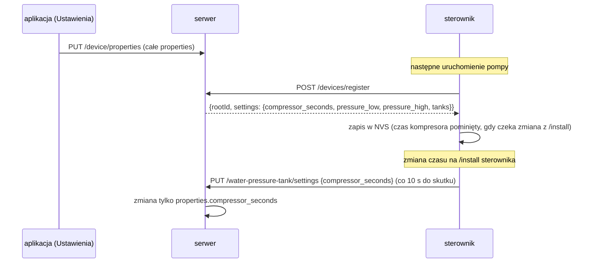

# Moduł water-pressure-tank — zasada działania

[← Dokumentacja systemu](../../README.md) · [1. Opis biznesowy](1-opis-biznesowy.md) · **2. Zasada działania** · [3. Dokumentacja techniczna](3-dokumentacja-techniczna.md) · [English](../../en/moduly/water-pressure-tank/2-how-it-works.md)

## Schemat


Działanie samego sterownika (kompresor, kolejka, strony) opisuje [dokumentacja firmware hydroforu](../../../devices/water-pressure-tank/docs/2-zasada-dzialania.md). Ten dokument opisuje stronę chmury i aplikacji.

## Uruchomienie w chmurze: daty z czasów względnych

Sterownik nie ma zegara. W każdej wiadomości podaje czasy liczone od swojego startu, a serwer zamienia je na daty według własnego zegara.

```mermaid
sequenceDiagram
    participant S as sterownik
    participant A as POST /water-pressure-tank/add
    participant M as MongoDB (water_pressure_tank)
    S->>A: {runId, pumpRunS: 1, compressorStartS: 1}
    A->>M: nowe uruchomienie: pumpStart = teraz − pumpRunS,<br/>woda = szacunek z bieżących ustawień
    loop co 1 s
        S->>A: {runId, pumpRunS, compressorStartS, compressorEndS?, restarts}
        A->>M: pumpEnd = chwila odebrania, lastSeenAt, czasy kompresora
    end
    Note over S: presostat wyłącza pompę → sterownik traci zasilanie
    Note over M: ostatnia wiadomość wyznacza koniec pracy pompy (±1 s);<br/>„w toku”, gdy ostatnia wiadomość ma mniej niż 5 s
```

- Rekord jest jeden na `runId` (unikalny indeks `{rootId, runId}`); kolejne wiadomości go aktualizują.
- **Uruchomienie z kolejki** (`queued: true`) — z którego przy poprzednim starcie nie doszła żadna wiadomość — dostaje daty z chwili przyjęcia i znacznik `timeApproximate`. Jeśli serwer już je zna, uzupełnia tylko koniec pracy pompy (`pumpStart + pumpRunS`).
- Początek kompresora zostaje zachowany, gdy kolejna wiadomość go nie ma.

## Szacunek wody (prawo Boyle'a)

Zbiorniki pracują przy tym samym ciśnieniu, więc woda z jednego uruchomienia to suma z włączonych zbiorników. Ciśnienia są bezwzględne (manometr + 1,013 bar); `p_d` — próg dolny, `p_g` — górny.

```text
poduszka powietrzna:  ΔV = k · V · 1,013 · (1/p_d − 1/p_g)
przepona (worek):     ΔV = V · p0 · (1/max(p_d, p0) − 1/p_g)     (0, gdy p0 ≥ p_g)
```

Przykład dla ustawień domyślnych (2–4 bar, 300 l z poduszką przy `k` = 1, 300 l z przeponą przy `p0` = 1,8 bar): 40,2 l + 111,7 l ≈ 152 l na uruchomienie.

Ten sam wzór jest w trzech miejscach — **serwer** (wartość zapisywana w rekordzie), **aplikacja** (podgląd w Ustawieniach i na głównym ekranie) i **sterownik** (strona `/`). Zmieniać razem; zgodność serwera z aplikacją sprawdza test.

## Wodomierz i współczynnik k



- Każde uruchomienie zapisuje osobno część z przepony i część z poduszki przy `k` = 1 — dzięki temu `k` da się wyliczyć niezależnie od tego, jakie `k` obowiązywało.
- Sugerowane `k` jest liczone z całego okresu objętego odczytami (nie tylko z wybranego roku); potrzebne są co najmniej dwa odczyty.
- Miesiące poza zakresem odczytów nie mają wartości wodomierza.

## Ustawienia: chmura ↔ sterownik



## Ekrany aplikacji

| Ekran | Dane | Odświeżanie |
|---|---|---|
| **Hydrofor** | `GET /device/properties`, `GET /water-pressure-tank/runs?from=&to=` (dziś) | uruchomienia co 10 s |
| **Dane → Uruchomienia pompy** | `GET /water-pressure-tank/runs?from=&to=` (miesiąc), CSV w przeglądarce | przy zmianie miesiąca |
| **Dane → Odczyty wodomierza** | `GET/POST /water-pressure-tank/meter`, `DELETE /water-pressure-tank/meter/:id` | po zmianie |
| **Wykres** | `GET /water-pressure-tank/summary?period=day\|month\|year&date=`; rok z wodomierzem: `GET /water-pressure-tank/meter/summary?year=` | przy zmianie okresu |
| **Ustawienia** | `GET/PUT /device/properties`; walidacja w przeglądarce | przy wejściu |
